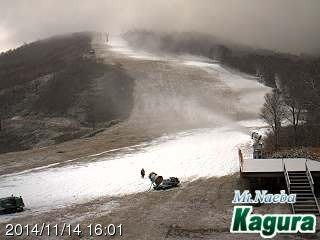

# 明日は今シーズンラスト（のはずの）Yetiへ出撃だっ！

📅 投稿日時: 2014-11-15 00:34:47

🏷️ カテゴリ: [日記](cc4b5682fb7b8b144980957a978653fb0.md)

ということで．

予想通りの冷え込みで，

志賀高原でも，熊の湯・高天ヶ原・一の瀬では，

人工降雪が始まったようですね～．

かぐらも，がんがん人工雪を打ってますよ～っ！！

…ただ．

やはり．

全く天然雪が期待できず．

[熊の湯は，今週土曜のオープン予定が後ろ倒しになり](http://ameblo.jp/kumakumanoyu/entry-11952143947.html)，

日曜以降になるようですが…

うーむ．16日までそこそこ冷えてくれそうなので．

それまでの人工降雪と．

17日に，ひどい雨にならないことと．

18～20日の再びの冷え込みに期待かな…

18，19日は，今のままいけば，

降雪が期待できる天気図ですっ！

＃でも，21日にまた気温が上がるかも…

とりあえず，スキーヤーのみなさん．

祈りましょう！！

…さてさて．

Yetiオープンから，約1か月．

明日もイエティに出没予定です．

…明日が，今シーズン最後の（はずの）イエティです！

来週からは，アサマ2000，丸沼，かぐらなどのスキー場が

オープン（するはず）です！

来週から，もう少し広くてコンディションがいいゲレンデで

滑れる（はずな）ので，楽しみです！

ということで．

明日も早いので，これから寝ます～．

おやすみなさい～
