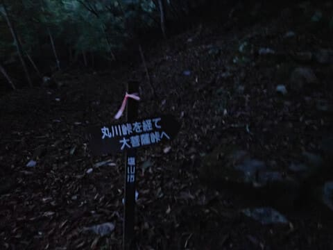

# 2023年9月，今度は大菩薩嶺へ行ってみた，その1…登山スタート！

📅 投稿日時: 2024-08-06 00:34:58

🏷️ カテゴリ: [登山・旅行](c1d637a11a25b457ac978d197adbdafc5.md)

ってなことで．

娘も夏休みに入って．この週末は土曜に

日帰りで長岡花火を見に行ったものの．

日曜は仕事で一日家で缶詰めになり…

相変わらずこの夏は，ダイビングもまだ

行っておらず．

さらに山歩きも，いつもの陣馬山以外

行っていない状態です（涙）

というわけで，Blogネタが切れかけて

いるので．

また，去年登ってまだレポートしていない

山シリーズ，

昨年9月，雲取山の翌週に登った大菩薩嶺

のレポートでも行ってみましょうか…

…しかし

昨年も，週末にゆっくり休んでいる時間が

取れないながらも，

毎週裏高尾や丹沢山系だと飽きる…

ということで，そんな遠くには行けない

けど，ちょっとだけ足を延ばして，

家からそう遠くない雲取山やら

大菩薩嶺に行ったんだったなぁ…

ってなことで．

昨シーズン9月の，大菩薩嶺の登山

レポートです！

ーーー

2023年のスキーシーズンが終わってから．

陣馬山や丹沢・蛭ヶ岳方面にばかり行って，

そろそろ違うところに行きたい…

と思っていたけど．

家からそんなに遠くなくて，昼までには

家に帰って，午後は仕事ができるような山で．

まだ行ったことがないところで．

景色が楽しめるようなところ，あるかな～…

と，探していたところ．

…ありますね．

まだ行ったことのない，メジャーなところが．

そう．大菩薩嶺．

メジャーすぎて混むんじゃないか…

という心配から，あまり行こうと思わないで

いたところ．

そして，標高差もそんなに稼げないショート

コースが多いので，トレーニングにはちょっと

物足りないかな…

ということで，これまで見送ってきたけど．

マイナーな丸川峠分岐駐車場をスタート地点に

して，ぐるっと大菩薩嶺→大菩薩峠→石丸峠を

回るルートにすれば．

距離は12.3㎞，標高差1080m程度と．

陣馬山往復よりは短いけど，標高差は1000mを

越えて，いいトレーニングルートになるし．

駐車場もマイナーだからそこまで混まない

だろう…

と，こんな感じのルートを計画したのでした…

ヤマレコの標準コースタイムは7時間32分．

まぁ，4時間ちょいで一回りできるかな？

と．金曜夜，また深夜まで仕事してたにも

関わらず．

睡眠3時間弱で，朝3時発で家を出て…

朝5時にまだ真っ暗な駐車場へ到着！

うーん．

予想より早く着いちゃった…

日が昇って明るくなるまで待とうかと

思ったけど．

ここで車で寝ちゃうとぐっすり

寝ちゃいそうで．出発が遅れて

昼までに帰宅できないな…

と．

ヘッドランプの明かりで出発！

最初はきれいな踏み跡のある

登山道ではなく，河原に沿って

登っていく道だったので…

暗い中，ヘッドランプではちょっと

分かりにくかったけど．

スタートして15分も経つと，周りが

うっすらと明るくなってきて，

標識とかも見えるようになり．

そして，周りがだんだんと明るく

なってきて．

暗い中はちょっと心配だったのが，

だんだん明るくなるとともに

あぁ…太陽の明かりってありがたい…！

と，改めて太陽のすばらしさを再認識．

周りは明るくなってきたけど．

まだ日が昇っていない，誰もいない

山道を淡々と登っていきます…

駐車場から丸川峠までは，

そこそこ斜度がある，木立の中を

登っていくルートで．

時々足場が悪いところもありましたが…

まぁ，淡々と木立の中の踏み跡を

登っていきます．

1時間ほど登ると．

開けたくさっぱらに出ました…！

広場の中にはこんな小屋がありましたが．

どうやらここが，丸川山荘ですか…

ここまで，駐車場から1時間13分．

丸川峠近辺は，草原の中の道を歩く

ルート．

こんな感じの道をしばらく歩くと…

また，木立の中を登る道になっていきますが．

このあたりで，朝日が射し始め…

気持ちよい朝日の中の快適な山歩きに

なってきました…

今日は天気がよさそうだな！！

（[続く](e413912b1d00aa8a5db7371424b29bce1.md)）
