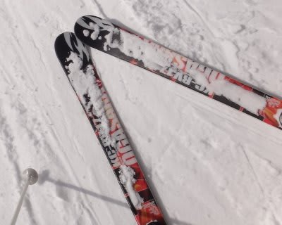
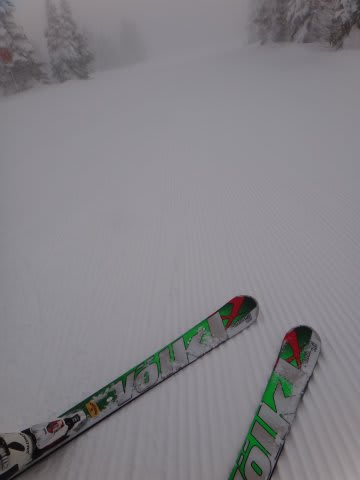

# ロングの板が2セットともヘタってしまった…と，いうことは．

📅 投稿日時: 2013-01-11 00:10:54

🏷️ カテゴリ: [スキー雑談](c1f9d2cb7478308da16419928ea3945e9.md)

ってことで．

Nordica Dobermann GS-proと，ATOMIC D2 DEMO Type-Aの2セットが．

見事にヘタっていたことに気づいてしまったわけですが．

…いや．

実は今シーズンに入ってから．

ATOMIC BLUESTER SXを買う前に．

夏スキーやシーズンイン時など，ゲレンデに石ころが出ているとき用の

'09 SALOMON DEMO X3が．

もうどうしようもないくらいデロンデロンに

ヘタっていることに気づき…

そして，昨シーズン譲ってもらった，'09 OGASAKA KC-RV．

この板も，12月に履いてみて，センターだけがグリップするように感じて．

「あぁ，ヘタッたなぁ…」

と感じてはいたのだが．

まぁ，DEMO X3は，だ．

私が小回りメインマシンとして2シーズンはき倒した上に，

その後もシーズンイン＆夏スキー用として，2シーズン使ったので．

むしろヘタっていないほうがおかしいくらいで，あきらめもつく．

そして，KC-RVは．

もともと3シーズン履いた中古を，タダで譲ってもらったもんだし．

5シーズン目になる今年．

ヘタってもそれほど惜しくない．

しかーし．

しかし，だ．

これらと比べると，まだNordica Dobermann GS-proと，ATOMIC D2 DEMO Type-Aは．

多少くたびれ感があってもヘタリまでは感じられず．

まだ現役続行か…

と．思っていたのだがっ！

ATOMIC BLUESTERを買って，悲しいことに気づいてしまった．

この2本もヘタっていた，と…

今シーズン，まさか．

4セット全ての板がヘタっていたとは．

…全く想定外っ！

＃そして唯一ヘタっていない[SALOMON 24hours LMは剥離](e6302c5755708c26ad01f9cd7b82c90ae.md)…(涙)

はっきり言って，ATOMIC BLUESTERを履いた後では．

この2本，履く気が全く起こらないくらいなのだ．

グリップしなくてスピードがだせなくて傾けない板は，

履いて楽しくないし．

おそらく．

この板履いてたら，下手になっちゃうかも…

…

…

でも．

シーズン中，165cmの小回り板だけで，すべてを乗り越えるのは．

レジャースキーヤーにとって，つらいのだ．

人が少ないぴかぴかバーンを，快楽のまま大回りしたい朝イチに．

大回り用の板が無いと，やっぱりつらいのだ．

うーん．

うーん．

どうしよう…

…

…

あれ？

何だ！？この板は？？？？

どうして私の手元に？？？

(続く)
