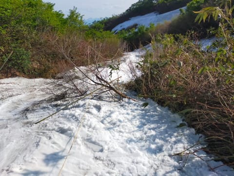

# 2024/6/8(土)の月山スキー場，詳細レポートまだ続く…結局1日沢コース滑ってたけど，土曜ラストはもうすごい状況に

📅 投稿日時: 2024-06-13 03:43:56

えー．

昨日もほぼ徹夜したのに．

今日もまだ仕事が終わってない…

ヤバい．

終わるのか．

とりあえず寝たい．

でも，2日連続でまともに記事を書かないのも

ヤバいので．

とりあえず先週土曜の月山ネタを何とか

引っ張って記事を仕上げてみる…

ってなことで．

大斜面はかなりドロドロになる厳しい藪漕ぎ

だったので．

基本的に沢コースをメインに滑ったのですが…

まぁ，沢コースも圧雪が入っているわけでは

ないので，朝からコースは荒れ荒れだし．

もう，幅も狭くなっていて，大回りが

できるような斜面じゃないので…

楽しいかというと，微妙（涙）

そして雪も汚れまくってるし．

日差しで表面が融けて，滑りもあんまり

良くない感じなのが残念…

まぁ，雪の上で滑れるだけ，ゼイタクを

言ってはいけませんね．

こんな中でも，沢コースでレッスンしている

グループがあるのがすごいな…

ちなみに．

山頂のTバーは滑ってませんが．

電動のTバーがなくなり，Tバー1本のみに

人が集中してます．

かなり待ち時間が長そうで．

Tバーを使わず，ハイクアップして

滑っている人が多かったですね～…

リフト待ちも全くなかった本日．

沢コースは基本的に人が少なくて，

終日ガラガラだったのが，まだよかったかな．

大斜面も，そこまで人がいなかった

感じですね…

ってなことで．

晴天で，雪がガンガン解けていったこの日．

朝はまだこの程度だった沢コース下部の藪が…

ラストではこの程度になっていて．

沢コースも，足元がドロドロになる

藪漕ぎコースになってきました（涙）

そのほかにも，朝は埋まっていた木が

立ち上がってきて，板を脱がないと

通れないポイントが増えたし．

この時期は藪が出始めると，たった一日で

一気にすごいことになるんだなぁ…

ということを痛感．

あさイチはそこまでひどくなかった，

リフト降り場からゲレンデに突っ込むところの

笹藪も，夕方ラストのころには

「どこを通れたんだっけ…？」

ってくらいに，完全に藪が立ってきて．

足元が雪解け水でドロドロになっている

笹藪を掻き分け，

さらにその先も，朝はこんな感じだったところが…

夕方には，もう立ち並ぶ灌木を乗り越えて，

何とかゲレンデに出られる感じに

なってしまって…

わずか数時間でここまで変わるのか！！

って感じ．

うん．

これ…

間違いなく今日で終わり．

明日はもうここ通れないよね…

ってなところを通ってまで，

なんでスキーを滑ってるんだろう…？？

という疑問を感じつつも．

結局この日も，リフトストップの

16時半まで滑りつくしてしまったのでした…

しかし．朝1時に家を出てきたというのに．

これから日帰りでさらに7時間運転して

家まで帰らねばならず．

自分で言うのもなんだけど，

そこまでしてこんなゲレンデを滑るか？？

と言いたい気分になったのですが．

いや．

でも．

ここまで大変なら，もうこれでしばらく

滑らなくてもいいや

と，自分の身体で思い知ることで．

これでスキーは終わり！！

と納得させるためのシーズン終わりの

儀式として必要なので．

日帰り月山という無謀なことをしてまで，

この時期に滑ることにしているのでした…←この時期の月山，

さすがの私でも2日間滑ろうと思うほど楽しくない

とりあえず．

今回の月山はかなり大変で，決して楽しく

無かったので．

これでやっと，もう今シーズンは滑らなくても

いいや，という気分になれたので．←それだけのために，

えらい高いコストをかけて月山に行くのか…

これにて私の2024スキーシーズン，終了です！！！
