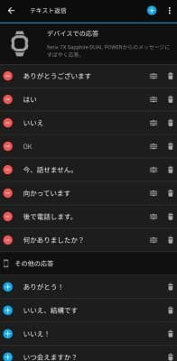

# 新しいスマートウォッチ，Garmin Fenix7Xを買ったよ！その10…スマホアプリ，Garmin Connectを使ってみる：その4

📅 投稿日時: 2022-08-27 02:08:30

🏷️ カテゴリ: [PC,カメラ&小物](c0d8caed13e597efe97b661a8ae56bed0.md)

夏休みが明けた今週．

私の周囲が，休みモードから

「休み明けたぞ！休み中の宿題は終わったんだろうな？」

モードに切り替わり．

月曜から金曜まで，

休み中にできなかった会議が

すき間家具のようにびっちり詰まり，

…今日も朝から休みなく会議が続き，

最後の9本目の会議が終わったのは22時近く…

そして．

会議の度に宿題にダメ出しをくらい

つづけるという，まるで夏休み明けの

小学生のような一週間だったため，

今週もまた平均睡眠時間がかなり

短かく（泣）

さらに，土曜午後から日曜は全国的に

雨なので．

この週末も，どこにも行けない週末に

なりそう…（涙）

あぁ…

「書類上は」5日も夏休みがあった8月なのに．

結局一回しか山に行けなかった…（激涙）

かつては[こんな平和な夏休みを過ごした](e298423c71920fd6e67ee1170bdfee496.md)

日々もあったというのに．

まさか，海にも行かなければ帰省もせず，

旅行にも行かず．

志賀高原へ遊びに行く計画も流れ，

8月に行ったのは日帰り山登り一回だけ

という夏休みを過ごすときが来るとは…（遠くを見る目）

ってなことで．

どこにも行ってないので，

書ける記事はガジェット紹介記事

しかないような今日この頃．

今日もまた，Garminの紹介記事です…

しかし．スマホアプリ，Garmin Connectの

説明だけで4本も記事を書くとは…

とりあえず，Garmin Connectの紹介．

もう少し続きます…！

（Garmin Fenix7Xのレポート全16回のもくじ

機能説明，登山用地図の作り方，登山で使ってみた…など

は[ここをクリック](e516b23a4874189de2e9208be87fa5184.md)）

ってことで．

Garmin Connectのメニューですが．

前回説明したアクティビティメニューの

他に，「健康情報の統計」メニューってのも

ありますが…

これはだいたいトップ画面に表示されていて，

ここから直接確認できるモノばかりですね…

そして次は，「パフォーマンス統計」メニュー．

ここからは，Garminさんが予測する，

5km走，10km走，ハーフ＆フルマラソンの

レース予測タイムとかを見ることができて．

その4週間での変化とか，6か月や

1年での変化とかが見られて．

体力が上がっているのか落ちているのか，

はっきりと見せつけられます…

うん．

Garminさん，やっぱり単に運動を記録する

スマートウォッチというより．

運動能力を見守る「鬼コーチ」って感じが

します…

で．

この「パフォーマンス統計」メニューからは

VO2Max値も確認できるのですが．

さっきのレースタイムは，この

VO2Max値からの推測タイムです．

パフォーマンス統計メニューには，

FTPとか乳酸閾値とかのメニューも

ありますが．

これはバイクで走ったり，別売りの

胸部装着の心拍計を着けて測ったり

しないと測定できないメニューですね．

そのほか，「トレーニングメニュー」が

ありますが．

これはまさにトレーニングの計画を

作るためのメニューで．

バイクやランのコースを作ったり，

目標ペースを入れたりするメニュー．

私は使わないですね…

そして，このメニューの真ん中あたりにある

「Insights」を見てみると…

こんな感じで，歩数・睡眠時間・階段を

上った階数の3項目を，各世代の人と

比較してどのあたりに位置するのか…

とかが見ることができますが．

VO2Maxとかタイムとかなら比較したいけど，

あんまり歩いた歩数と睡眠時間を

人と比較しても…って感じかな…

あまりにも機能が多すぎるので，

飛ばし飛ばし説明すると…

ここにあるセーフティ＆トラッキング．

こいつを設定すると．

ウォッチがある程度以上の衝撃を受けて，

特定の時間内に操作をしない場合は

連携したスマホから登録した連絡先に

自動で連絡が飛ぶ…

という設定ができたりして．

あまり考えたくないけど，

山やスキーで事故があった時に

役に立つかも…？？

さらに，メニューの下の方．

「Garminデバイス」を選ぶと…

ウォッチの各種設定ができます！

ウォッチへのスイカチャージも

ここからできますし…

LINEやメール，電話着信時に

ウォッチからクイックメッセージを

返すための文面もここで選べます…

ってなことで．

まだまだ時計設定項目はいっぱい

あるんですが．

長くなったので今日はこのあたりで…

（続く）

## 💬 コメント一覧

### 💬 コメント by (metabo-joker)
**タイトル**: Unknown
**投稿日**: 2022-08-27 11:30:51

いつも楽しく拝見してます。

ＶOmaxの数値見て驚きました。普段走ってる私よりも数字高いです。。。。

スキーがそうさせてるのか、仕事がそうさせてるのでしょうけど凄いですよ！

### 💬 コメント by (Skier_S)
**タイトル**: ＞metabo-jokerさま
**投稿日**: 2022-08-28 20:19:55

え…そうなんですか？

この数字，高いんですか…

いや，私はホントに週末にしか運動してなくて，

平日は在宅勤務で一日100歩しか歩かない（トイレまで10歩を5往復？）みたいな生活を

してますし…

そして，8月は一回しか山に行っておらず．

それ以外はほぼずっと家で過ごしているので（涙）

なんで高いのか，私にも良く分からないです…

