# 2021/2/14(日)の志賀高原スキー場特派員情報…そして15日はやっぱり終日雨の予想…

📅 投稿日時: 2021-02-15 02:16:18

🏷️ カテゴリ: [日記](cc4b5682fb7b8b144980957a978653fb0.md)

ということで．

本日も一日自宅近辺で過ごしていた

Skier_Sですが．

…今日はちょっと余裕があったので，仕事の合間に

お出かけをして．

普段，スキーシーズンには絶対に行くことが

無い，家のそばのスバルディーラーへ

行ってきました…！

…いや．

決して新型LEVORGを買いに行ったとか

いうわけではないので，そこは

誤解なきよう…

我がVMG LEVORG君に，ちょっと

気になる不具合があったので，

見てもらいに行ってきたんです…

まぁ，どんなことがあったのかは

追って報告しますね．

…そして，ディーラーに行ったついでに

いろいろ試乗してきたので．

普通はスキーシーズンにやらない

試乗レポートもまた追ってやりますので，

お楽しみに…

ということで．

今日も特派員からの志賀高原レポートです！

えー．

今日も，朝は晴天ピカピカの天気でスタート！

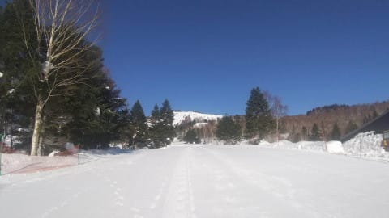

本日は，昨日の地震の影響で，

焼額ではファーストトラックの

営業が無かったようですが．

通常営業開始前はこの程度の人が並んで

いたようです…

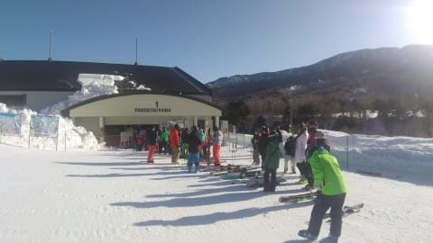

そして．

えええ？？

今日は朝から気温が0℃近いんですが！？？

…これは．

2月上旬として，ありえない高温なんですが…

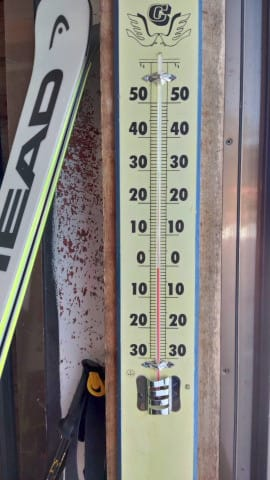

でも，朝イチはシマシマ！！

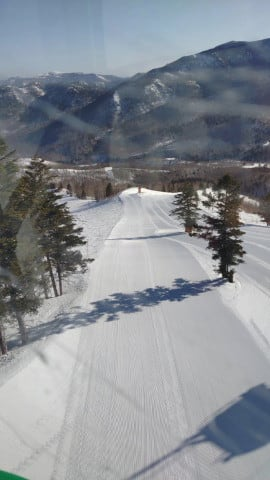

あさイチのうちは，比較的硬めの，意外と

いい感じのシマシマを滑れたようですが…

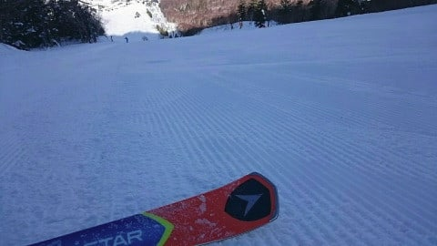

やはり気温が高かった本日．

バーンはすぐにコロコロが出てきて

しまったようです…

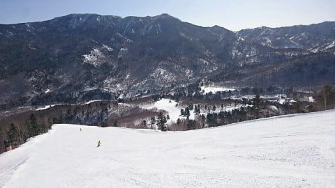

ただ，気温がむちゃくちゃ高く，日差しが

かなり強烈だった本日．

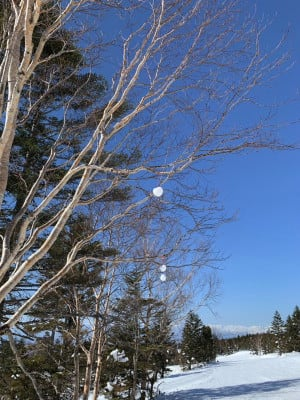

そのおかげで，バーンの殺人コロコロも

すぐに緩んで，半殺しコロコロくらいに

なっていたらしいです…

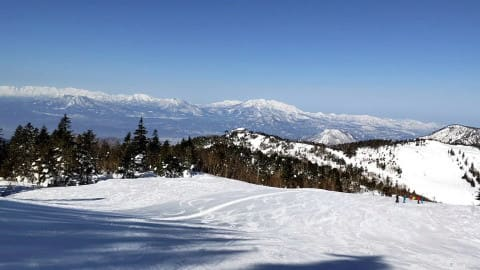

しかし．朝のうちのバーンコンディションは

一見良さそうに見えますが．

標高が低くて，日差しが強いところは

一気に雪が緩み始め…

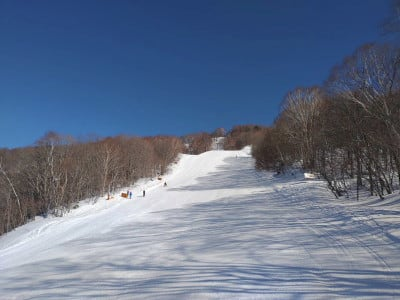

昼間の気温は+8℃くらいまで上がった

こともあって．

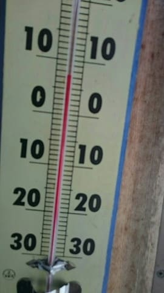

一の瀬方面は昼過ぎまで何とか雪は

もってくれたものの，午後はちょっと荒れ始め．

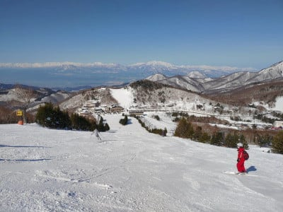

日差しの強いバーンでは，

板の滑りが悪くなる妖怪板掴みが

出現するレベルで．

とても2月上旬の志賀と思えない

雪だったようです…（涙）

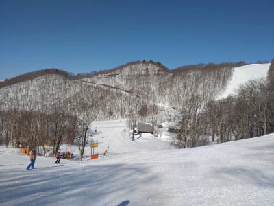

滑りが悪くなるほどではない

ゲレンデでも，強い日差し＆高温で，

雪は全体的にしっとりしてしまい．

重い3月~4月の雪になっていったようで．

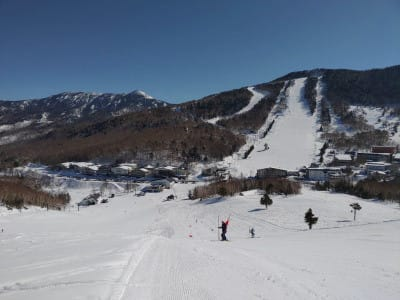

さらに，奥志賀のエキスパートコースは，

圧雪車故障で非圧雪でオープンした

というのもあり．

結構荒れた，重いバーンになっていった

ようです…

…でも，奥志賀って，

雪が重くなる時期に，毎年圧雪車が壊れて．

年に何回か非圧雪でのオープンに

なってますよね…

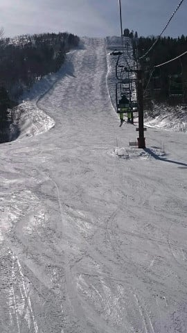

…で．ゴンドラ待ちがどのくらいだったのか，

午前中のレポートが無くて分からないのですが．

午後はガラガラの飛び乗りだったようで．

ゲレンデ自体は混んでなかったようです…

ってなことで．

天気はいいけど，雪質的には残念だった

らしい，本日の志賀高原ですが．

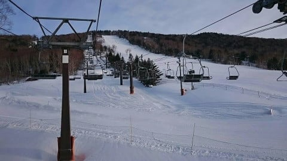

翌日は雨になるという予感を全く

感じさせない，すっきり晴天のまま

営業終了時間を迎えたようです…

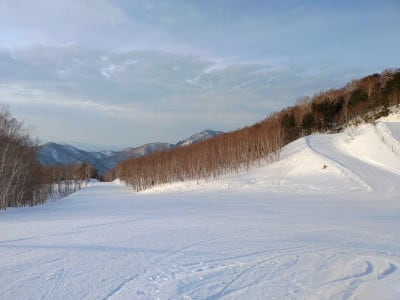

今日は，雪が重くなって残念だったけど．

どうせ明日の雨で壊滅的な雪になっちゃうんだし．

むしろ晴れただけ良かった…

という感じでしょうか．

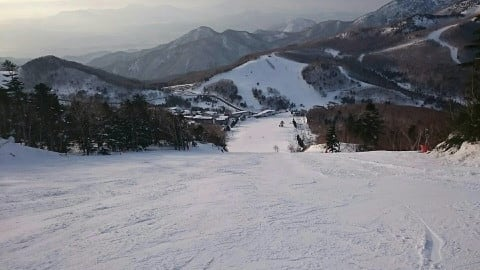

とても翌日の月曜未明から雨に

なるとは思えない，穏やかな夕日が

皮肉ですね…

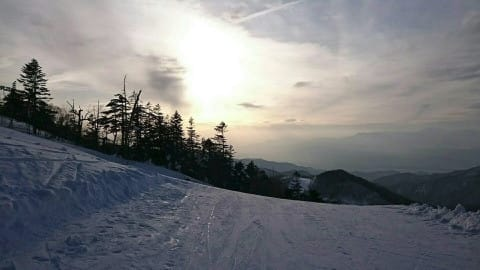

ということで．

月曜は諦めてください．

やはり，朝9時の850hpa気温図では．

赤い0℃線は志賀よりかなり北にあるし…

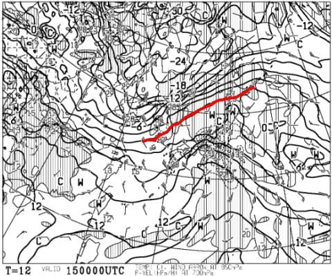

15日の朝9時から夜9時までの降水域は

日本をガッツリ覆っていて．

志賀高原でもかなりザーザー降りそう

です（激涙）

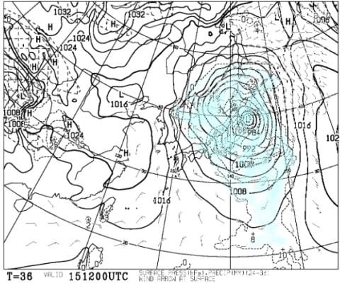

ということで．

15日は早朝から雨．

一日雨．時折強く降る．

ゲレンデは水浸し．

です（泣）

翌16日は冷えそうですが…

そんなに雪が降らなさそうなので．

16日は朝からゲレンデはガチガチ氷．

その上にうっすら雪…

曇り~雪がぱらつく

って感じでしょうか．

そして，17日は…

850hpa図を見ると．

赤い0℃線は沖縄まで下がっていて．

志賀には水色の-12℃線が！！

これは，朝は-15℃，昼も-10℃程度の

激冷えデーですね…！！

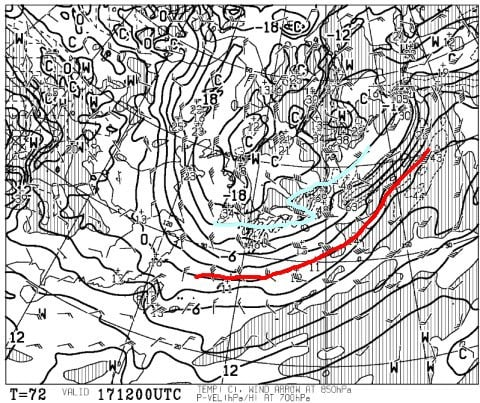

地上天気図は見事な冬型で，

日本海側はドカ雪になりそう！

…でも，完全西風なので，

志賀の積雪は20cmほどかな…

でも，氷は隠れてくれそうかな…！

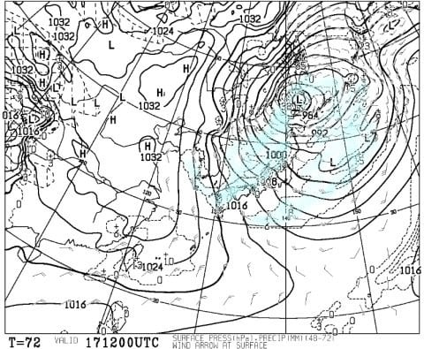

なので，

17日は激冷えで，朝から雪！

朝の積雪は10~20cm，

昼間も降り続けて積もる．

緩斜面はアイスバーンが隠れてくれそう．

って感じでしょうか…

18日も激冷えで雪が降ってくれそうなので．

…急斜面は，上の雪がはがれて下地の

硬いのが出てきちゃうかもしれませんが．

17，18日のそこそこの積雪で，

週末までにある程度はバーン状況は

回復しそうです…！

…しかし．15日の高温と17日の低温の差が

極端すぎる（涙）

15日の雨は，決してスキーに行けない私の

呪いのせいではありませんので，

私を恨まないようお願いします…

PS.

今日もおこみんは遠足に出かけていたようです．

志賀高原では無くて…

これは，斑尾？

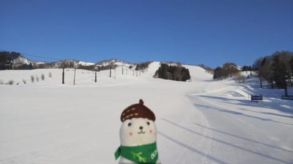

## 💬 コメント一覧

### 💬 コメント by (ほっぽ)
**タイトル**: レヴォーグ
**投稿日**: 2021-02-15 07:08:31

Ｓさん

ＶＭＧレヴォーグの気になること、気になります(^^;

続報と試乗インプレッションお待ちしています。

土日は標高の低い場所で修行していましたが、そこでも20000mステッカーの存在を知る方に声かけて頂き、ちょっと20000mネタで盛り上がりました。

長野県以外でも有名になりつつありますね。

ちょっとビックリしました。

http://hoppo.officialblog.jp/

### 💬 コメント by (新米パパ)
**タイトル**: Unknown
**投稿日**: 2021-02-15 09:15:26

ようやく、ようやく志賀高原の今季デビューを土日にいたしました。

あー、出遅れ感。。

でも、やはり、志賀高原は格別ですね、最高です。

もう、なんだかよく分からないけど、志賀高原は最高だと思い知らされました。

小学生スキーヤー達の上達ブリに我が娘もビビッてしまいご一緒できませんでしたが、、

うちのもナスパで頑張ってジュニア1級にあと少しなんですが、まあ、志賀高原のスキーヤー達はレベル高すぎる。

もう、冬の間だけ志賀に住みたい。

上信越道の千曲川SA越えてからのトンネルのスピード違反取締は注意せなあかんですね。

朝6時からやってるとは。。あそこ80キロ制限すからね。

免許取消されたら志賀高原に行けなくなっちゃうからなー。

### 💬 コメント by (おこ○ん)
**タイトル**: Unknown
**投稿日**: 2021-02-15 10:52:13

あ～ら・・・😁

Ｓしゃんなら✌️解るカナ❓️って🙄

残念ぇ～ん😁

土曜日は斑尾💞日曜日は戸狩野沢温泉スキー場でしたぁ～😅

長野県民が無料でしたぁ～👍😍🎵

### 💬 コメント by (レインボー73)
**タイトル**: Unknown
**投稿日**: 2021-02-15 11:04:24

月曜日の志賀高原情報（はやっ！）

液体が降るというエス様の予報をあざ笑ってやろうと、『てんきとくらす』の雪予報に期待をかけて上ってみたものの、ニゴンパークはしっかり雨。

私の負けだ！　ならば気持ち良く滑ってあざ笑ってやろうと、ゴンドラ2基ともストップのなか、雨の中４ロマ乗って２高へ。表面は硬くてブレーキも皆無だけど、ゴーグルの水滴で楽しくない。新調したカッパの紺もびしょびしょ。美女美女ならよかったのに。

結局２高を二本滑っただけで、九時にリタイア。レインボー（２時）なんて、名乗るもおこがましい。

ヤケビ限定で毎日出没する、あの76歳翁でさえ、とんぼ帰りしたのに。

ところが、４ロマ乗り場には『ネスコスキースクール』の、あんまり若くはない集団が！　今年も来てくれてありがとう。

皆様、安心してお仕事にお励みくださいませ、

### 💬 コメント by (さち)
**タイトル**: Unknown
**投稿日**: 2021-02-15 11:59:32

半殺しコロコロwww

### 💬 コメント by (お察しください)
**タイトル**: Unknown
**投稿日**: 2021-02-15 12:11:54

本日は西館WCコースでスーパーＧ開催、画像送りたかったですが、防水機能無しのスマホのためごめんなさい。

西館山頂は雪混じりの雨、雨なら滑ることを期待して出走しましたが妖怪が！私の足を掴む！

中腹から下の方が妖怪はいないけど、柔らか過ぎて滑らない。

ゴーグルにもワイパーが欲しいよね。

ウェアもぐっしょりのためリタイアします

### 💬 コメント by (お察しください)
**タイトル**: Unknown
**投稿日**: 2021-02-15 14:00:33

リタイア宣言後、やっぱり悔しいので西館とジャイアントを1本ずつ。

1億3000万人の読者の皆々様お喜びください！

12時半頃から徐々に雪の比率が増え、13時には湿っぽい雪に。

ジャイアントのリフトを降りる頃にはウェアにも積雪が。

冷え込み始めたため妖怪も退散。

西館もジャイアントも、誰もいないしよく滑り始めましたよ。

しかし既にインナーまで浸水しているため、ここで勇気ある撤退。

午後から滑り始めた人にはご褒美になったのではないかな。

### 💬 コメント by (いちと)
**タイトル**: Unknown
**投稿日**: 2021-02-15 16:26:19

昨日まで、4泊で参戦しました　S様の当初の予想を1日ずらして頂き、お陰様で、いい天気で快適に過ごせましたし、今シーズン、アスペン神田で買った板もおろせました　今日からジャイアントでも大会もあると聞いていましたが、生憎の天気でなんだか申し訳ない気分です　でも志賀高原は、私以上の先輩達が元気で、コロナをぶっ飛ばす勢いには、尊敬に値しますし、高級リゾートでない、志賀高原独特の合宿雰囲気が来年には完全復活を願わずにはいられません

### 💬 コメント by (レインボー73)
**タイトル**: Unknown
**投稿日**: 2021-02-15 19:03:53

月曜日の志賀高原情報２

朝はゴンドラ両方ストップだったけど、10時から１ゴンが動いたそうな。根性なしスキーヤーふるい落とし機能に、私らは30分で落ちたけど、兵（ツワモノ）達もいるもんですね。過ごすぎです。西館様も凄すぎ。西館Jrも凄すぎ。

もっとスキーを好きにならなくちゃ。

明日も強風予報なので、ゴンドラ危ない。あと２ヶ月しかできないなんて、今のうちにスキーしとこっと。

### 💬 コメント by (レインボー73)
**タイトル**: Unknown
**投稿日**: 2021-02-15 19:06:44

明日はゴンドラ正面からの風予報なので、動きそうな気がします。明日に期待して、皆様、おやすみなさいませ。

### 💬 コメント by (Goku)
**タイトル**: Unknown
**投稿日**: 2021-02-15 19:47:08

昨日は何てったて、オープンしたての一の瀬・パーフェクターが最高でした(^^♪

エッジ噛み噛み、泪チョチョ切れ、まさに昇天バーンでしたよ。

で、パーフェクターを思う存分滑れるいい方法を思いつきました！それはまたお会いしたときにでも。

### 💬 コメント by (レインボー73)
**タイトル**: Unknown
**投稿日**: 2021-02-15 21:06:54

極様、昨日、パーフェクタはポールが張ってあったのでは？

### 💬 コメント by (Goku)
**タイトル**: レインボー様
**投稿日**: 2021-02-15 23:59:15

ポールは基本１３時までで終了です。

昨日はオープンしたてのコースを一の瀬の神様と爆走しました。

### 💬 コメント by (Skier_S)
**タイトル**: コメント回答遅れました
**投稿日**: 2021-02-16 09:24:59

＞ほっぽさま

LEVORGは追ってレポートしますが…後日改めて入院になりました．

そして，20000mステッカー，そんなに有名だったんですね．

ゴールドは驚かれたんじゃないですか？？

ステッカーが会話のきっかけになったなら嬉しいですね…

＞新米パパさま

ようこそ，志賀高原へお帰りなさい！

やっぱり志賀がいいですよね…

しかし，焼額キッズたちのレベルの高さは私もびっくりしています…

また志賀高原でお会いしましょう！

＞Yumiさま

戸狩はかつて20年ほど前，人生一度しか行ったことが無いので…分からなかったです（涙）

今日も遠征お疲れ様です～！

＞レインボー73さま

さすがのレインボーさんでも30分で早上りでしたか(笑)．

しかし，それでもちゃんとスキー場まで行っているところが

偉いですね(笑)．

＞さちさま

某特派員が「半殺しコロコロ」と書いていたので…

そのまま書きました(笑)．

＞お察しくださいさま

雨の中，レポートありがとうございます…

西舘は，午前中は滑り悪かったんですね．

午後まで雨，夜から雪の予想だったんですが…

予想より早く雪になって，ちょっとは良かったのかな？

雨の中の滑走，お疲れ様でした！

＞いちとさま

木曜から日曜までは，ベストな滞在期間でしたね！

いい天気で滑れて良かったのではないででしょうか…

月曜はちょっと残念な天気だったようですが，

木曜日くらいまでものすごい冷えた雪になるので

すぐ回復しそうです．

また志賀高原へお越しください～

＞Gokuさま

他のゲレンデが軒並み高温でやられていく中，パーフェクター良かったんですね…

今度お会いした時に秘儀を教えてください！

### 💬 コメント by (レインボー73)
**タイトル**: Unknown
**投稿日**: 2021-02-16 11:43:16

火曜日の志賀高原情報

あれれ、朝の湯田中、積雪1ｾﾝﾁ。蓮池ー６℃。天界は雪。除雪量が半端ない。膝まで積もったとか。

当然ミニファーストはなし。パノラマからカラマツへ。あれれ、気持ちいい。圧雪の上には数cmの新雪だけ。ただ、特に走る雪ではない。2高は指先が冷たすぎで、連続では無理。

オリンピックも５センチくらいかなあ。平らで滑りやすい。ＧＳはもうやや荒れ。

ＳＧＳは友人によると、『真っ平らで重いけど滑りやすい』とのこと。

ダイヤモンドは非圧雪まる残り。フィッシャーＧＳ板で初の膝パフ。浮く浮く。少しだけ自信。

ファミリーはボコボコ深い。下から吹き上げる雪煙で、上下がわからず怖かった。

寒いので、高天の銀嶺でラーメン800円。もちろんgo to eat対応なので、得した感。

食べてるうちに晴れてきたけど、風はますます。西館はレースがあるようどし、たまごゴンドラは怪しいので、目指すはダイヤモンドかなあ。

