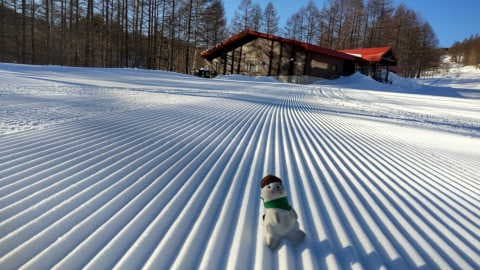
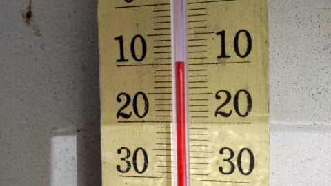
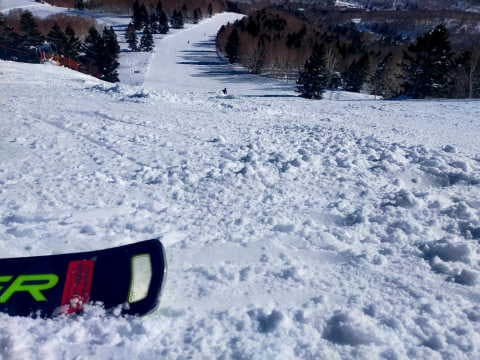
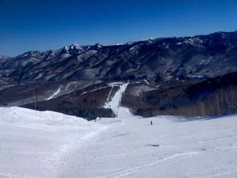
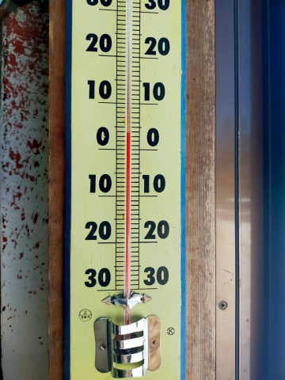

# 2月28日(火)の志賀高原スキー場，特派員レポート…晴れて気温は上がったけどいいコンディション！…そしてR30のGS板を履いてみた

📅 投稿日時: 2023-03-01 02:33:45

えー．

そういえば，この週末．

私の物欲を刺激することに異常に

長けている，某スキーショップの

社長さんから，←全然「某」になってないから

「R30のGS板あるから履いてみない？」

という悪魔のささやきを受けて．

2020シーズンモデルのFISCHERの，

レディス188cmのGS競技用板を数日間

借りて滑っていたのですが…

R=30mの板なんて，試乗会で履いてみようと

思うことは絶対ないので…生まれて

初めてのR30の板を体験しました！

…果たして．

こんな板履いて曲がれるのかな？？

と思ったけど．

意外と柔らかくて，良くたわんで曲がる！！

いや…最近のR30って，こんなに良く

曲がるんだ…

意外と柔らかく，驚くほどズラしのコントロール

性もいいし…

最近のR30の板は，驚くほど扱いやすい

ということを知って，ちょっとだけ物欲が

刺激されましたが…

うん．

まだ大丈夫．

R27のGS板も持ってるし．

物欲になんて，負けないぞ～！！

と，自分に言い聞かせている今日この頃．

皆様いかがお過ごしでしょうか（時候の挨拶）

ってなことで．

本日も志賀高原の特派員から写真が送られて

来たので．

2月28日の志賀高原，特派員レポートです！

…いや．

見事な晴れ＆シマシマですね…！！

そして，あさイチは放射冷却で-10℃まで

下がったようで…

…

これは，あさイチは最高だったでしょうね…

…こんな日に滑りたかった…

ただ．

昨日の昼間，強い日差しで雪が緩んだ

南向き斜面は，朝は殺人コロコロが

多かったみたいです…

でも，南向き斜面以外はコロコロ発生は

なく，特に北向きの奥志賀は終日いい雪

だったみたいです…

とはいえ．昼間はかなり気温が上がって…

最高気温は2月の志賀と思えない

プラス5℃近く！！（涙）

さらに快晴の強い日差しがゲレンデに

降り注いだので…

南向き斜面は，コロコロもすぐに緩んで，

しっとりした感じの雪になっていった

みたいです…

ただ．

春雪のように緩んだわけではなく．

南向き斜面がしっとりしたくらいで．

それ以外の斜面は，いい雪をキープ

してくれたみたいです…！

この高温は，明日の3/1まで続き．

明日は今日と同じ，最高気温は+3℃越えの

晴天になりそうですが…

3/2の朝から雪がちらつき始め．

3/2の夜に向かって冷えていき，

雪も10cmほど積もりそうです．

そして，そのあとの3/3,4,5は晴れて

くれるけど．

4，5日は，今日と同じくらいの

プラス気温になっちゃうかな～．

…’まぁ，雨が降るよりはいいかな．

ってなことで．

明日，今週末の詳細天気予想やります～！

## 💬 コメント一覧

### 💬 コメント by (レインボー75)
**タイトル**: Unknown
**投稿日**: 2023-03-01 16:00:01

水曜日の志賀高原情報

人の少ない一日でした。朝はまずまずの冷え込みで、快適バーンでしたが、昼前には下部はゆるんできました。西館で食事してニゴンの陣地に戻るときに、サウスの最後の分流で、出ました、妖怪足つかみ！

あーあ、春が来ちゃいましたね。昼過ぎの第一トンネル入り口では、恒例のスリップ事故。気温は３℃でした。0℃前後は危ないんですよ。楽に走れるから余計に怖いんです。志賀高原は雪質は最高なんですが、事故が多いので、くれぐれも慎重運転がお勧めです。

今日は快適やけびをぐるぐるしてましたが、特派員から奥志賀いいよって連絡が入ってました。オリンピックも白樺も、「この快適続け」と唱えながら楽しめました。

明日は湿った雪が降るのかなあ！

それから、最近は書き込みをサボることが多かったですが、２月は皆勤賞を受賞しました。誰も何もくれませんが。

さらに私事ですが、今日は47回目の結婚記念日なんですが、スキーがあるから帰れない私って！

### 💬 コメント by (Skier_S)
**タイトル**: ＞レインボー75さま
**投稿日**: 2023-03-02 02:27:18

あ，2月は皆勤だったんですね…！

あと，結婚記念日おめでとうございます！！

…こんな日に一人で滑っていていいんですか…？（笑）

