# 1月20，21日の週末の志賀高原スキー場の天気は…晴れそうだけど，積雪がないので…コロコロ＆固い斜面かな（ちょい涙）

📅 投稿日時: 2018-01-18 02:34:42

えー．

本日．

かなり残念なことに．

やはり，[志賀高原は予想通り雨](https://www.facebook.com/okushiga.kogen/posts/940754059408236)になってしまったようで…（泣）

山頂付近はぎりぎり雪だったみたいですが．

…昨日の予想の

　山頂付近は湿っぽい雪がわずかにぱらつき．

　麓は…ミゾレ，標高が低いところは雨っぽいのが

　ポツポツ降る感じでしょうか…

　あ，風が強そうなので，焼額2ゴンと奥ゴンは

　ヤバいかな．

と言う通りの天気だったようです…（泣）．

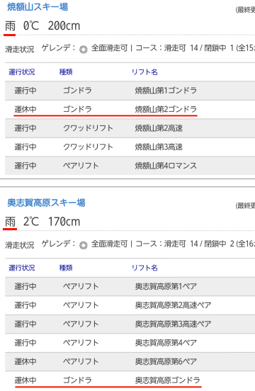

（[志賀高原索道協会HP](http://www.shigakogen-ski.com/live-lift-status/list)より）

さらに予想通り，焼額2ゴンと奥ゴンは

運休だったようで．

…こんな悪い天気の予想は，当たらなくていいのに…．

なぜ，こんな予想はここまでぴったり当たるのか…（泣）．

幸い，ザーザーぶりにならず．

予想通り，ポツポツというか，パラパラ程度の降りで

収まった，というのがせめてもの救いですが…

夜になって雪に変わったようですけど…

気温が高いので，かなり湿った雪のようです（涙）．

そして．

この雪はそれほど積もらず．

このままほとんど積雪が無いまま，週末に突入しそうです（激泣）．

あぁ…

土日は殺人コロコロ＆固いバーンなのか…

とりあえず．

土曜20日の850hpa気温図を見ると．

赤い0℃線は本州南側．

志賀は-3℃線が掛かるくらいなので．

このシーズンにしては高めの気温ですが，

昼間もマイナス気温をキープしそうかな．

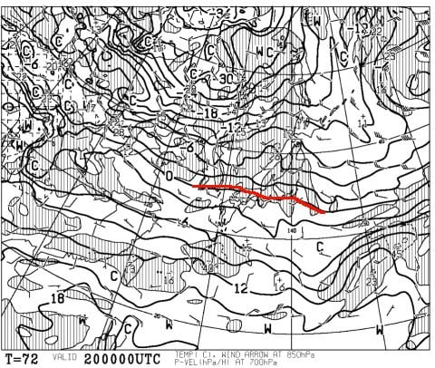

そして，土曜20日の地上天気図は…

うむ．

降水域は志賀に掛かってないし．

まぁ，晴れそうな天気図かな～．

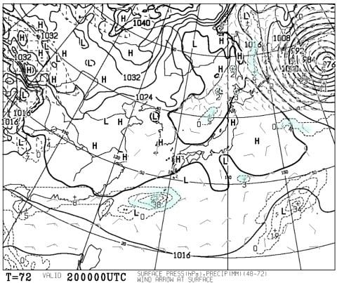

…逆に言うと，全く積雪は期待できませんね．

今日の雨で固まった雪が，隠れてくれなさそう…（涙）．

で．

日曜21日の850hpa気温図は．

まぁ，この日も20日と同じ程度．

本州南岸に赤い0℃線，志賀は-3℃線が

かかる程度．

山頂は昼間も0℃まで上がるかどうか…

という程度で，この時期の志賀としては

ちょいと高めの気温．

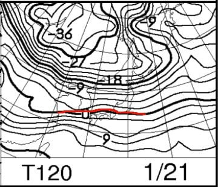

そして，日曜の地上天気図は…

…この日も降水を予想する網掛けが志賀に

かかっていないので．

まぁ，晴れそうですね．

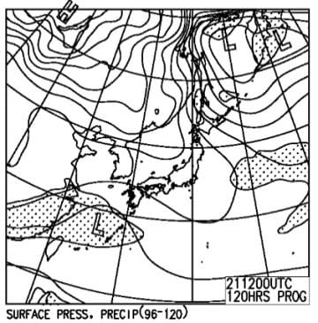

またの言葉でいうと「全く積雪がなさそう」

…あぁ…

やはり氷の固い下地が出てきそう…

ってことで．

この週末の天気をまとめると．

土曜：朝から晴れ！終日晴天．朝の気温は-5℃程度．

　朝イチは締まり気味のきれいな圧雪で，

　朝イチはかなり楽しめるかな！

　昼は0℃近くまで気温が上がるか…

　昼近くには，バーンは大量のコロコロ＆

　固めの下地が出てきそう．

日曜：この日も晴れ．朝の気温は-5℃程度，

　この日も，朝イチの圧雪かけたて斜面は，

　締まったハイスピードシマシマバーン！

　ただ，じき氷のコロコロが出てきて，

　急斜面はすぐに下地の固いのが顔を

　出してくるでしょう…

　昼間は気温0度くらい．

　雪は固いとは言っても，ツルツルアイスバーンと

　いうよりザラザラ固まった感じかな．

　新雪が積もってないし，バーンは固めなので

　午後になっても凸凹にならないかも…

　

って感じでしょうか．

下地は固いし，氷のコロコロは出てきそうだけど．

まぁ，それほど寒すぎるでもなく，晴天で．

ちょうどいいスキー日和の天気になりそうです…

…

で．

ここで終わらない．

まだ続く，週末以降の天気予想．

22日，月曜の850hpa図を見てみると…

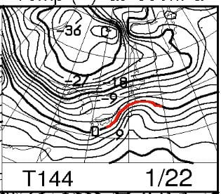

うが！

やばい．

0℃線が志賀高原より北に行っちゃってるように

見える…っ！！？

そして，月曜の地上天気図は…

…

うがぁ！

本州全体を覆う，降水域！

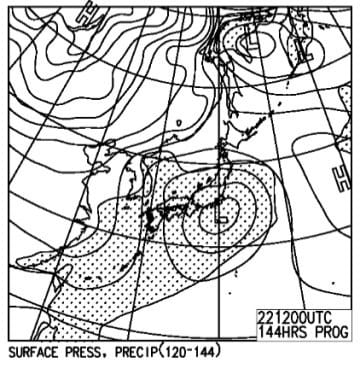

…これは，

また22日に雨の危機か！？？

…と．思いますが．

もう一度，22日の850hpa図を見ると．

うーむ．

心眼で赤線の曲がり方を見ると．

大体水色にマークした東北あたりが

低気圧中心だよな…

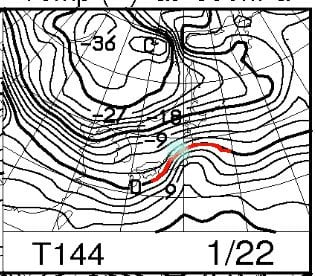

だから，志賀高原より北側にある低気圧に向かって

南風が吹き込むんで，気温が上がるんだけど…

でも．22日の地上天気図をもう一度見てみると．

関東の南あたりに低気圧があるよ？

これだと，志賀は低気圧に向かって北風が

吹き込む形なので．

こんなに高温にならないはず！？？

このずれは一体…？？

…

そうです．

これは．

[以前にネタにした，GSMとアンサンブル平均の
ずれ](e3c57af4e9600e6caa6b63c9b953889b8.md)です．

この，赤字でマークした点線がGSM，

青でマークした太線がアンサンブル平均です…

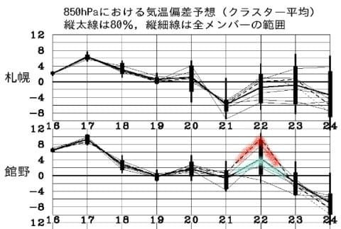

22日は予想のばらつきが大きく．

赤のGSMはかなり高温にずれてしまってます．

この，850hpa図は気温が高めの赤線のGSMに基づく図，

この地上天気図は気温が低めの青線の

アンサンブル平均に基づく図です．

で．

こういう感じでばらつきが大きい予想の場合は．

大体アンサンブル平均値に落ち着く確率が高いので．

まぁ，GSMベースの850hpa図ほど高温になる

可能性は低いでしょう．

うん．高温になる可能性は低い．

アンサンブル平均の地上天気図通り，

低気圧は志賀より南を通り．

志賀は低気圧に北風が吹き込むので，

それほど高温にならないはず…

大丈夫です．22日は雪でしょう．

…そして．

23，24日は激冷え．

特に，24日は…

ふあ？

なに？

水色の-15度線が志賀高原に！？？

これは…志賀は-18度とか，それ以下に冷え込むよ！？？

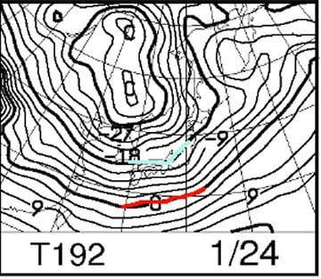

で．地上天気図を見ると…

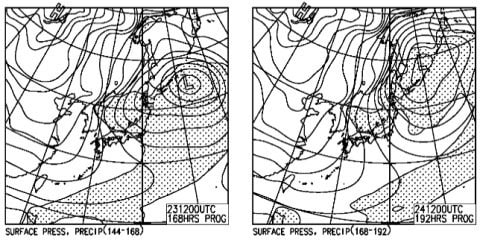

…

…見事な縦縞冬型の天気図．

これは…23，24日は降りますね．

雪が降る日の翌日，24日，25日は

パウダーねらい目ですね．

…平日休める人で．

パウダーを滑りたい人は．

24，25日を狙おう！

＃24日はかなり吹雪きそうなので，25日の方がいいかな…

## 💬 コメント一覧

### 💬 コメント by (まいる)
**タイトル**: 土日
**投稿日**: 2018-01-19 17:45:40

お疲れ様です。

いよいよ、明日から志賀高原ですが、土日の雪質は悪そうですね

とりあえず、明日はスキーの予定で、ボードは履きません。

到着したら、ゴンドラ乗り場で書き込みしますねー

### 💬 コメント by (Skier_S)
**タイトル**: まいるさま
**投稿日**: 2018-01-19 23:24:02

をを！

久しぶりの志賀高原ですね！

明日はまたイチゴングルグルしてます…

しかし，明日はスキーなんですね？？

…昨シーズンはお会いできず，

どんなウェアだったかとかはっきり

覚えてないので，また声をかけてください~！

### 💬 コメント by (まいる)
**タイトル**: 外観は
**投稿日**: 2018-01-20 00:15:18

Sさん、こんばんは

私も記憶が飛んでるかもです。

藍色のメットで灰色のジャケットです。

Sさんは板で発見ですかねー

１ゴン了解です。

### 💬 コメント by (Skier_S)
**タイトル**: まいるさま
**投稿日**: 2018-01-20 22:34:46

今日はお疲れさまでした～！

無事お会いできて良かったです…

また来月も一緒に滑りましょう！

