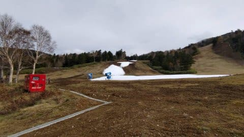
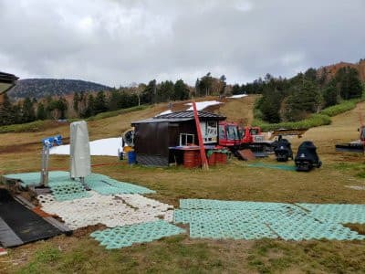

# 今週は11月3日(水)も休みじゃないか！…軽井沢オープンのこの日，Yetiも軽井沢も曇り～晴れ．そして5日横手プレオープンは厳しいか

📅 投稿日時: 2021-11-02 01:30:46

🏷️ カテゴリ: [日記](cc4b5682fb7b8b144980957a978653fb0.md)

いや．

よく考えると．

今週水曜日は，祭日じゃないですか…っ！！

週の平日が4日しかないおかげで，

普段5日でやる処理を4日でこなさねば

ならず．

ちょっと仕事が切羽詰まっていて…

今週は，Blogを更新するどころじゃ

ないのですが…（涙）

でも，手短に更新！

えー．

とりあえず，祭日の水曜，11月3日には．

ついに軽井沢スキー場がオープン

しますね～！！

おそらく，3日は軽井沢もYetiも，

晴れ～曇り，といった天気．

Yetiはもしかしたら，一瞬雨がパラパラっと

落ちてくることもあるかもしれませんが…

本格的な雨にはならないと思うので，

ご安心を．

そして．

3日から4日にかけて．

当初予定よりちょっとだけ冷えそうで…

横手の2000mを超えるところ，ギリギリ

雪がぱらつくかも…！！

おそらく，3日午後から4日午前にかけて．

運がよければ，横手は人工降雪機が

動かせるくらい冷える可能性が…！

…でも．

特派員から送られてきた，今日の横手の

状況を見るに…

うーむ．

一晩くらい人工降雪機が動かせたからって，

滑れるレベルにはならなさそうな感じ…

運がよければ，3日昼間から4日は午後まで

人工降雪機が動かせるかもしれないけど…

そこまで冷えるかギリギリきわどいところ．

うーむ．

やっぱり横手山，5日プレオープンは

厳しそうな予感…

…もし．

もし，これで5日に無事横手山が

オープンできたら．

それは，

横手山スタッフの執念と．

横手で滑りたい人の怨念による，

空間のねじれが生み出した奇跡

としか言いようがないです…

うーん．

でも，

この時期に横手の人工降雪で滑りたい

って人は，いろんな怨念が強そうだから．

もしかしたら，奇跡が起きるかも…
