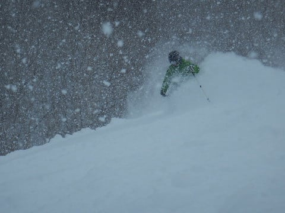
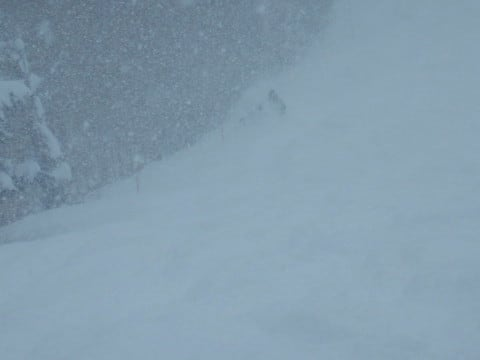

# うぎゃー！今シーズン初転倒っ！4シーズンぶりの，板が外れるような転倒だよ…そして，新雪で板を外れた時の探し方

📅 投稿日時: 2018-01-31 02:47:24

🏷️ カテゴリ: [日記](cc4b5682fb7b8b144980957a978653fb0.md)

えー．

ちょっと時間が経ってしまったネタなのですが．

正月休みに，オリンピックコースが

ひざパフになった日のこと．

…この，膝パフオリンピックコース．

一見気持ちよさそうに見えるけど．

下地のカリカリの凸凹の上に，40cmの軽いパウダーが乗って．

底の凸凹が全く見えず，

いきなり突き上げを食らったり．

エッジが突然固い雪に引っかかったりと．

かなり難しいコンディション…

最初は「パウダーだぁ！（はぁと）」って感じで

喜んで太板で突っ込んだけど…

幅が広い板のエッジが，見えない新雪の下の

カリカリに引っかかると，

板がどう反応するか分からず，

これはちょっと怖い…

…そういう時は．

そうです．

出動だ！SXっ！！

そう…

私の体の一部と化しているSXを履けば．

我が家になぜか４セットも並んでいるSXを履けば．

どんな難しい斜面でも，

どんな難しいコンディションでも．

なんの苦も無く滑れるのだ！

…と，SXで新雪エリアに突っ込んで．

見えない凸凹があろうが，SXを履いていれば

怖くないのだ！

と，気持ちよく大回りをかましていると…

「ガツン」

と，新雪に隠れていた，かなり大きく固い凸に板が

突き刺さった感触があり…

そのまま片足の板が外れ，前方一回転宙返りっ！！

あぁ…

転んだ！！！

転んじゃったよ～！

転ぶって，こんなだったんだなぁ…

と．

ここ数シーズンほぼ忘れかけた感触を

久しぶりに思い出しながら．

雪面に投げ出される自分がいたのでした…

しかし．板を外して転ぶなんて．

昨シーズンはポテこけ1回，他人との交錯1回で，

板が外れるような転倒はせず．

一昨シーズンは未転倒．

3シーズン前は，衝突で1回こけたけど，板が外れるほどでは

なかったし…

…となると，4シーズンぶりか！！

あぁ…

自分も転ぶんだなぁ…

と，思いながら立ち上がると．

…

…

外れた方の板が無い…（汗）．

当然，パフパフ新雪の下に埋もれて，

板が全く見当たらないわけですね（涙）．

やっちまった…

やっちまったよ．

よりによって，一番こけてはいけないところ．

板を外すと厄介なところでこけちゃったよ…

こういう場合は冷静になって．

まず，こけて静止したところにストックを1本立てて．

そして，冷静に上を見て．

自分が転がり落ちた跡を見極め．

滑っていたシュプールが，転倒した跡に

変わる地点…すなわち，転んだ地点に

ストックをもう1本立てて．

で，その間を冷静に探す，と．

これまで，新雪で板を見失った人を何度か助けたけど．

慣れてない人はむやみやたら動き回って，

自分の転んだあとも消えてしまい，

目印が無くなって，どこで転んだのか，

どこで立ち上がったかがすぐに

分からなくなるので．

まず，転んだ地点と止まった地点の2か所．

冷静にストックを刺しておくことを忘れずに！！

すぐ見つかるや…

と思って，ストックでマークをせずに探し始めると．

すぐに「どこで転んでどこで止まったか」

が分からなくなって，探す範囲が

むやみやたら広くなるので，ご注意！

…で．

ストックを立てたあと．

2本のストックの間の雪を，外れなかったほうの板で，

1m間隔くらいで切るように探していくと…

ガツン，と外れた板にぶつかります．

はい．

すぐ見つかりました．

…良かった…

しかし．

SXを履いていれば転ばないという，根拠のない自信が

崩れてしまった…（涙）．

これは．

昨シーズン，新雪で転倒し．

[太い板さえ履いていれば転ばなかったのに](edf393fc02a8cc288e2dfee4b6e45eaf4.md)…

という強い思いが，私に太い板を買わせたのですが．

それにもかかわらず．

太い板を履かずに新雪を滑ったので．

「新雪で転ばないように私を買ったのではなかったの？？？」

という太い板のジェラシーというか怨念が，

私を転倒させたのでは…

と思わずにいられない，Skier_Sだったのでした．

…次からは新雪では素直に太い板を履こう…

## 💬 コメント一覧

### 💬 コメント by (komu)
**タイトル**: 4年前
**投稿日**: 2018-01-31 07:27:54

大転倒を見たような…

今回は怪我しなくて良かったですね。

速度域が普通ではないので気を付けましょう

### 💬 コメント by (ほっぽ)
**タイトル**: 私もコケました。
**投稿日**: 2018-01-31 08:58:51

Sさん

私も先日イエティでGS板で練習してたら内側に乗ってしまいコケました。

アイスバーンだったので痛かったです。

昨夜はイエティも雪が降ってプチパウダーが楽しめました。

### 💬 コメント by (しんちゃん)
**タイトル**: こけるとその後･･･
**投稿日**: 2018-01-31 22:53:18

私もシーズン中ちょくちょくこけます(笑)

こけた後、2日後ぐらいに筋肉痛になってしまいます(^^;

Ｓさんは大丈夫でしょうか？

滑走スピードが尋常じゃないですし、お体お大事に(^^)/

### 💬 コメント by (Skier_S)
**タイトル**: みなさん，怪我しないように…
**投稿日**: 2018-02-01 00:30:35

＞komuさま

いや…

そんなこともありましたね…

膝がかなり痛くて曲げられず，スキーウェアのズボンをはくのに

苦労した思い出が…←それでも滑ったけど

＞ほっぽさま

あら…けがしないようにお気を付けください！

しかし，イエティでパウダーとは珍しいですね~．

＞しんちゃんさま

こけた後筋肉痛になったことはないです…

筋肉痛が出るのは足でしょうか？？

しかし，トップスピードでこけたら

ヤバいでしょうが、以前トップスピードで

転んだのがいつか思い出せないくらい，

セーフティーな滑りで転ばないように

しているスキーヤーなので(笑)

