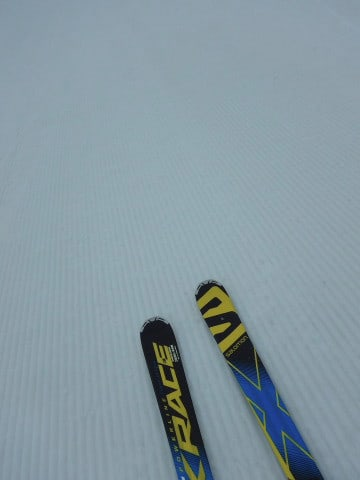
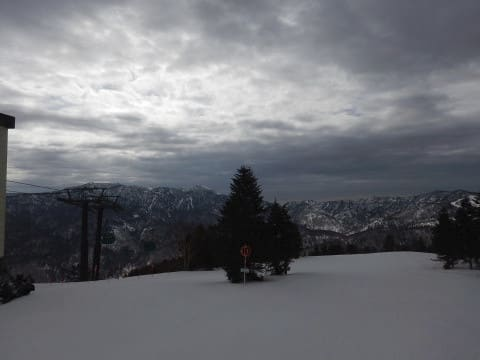
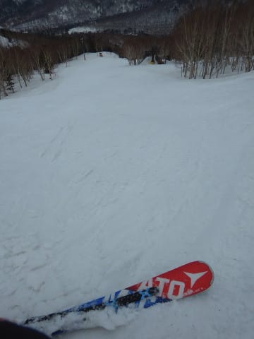
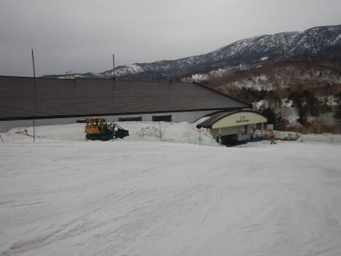

# 2019/4/21(日)の志賀高原スキー場，詳細レポート！…朝から気温は高かったけど，終日曇りだったので壊滅的ザブザブにならず．板は比較的滑り，ガラガラだったので楽しめたよ

📅 投稿日時: 2019-04-23 03:20:40

ということで．

GW初日の4月27日の志賀高原．

まだ予想ばらつきが大きい状況で．

確定的なことは言えませんが…

雪が降る可能性が高いです．

ええ．

雪です！！

…ただ．

繰り返しますが．

27日の予想は，まだばらつきが大きく．

あと1-2℃予想気温がずれると

雨になりそうなので，

まだ断定はできません…

とりあえず．

27日の土曜日に志賀に行く人は．

まだスタッドレスタイヤを履き替えない

ことをおススメしておきます…

うーむ．

どうせ降るなら．

腰パフくらいの新雪パウダーを期待っ！←だから，この時期にそんなに降ったら異常気象だから

ってことで．

本題の，日曜の志賀高原のレポートです～！

えー．

この日は気温が上がりそうだったので．

雪がいいうちの，あさイチが勝負だ！

…と，やる気満々で朝6:30の早朝営業から

並びますが…←朝イチが勝負って…結局ラストまで滑るんでしょ（全員が思うツッコミ）

最終的にはこの後ろに，駐車場に達する

ほどの長い列ができたので．

うむ．

焼額の早朝営業，今日はかなり参加者が

多そうですね…

ってことで．

あさイチゴンドラで山頂に出ると…

うむ？？

確か，誰かさんは晴れと予想してたのに．

見事に曇ってますね…

まぁ，この時期は．

晴れるより曇った方が，

雪が緩まなくていいのだ！

このくらいが一番いいのだ！←天気予想が外れたことを必死にごまかしている

…しかし．

気温は朝6:30ですでに+3℃ですか(涙）

気温高すぎ…（泣）

いや…

これで晴天だったら，雪がどうしようも

ないほど緩むところだったけど．

曇りで良かった…

ってことで．

朝から気温が高かったので．

バーン表面はガチガチに固まっておらず．

ガッツリ足場が作れる，いい感じで

板が食い込む柔らかさ！

…これは．

傾きたい放題の，快感大回り

バーンではないですか！！

大勢の人が並んでいた早朝営業

だけど．

2本目以降は滑る人もばらけていき．

ゲレンデはいい感じの貸し切りバーンに

なってきて…

それでいて，日が射してないので，

雪が一気に緩むこともなく．

いい感じで板が雪面に食い込む，

ガラガラシマシマバーンを，

好き勝手に大回りしたい放題っ！！

早朝営業の2時間の間．

ひたすらいい感じの大回りを

お腹いっぱい満喫…

いや～．

この時期の早朝営業．

やめられませんな！！

で．

8:30の通常営業開始時間には．

パノラマコースがオープンされるので．

まだ誰も滑っていない，

パノラマ～サウスへ，Go！

…そして．

早朝に続き，シマシマのおかわりを

いただくのだ！

いやーーー．

今日は人が少ない！

もう，完全貸し切りバーン状態！

誰もいないよ！

人が少ないので，雪がほとんど荒れず．

9時を過ぎて，雪が柔らかくなってきても．

柔らかい雪で気持ちよく大回り可能！

第2高速リフト沿いの，唐松コースも．

貸し切りフラットバーンで…

雪は緩んできたものの，

10時過ぎくらいまではかなり気持ちよく

滑れる雪でした～！

ってな感じで．

焼額がいい感じなので．

なかなか焼額を脱出できませんでしたが．

さすがに11時半ごろになると，ちょっと

雪が重たくなってきたので…

ようやっと，試乗会のために

一の瀬へ移動します…

いや．

今日はこのままずっと焼額に籠ろうかと，

一瞬思ったんですが…

どうもこんなシロートの試乗レポートを

期待している一部特殊な読者の方もいらっしゃるようなので．

ここは読者の皆さんのために，

ホームゲレンデを捨てて，

一の瀬へ向かうのだ…

偉いぞ，自分！←いや，ただ単に自分が試乗したいだけでしょ

一の瀬は，試乗会があるからか．

焼額より滑っている人が多いですね…

一の瀬到着は12時ごろでしたが．

この時間には，一の瀬正面バーンは

表面が完全に緩んでしまっているものの，

まだそれほど荒れておらず．

うむ．

試乗するにはまだギリギリ行けるかな？

そして．

パーフェクターコースは…

こちらは滑る人が少ないからか．

雪は正面バーンより緩いけど．

まだ大回りで行けるかな？

でも．

1時を過ぎてくると…

正面バーンの雪は一気に緩み始め．

そのせいで，正面バーンは激烈に

重い雪の，荒れ荒れバーンに

なっていきました…（涙）

…うーむ．

これはもう，雪が重すぎて．

試乗して板の性能が分かるレベルの

雪ではありませんね（泣）

パーフェクターは，滑る人が少ない分，

荒れてなくて，まだマシかな～．

と言いながらも．

試乗会が終了する，午後2時半過ぎまで

一の瀬を滑り倒して…

戻ってきました，焼額．

…いや，焼額，ガラガラなんですけど！！？？

ガラガラだったせいで．

全然雪面が荒れてないんですけど！？？

これは…

午後3時過ぎにこんなフラットバーンで

いいのか？？

そして，人がこんなにいなくていいのか？？

午後3時には，気温が+5℃と結構

高かったものの．

太陽が射さなかったし，人も

滑っていないので．

雪がほとんどフラットなままで，

板も結構滑るし…

いや，

これ，楽しいじゃないですか！

雪が柔らかいけど，

フラットで貸し切りで大回りしたい放題で．

いいじゃないですか！！

ビバ！焼額っ！！

…ってことで．

寂しいほど誰もいないゲレンデを．

今日もお約束通り，ゴンドラストップまで

滑り倒してきたのでした…

（この日，2ゴン山頂に掲げられたこいのぼり）

いやーー．

気温は上がったものの．

板が張り付く雪にならず．

焼額はいい感じのフラットバーンを

滑ることができて…

意外と楽しめた一日でした～！

で．

ついに，来週からGWですよっ！！

…GWは，毎日太い板が出せるほどの

ふかふかパウダーが降り続いてくれると

シアワセなんだけどなぁ…←だから，そんなことありえないから

今週金曜まで，ちょっと気温が高い日が

続くので心配だけど…

まだまだ雪はたっぷりあるし．

GWは楽しめますよ～！

## 💬 コメント一覧

### 💬 コメント by (NorthFox)
**タイトル**: 物欲選手権勃発？
**投稿日**: 2019-04-23 07:31:47

こんにちは。試乗レポート楽しみにしています。

私も20、21日と試乗させてもらい、ロシのDEMOのαのLTDがとても、とっても気に入りました。

自分の技量では持て余すだろうと思っていたのですが、全然そんなことは無くて緩んだゲレンデでも大変乗りやすく、しかも楽しかったです。楽しくて滑っていて笑っていた程です。

しかし、困りました。このところスキー用品の散財が続いているのに、こんなにも気に入った板が見つかってしまうとは。（カラーはちょっと派手すぎますが）どうしたものか．．．．

とりあえず気持ちを落ち着けるために神田の街に出かけようと思います。

### 💬 コメント by (原  克彦)
**タイトル**: Unknown
**投稿日**: 2019-04-23 10:16:00

スキーの話ではないのですが、スバル車のオーナーのSさんに質問です。

池袋の車の暴走事故により2人の方が亡くなられましたが、アイサイト付きのスバル車でしたら、車がストップして事なきを得たのしょうか？

駐車場から間違って後進と前進を間違えても前に障害物があれば進まないのでしょうか？

教えてください。

### 💬 コメント by (Skier_S)
**タイトル**: コメント回答遅れました！すみません…
**投稿日**: 2019-04-25 00:45:39

＞NorthFoxさま

こちらの回答を書いていたのですが，ちゃんと投稿されていなかったようで…

回答遅くなりましてすみません．

ロシのDEMO-ALPHA，いい板だと思います．

ぜひ，物欲の沼にまみれて行ってください．

神田の街に出るって…

自ら敗北に行く覚悟満々ですね(笑)．

＞原　克彦さま

回答遅くなりましてすみません．

アイサイト，基本的に人や車が目の前にいれば

ブレーキがかかるので，今回の事故も回避できた

可能性も高いのではと思います．

駐車場からの前進でも，前にある程度の高さの

障害物があればブレーキがかかります．

LEVORGもD型以降は，バックでも後ろの障害物で

ブレーキがかかりますし…

いろんな衝突の可能性は減らせます．

ただ，背が低い，1m以下の細いポールなどには

反応しないことがありますので，過信は禁物ですが．

