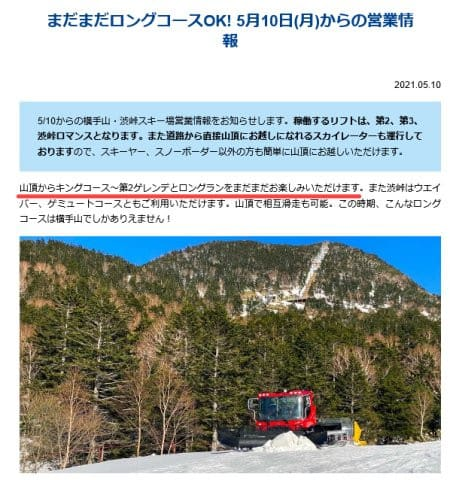
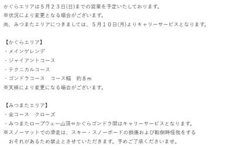
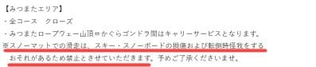
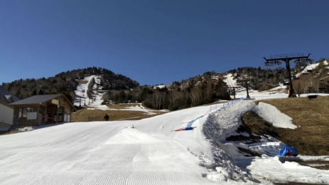
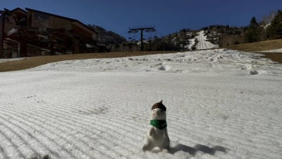
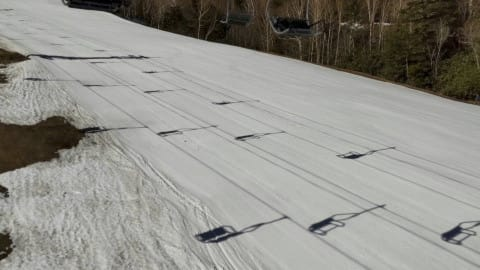
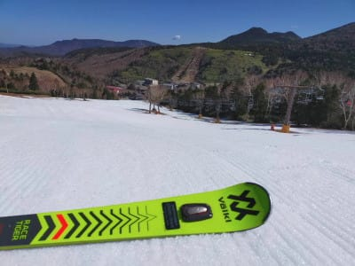
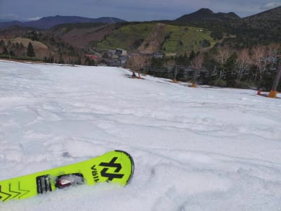
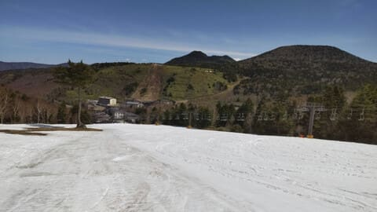

# 2021/5/10(月)の志賀高原，熊の湯スキー場特派員情報！…今日は意外と雪が滑ったようだけど…

📅 投稿日時: 2021-05-11 00:35:07

ということで．

熊の湯は今週末16日まで，

かぐらも来週末23日までの営業となり．

それ以降も残るは，横手＆渋と

月山くらいになってきたわけですが…

まだ，横手は山頂から第2トリプルまで

滑れるようですね…！

（[横手山スキー場ホームページ](https://yokoteyama2307.com/news/14475/)より)

ただ，かぐらスキー場の方は．

みつまたの雪が無くなったようで…

滑れるのはかぐらエリア＆ゴンドラ

コースのみ．

みつまたエリアはロープウェー山頂から

リフト＆徒歩移動になるようですが…

（[かぐらスキー場ホームページ](https://www.princehotels.co.jp/ski/kagura/informations/20202021/kosu/mitsumata_close/)より．以下同)

…って．

これ，よく見ると…

去年までは，みつまたの移動や

リフトを降りてからゴンドラまで，

ピスラボを滑っての移動もOKだったのに…

今年は，ピスラボ移動は禁止に

なったようですね…！！！

まぁ，私にとっては．板が痛みそうだし，

転ぶと怖いピスラボを滑るつもりは

毛頭ないので，問題は特にないのですが…

よっぽど怪我する人が続出したんでしょうか…

で．

これから週末にかけて．

明日の11日はちょっとだけ冷えそうなんですが．

13日から気温が上がり．

13日木曜の夜から14日金曜あたりと．

16日の日曜，雨になりそうな予感…

うーむ．

またここに来て，週末雨か（涙）

このGWも7日中3日間，雨にやられたし．

その前は，7週のうち6回の週末で雨だったとか．

今シーズンはホントに雨にたたられた

シーズンだなぁ（涙）

…ってなことで．

本日も志賀高原からの，特派員情報です~！

今日も志賀高原は晴天！！

そして，朝イチはシマシマ！

今日の朝は比較的冷えたらしく．

朝からザブザブではなく，雪は

比較的締まっていたようで．

朝のうちは板がいい感じで滑る，

楽しいバーンだったようです！

そして．

今日は昼間も気温は+7℃程度と，

平年比で言えば結構低めの気温

だったのもあり．

晴天だったわりに，昼近くまでそこそこ

滑るバーンで，結構楽しめたようです…！

さすがに，昼ごろになるとちょっとだけ

荒れてきたみたいですが…

でも，人が少なかったので，ひどい荒れ荒れ

斜面にはならなかったようで．

昨日と違って，かなりいい感じの

一日だったみたいですね…

ってな感じで．

熊の湯も，残るはあと6日．

無事，最後までもってくれるように祈る

ばかりですが…

最終日の16日，やっぱり雨っぽいなぁ…(涙）

でも．最近．

雨の方が混まないし，板が滑るので

イイかも…

と，思い始めている人が．

私の周りで増えているという，危険な兆候が…

やはり私の周りはおかしなスキーヤーばっかりだな

PS.

いつものおこみん特派員からのチャレンジ．

「おこみんはどこだ？」

## 💬 コメント一覧

### 💬 コメント by (ikkun)
**タイトル**: Unknown
**投稿日**: 2021-05-11 08:00:04

おはようございます   あ愛しのyellowフォルクル( *´艸｀)こうしたご報告受けたら……スキーヤーは心動きますよ❗罪な方々(笑)

### 💬 コメント by (Skier_S)
**タイトル**: ＞ikkunさま
**投稿日**: 2021-05-12 02:10:58

私も特派員からのレポートをよだれを垂らしながら見ています…

