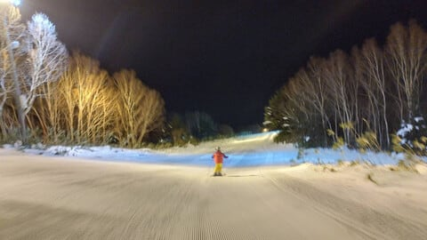

# 3連休なのに，スキーに行けなかった…

📅 投稿日時: 2024-01-07 05:08:54

🏷️ カテゴリ: [日記](cc4b5682fb7b8b144980957a978653fb0.md)

ということで．

3連休初日は大変きわめて残念なことに，

志賀高原へは行けませんでした（涙）

で．

私が行けなかった志賀高原．

おそらく槍やミサイルが降るはず…！

と思ってたけど．

特派員によると，朝は晴天のいい

コンディションだったようです…

でも．

1日に降って以降，ほとんど雪が

降らなかったため．

一旦オープンだった白樺コースが

クローズになり，

さらにGSコースも雪が薄くなってきて

来てるみたいですね…

まぁ，

私が行けないのでコンディションが良く

ならなくていいんですが←ひどい…

ただ…

本日から第3高速が動き，ナイターも

第3高速のイーストコースに変わって，

ナイターはすごく良かったみたいです…

悔しい…（涙）

で．

私は3連休2日目もスキーに行けそうにありません．

せっかくの3連休なのに…（こぼれる涙）

3連休中日も，妻の看病で過ごします．

あぁ…

こんな残念な3連休になるとは…

## 💬 コメント一覧

### 💬 コメント by (ねも)
**タイトル**: Unknown
**投稿日**: 2024-01-07 19:30:06

Ｓさん

お連れ合い、どうぞお大事に！

栂池で滑りましたが、春先のような雪だったり、人出いっぱいで、ご看病＋静養も良いかも？(笑)

雪不足はいつになったら解消するの!?という感じ😅

### 💬 コメント by (Skier_S)
**タイトル**: ＞ねもさま
**投稿日**: 2024-01-08 03:58:11

うーん．

やっぱりコンディション悪いんですね…

まぁ，私が行かなかったからかな？←それは違う

来週までにはちょっと降りそうなので，そこで状況改善に期待…！

### 💬 コメント by (Eddie)
**タイトル**: Unknown
**投稿日**: 2024-01-10 10:13:41

4~6日に志賀にいました。6日に、徒然さんに会えるかと、Fischerの板を頼りに探してましたが、残念。雪不足でしたが、空いていたので、楽しく滑れました。徒然さんのレポート、楽しみにしてます。

### 💬 コメント by (Skier_S)
**タイトル**: ＞Eddieさま
**投稿日**: 2024-01-12 00:33:40

コメント回答遅くなりました…

残念ながら，6日には志賀に行けず…お会いできず残念で

す．

まぁ，週末に焼額に行けば，大体かなり高い確率で発見できるかと思います（笑）．

また今後も志賀高原へお越しください！

