# 2020/1/25(土)の志賀高原スキー場は…先週の予想をい意味で裏切る，冷え冷え晴天！ゲレンデはちょいと硬めだけど，エッジが効く楽しいバーン！

📅 投稿日時: 2020-01-25 23:34:49

ということで．

いつも通り本日も，やってきてます志賀高原！！

いやーー．

先週初めのころの予想では．

ダメダメ高温雨降りの可能性もあった

志賀高原ですが．

フタを開けてみると．

ゲレンデはトップシーズンみたいにふわふわでは

なかったとはいえの．

晴天冷え冷え＆締まった雪の，いい感じの一日でした～！！

えー．

まず

朝に志賀高原に登ってくる道路ですが．

一部，かなりテュルンテュルンな感じで

滑ったので．

登れない車が多数…

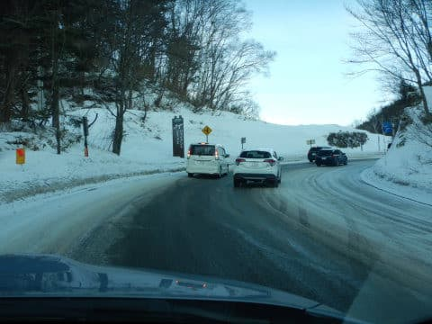

登れない車で道は結構詰まって

時間がかかるので，いつもより早めに

出てくることをおススメ…

そして，FF車や古いスタッドレスを履いた車は，

上林チェーンチェックのところでチェーン

装着をおススメしておきます…

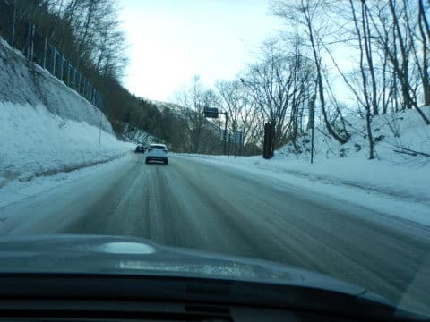

…ってな感じで．

テュルンテュルン道路を乗り越えて．

やってきました，焼額！

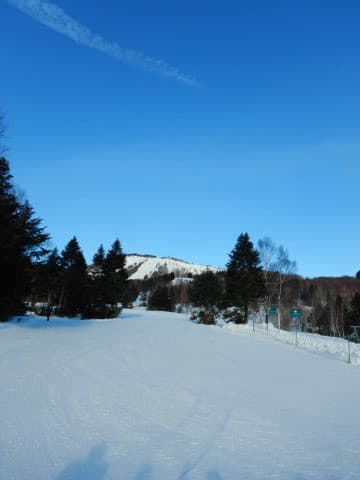

いい感じで晴天で，

わずかですが，新雪が乗っているので．

…これなら，ガチガチツルツルアイスバーンじゃ

なさそうですね…

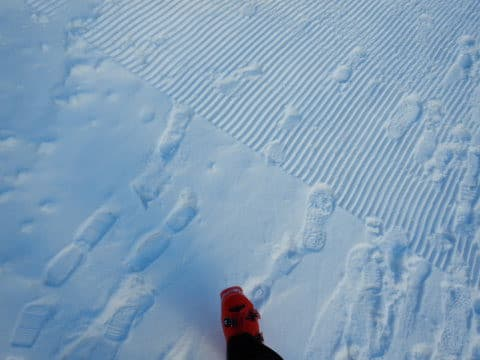

朝8:30の営業スタートに並んで，

ゴンドラで山頂に向かうと…

山頂気温は，-10℃と冷え冷え！

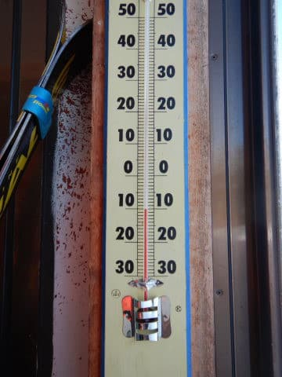

…経験則上，ここまで冷えると．

ガチガチガリガリアイスバーンではなく，

水気が抜けて，表面が崩れていき．

硬いバーンながらもエッジが効く，

いい感じのハイスピードバーンに

なるはずっ！！！

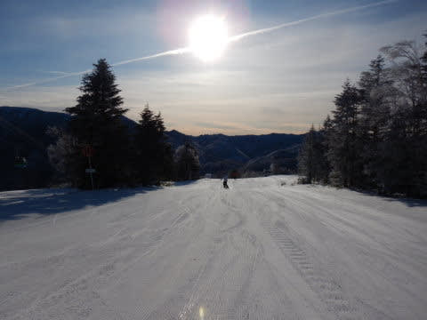

と，晴天ピカピカのシマシマバーンへ

飛び込むと…

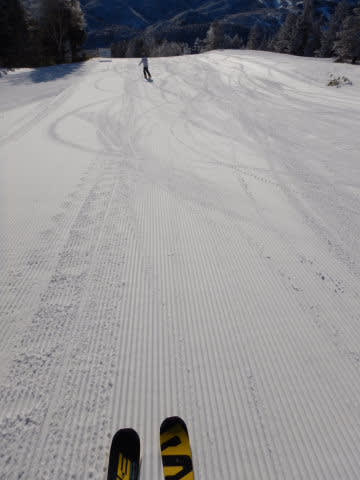

え！？？

いいよ！！

これは，予想よりいいよっ！！！

結構固めながらも，シマシマの凸部に

かっちりエッジが刺さりこみ，

それでいて足元の雪が崩れていかないという，

いい感じでエッジがとらえてくれる，

がっちり締まった最高のスピードバーン

じゃないですか！??

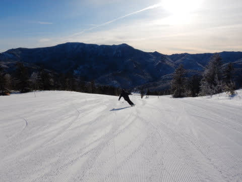

トップシーズンのやわらか雪ではないけど…

おそらく，レーサーやハイスピードスキーヤーには

たまらない，

シーズン中そうそうない感じの，エッジがガッツリ

噛みこむのに，ピシッと固まったバーン！

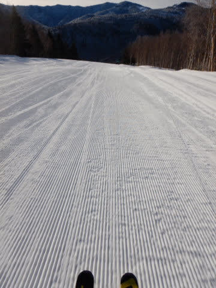

昨日までは，ガリガリアイスバーンを

覚悟していたのに．

これはいい意味で予想を裏切るいいバーン

コンディション！！

気持ちいい晴天の中，こんなシマシマバーンを

滑れるとは…！！

嬉しい誤算っ！！

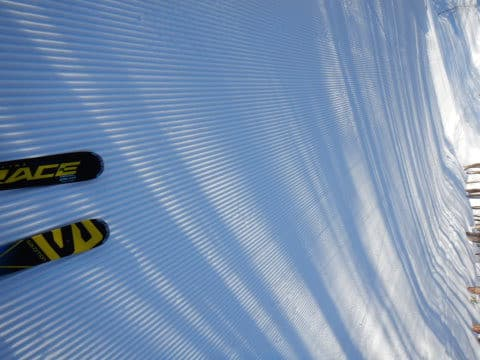

さすが，私の祈り＆必死の踊りは効くなぁっ！！←違う．違うから．あなたが志賀高原の天気を決めてるんじゃないから

思ったより木曜の雨では雪が解けなかったのか．

GSコースやパノラマコース，オリンピックコースは

ブッシュもなかったし…

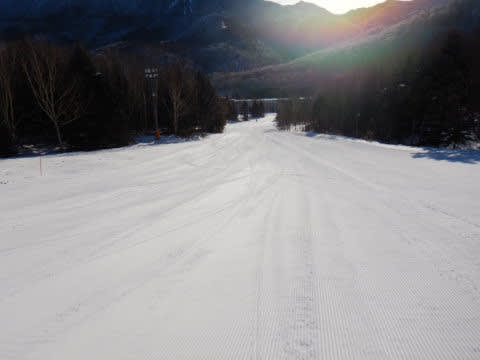

何にしろ，昨日夜の修正予想の通りの

朝からの晴天で．

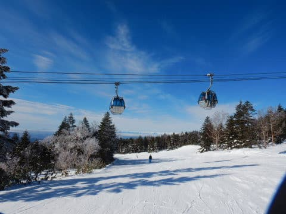

そして，下地は固めながらも．

わずかに積もった新雪と，冷え冷え

気温のおかげで，エッジが効いて滑りやすい，

いい感じの冷え冷え雪だし…

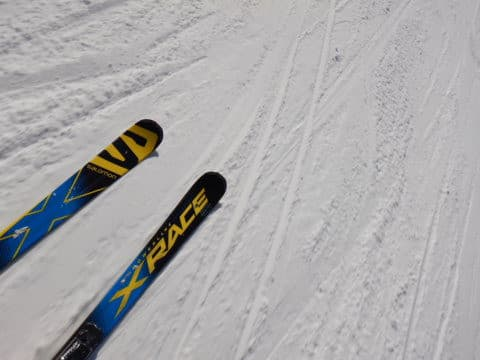

ちょっとだけオリンピックコースには

コロコロが出かかってたとはいうものの．

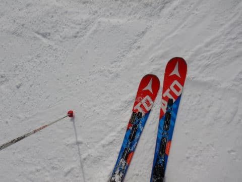

…でも．

午前10時半ごろには，

ゴンドラはゲートの外にちょっと

はみ出るくらいの，2-3分待ちまで

列が伸び…

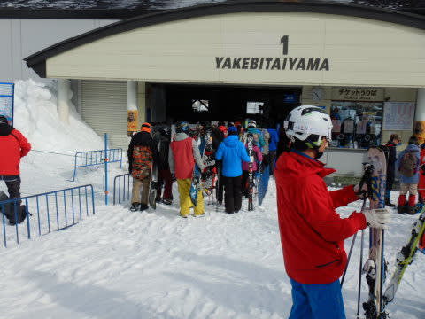

ゲレンデ上の人口密度も，ちょっと

上がってきてしまいました…（涙）

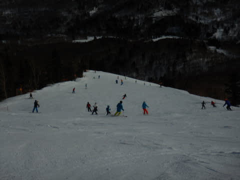

そして今回．

志賀高原に滅多に来ない人と

滑りに来ていて．その人に私に

つきあわせて，

朝から夕方まで1ゴン以外乗らない

ということをさせちゃうと，

何かの修行と勘違いされそうなので．

今日は珍しく，奥志賀方面へ脱出して

みました…

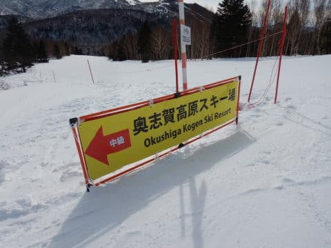

先週にブッシュが出ていたらしい，

奥志賀連絡コース．

今日は全くブッシュもなく…

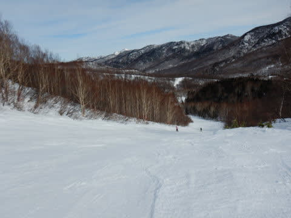

そして，やってきた奥志賀ゴンドラは

ガラガラ！！

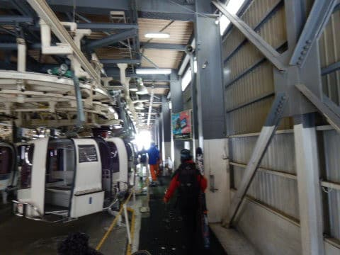

ダウンヒルはコロコロ地獄だったという

情報を受けていたので．

ゴンドラ側ダウンヒルコースは滑らず，

エキスパート側に向かいますが…

その途中の第3ゲレンデもかなり気持ちよく．

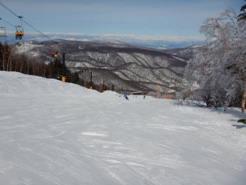

雪は固めながらも，がっつりエッジが効いて

好きなだけ傾いていける，傾き放題バーン！！

第2高速ペア沿い，エキスパートコースも…

しっかり締まったバーンです！

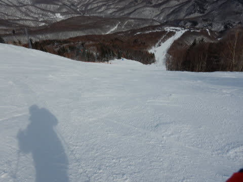

しっかり締まっているので．

午後になっても全然ゲレンデは荒れず，

かなり飛ばせるフラットバーン！

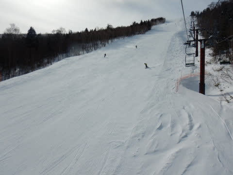

うひゃーーーー！！

人も少なく，スピードは出せるし．

かなりのスピードで滑れるよ！！

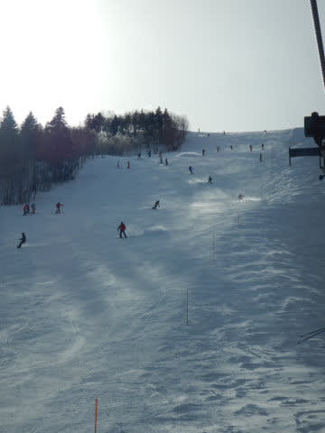

と．

気づけば2時間近く，ひたすらエキスパート

コースを回していましたが…

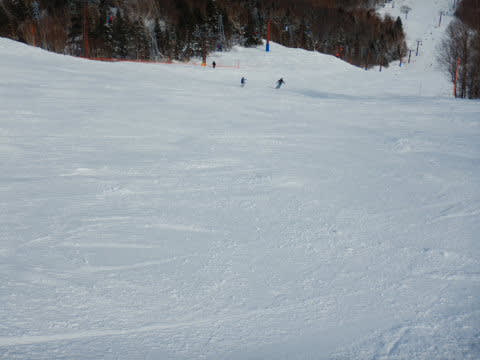

午後3時ごろには．

北斜面のエキスパートコース．

コースが陰って見にくくなって来たうえに．

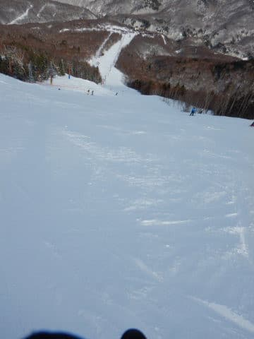

ちょっと荒れ始めていて．

硬い見えない斜面は危ないので，

焼額に退散することに…

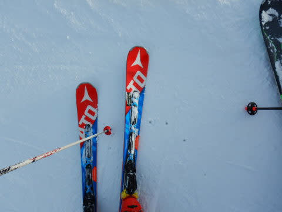

…焼額にやってくると．

うおおおお！

雪が…雪が柔らかい！！

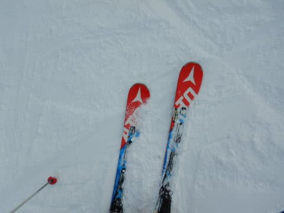

焼額のGSコース，午後になって

雪が崩れて，優しい感じのやわらかい

雪になってました…

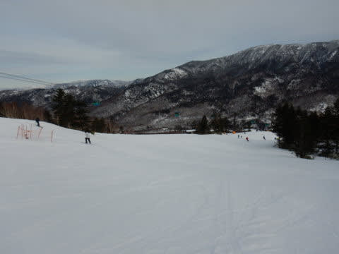

柔らかめだったので．

さすがに午後4時の営業終了のころには，ちょっと

荒れ始めてきましたが．

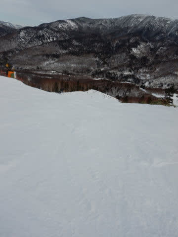

それでも，下地が硬いのでひどい凸凹に

なることはなく．

ラストまで，大回り行けました～！！

午後3時からはガラガラだったので．

ゴンドラをグルグル営業終了時間まですべってました…

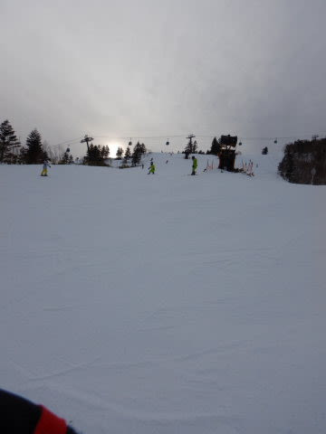

いやーーー．

一時はどうなることやらと

心配していたこの週末．

トップシーズンのふわふわ雪とは違うけど．

いい感じに締まって，午後まで凸凹にならない

バーンを滑り倒してきたのでした…

## 💬 コメント一覧

### 💬 コメント by (せっちゃん)
**タイトル**: Unknown
**投稿日**: 2020-01-26 10:33:02

こんにちは。

めちゃくちゃうらやましいゲレンデ状態ですね！

当方の地元に近い奥美濃はようやく80cm程度の積雪で、まだまだ閉鎖されているコースが多いです。

さて、今シーズンの志賀高原トライの日程が決まりました。

２月８日から３泊４日で行きます。

初日は焼額のシマシマを味わいに行こうかと。

お会い出来ましたらよろしくお願いします。(≧∇≦)

### 💬 コメント by (新米パパさん)
**タイトル**: Unknown
**投稿日**: 2020-01-26 10:51:10

昨日奥志賀にいらしてたのですか？

私もチビ連れてずっと奥志賀の第三、林間、第一をウロウロしてました、後光がさすスキーヤーと言われる主様を拝むことは出来ませんで、残念です。

きっと、逆光のせいですかね。

信仰心と、喜捨が、足りないのか。

再来週も奥志賀、ヤケビでチャレンジします。

引き続き、レポートよろしくお願いします。

🔲　私はロボットではありません。

### 💬 コメント by (ほっぽ)
**タイトル**: 1/26志賀高原
**投稿日**: 2020-01-26 23:25:58

Ｓさん

今日は最後の最後に意外な所でお声かけさせて頂きました。

こちら、ロンバケを終えて無事帰宅。

今日の志賀高原をblogで更新しました。

次の週末は法事と軽カーのレースがありスキーお休み。

次の週はいよいよ、ですのでよろしくお願いします。

http://hoppo.officialblog.jp/

### 💬 コメント by (西館)
**タイトル**: 来週も踊らねば
**投稿日**: 2020-01-27 01:54:03

この週末は天気、雪の状態ともに期待を裏切る(全く期待していなかったのにまずまずの)良いものでしたね。

でも土曜日の夕方、一瀬で救急車、高天原でパトロールさんに担架搬送される人、他にもスノーモービルにタンデム搬送される人数名を見ました。

氷のコロコロだけで無く、小石もコロコロしていて全く飛ばせませんね。今シーズンは超低速です。

次回は金曜日～志賀高原入りですが、火曜日と水曜日以降も再び力を合わせて踊らないといけない感じでしょうか。また天気予報お願いいたします。

お宿で常連さんとお話できたのですが、その方もこのブログの読者さんでした。いやぁ、S様、人気者ですね。

### 💬 コメント by (Skier_S)
**タイトル**: 今日も帰宅は深夜
**投稿日**: 2020-01-27 02:28:23

＞せっちゃんさま

コメントありがとうございます～！

志賀，特に焼額のバーンコンディションは，雪不足の今年でも

割といいですよ～！

8日から3泊4日，私も志賀に居ますので，ぜひ焼額でお会いしましょう！

＞新米パパさま

あら？？奥志賀にいらっしゃったのですか？

ゲレンデで全然お見かけしませんでしたね…

私はエキスパートグルグルだったので，

第3や林間をメインだったなら，会わなかったかも…

また再来週お会いしましょう！

＞ほっぽさま

今日はお会いできませんでしたね…

長期お休みお疲れ様でした．

無事社会復帰できますことを祈ってます（笑）．

＞西館さま

この週末は，焼額は結構恵まれてました～！

一の瀬，高天ヶ原はガリガリだったようですね…

やっぱりこの週末は，焼額・奥志賀方面が良かったようです…

次回は金曜日からですか．

一応，火曜28日にちょっと危険な日がありますが，

29日以降は雪になりそうなので，週末はバーン状況回復するんじゃないでしょうか？

とりあえず，今週末もいいコンディションになることを期待！

