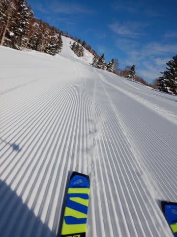
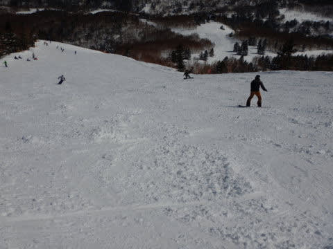
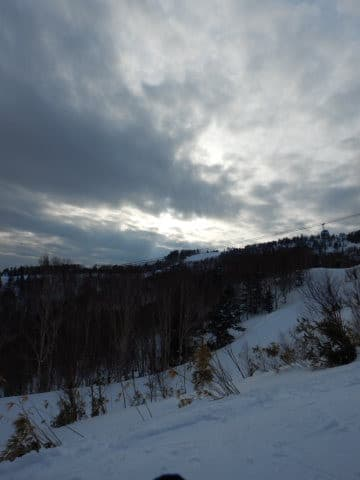

# 2020/2/29(土)の志賀高原スキー場は…朝から晴れ！朝イチ最高！昼間は強い日差しで雪が緩んだものの，スキー場はガラガラ

📅 投稿日時: 2020-03-01 04:38:54

🏷️ カテゴリ: [2020スキー滑走日記](c282e9230de179e245c7334eabeb0a3b3.md)

ということで．

本日も志賀高原に来ていますが．

本日は，予想を外し（涙）

終日晴天の志賀高原でした～！

えー．

まず．

朝の志賀高原の登り道．

一見雪がない普通の道路に見えますが…

ブラックアイスバーンで，ところどころ

かなりのテュルンテュルン！

滑って登れない車もありましたし．

おそらく日曜朝もテュルンテュルンだと

思うので，明日登ってくる方は

お気を付けください…

ただ，ごく一部が凍ってはいますが，

道路の積雪はほとんどありませんね…

うーむ．

もっとドサドサ降ってほしいところですが…

ってなことで．

いつも通りの焼額第1ゴンドラに

営業開始前に並ぶわけですが…

なんだか，朝からすっきり晴れてますよ！？？

誰かの予想では，朝は曇りだったはず…？？

見事に予想を外してます（涙）

でも．

山頂にやってくると，気温は-6℃と．

-5℃前後という予想は当てたようですね…

そして，朝イチの山頂は…

すっきり晴天のピカピカ最高シマシマ！！

今週は，なぜかコロナウイルスの影響で

ファーストトラックのイベント中止となったので．

ファーストトラックに荒らされてない，

完全無欠のシマシマっ！！

雪質は最高にいい感じの，

これ以上はない極上で，思わず

声を上げながら滑ってしまうほどの，

官能を刺激する最高シマシマっ！！

晴天の中，こんな超快楽シマシマを

滑れるとは…

シアワセっ！！

間違いない．

おそらく，今シーズン一番．

ぶっちぎり最高に楽しい朝イチの1本！

最高っ！！！

いや．

ホントに．

朝イチは最高の悦楽を

思うぞんぶん堪能できました…

いやーー．スキーやってて良かった…

で．

今日はそれほど混んでおらず．

ゴンドラの列も，いつもピークの

朝10時になってもほとんど並ばない

ほどだったので，

ゲレンデの人口密度も低め！

朝のうちは，いい雪質のゲレンデを…

すっきり晴天の下，

混んでないゲレンデを気持ちよく

滑ることができ…

さらに．

午前11時には，ゴンドラもほぼ待ちなし．

リフトもそんなに並ばず．

うーん．

コロナウイルスでみんな外出を

控えているのか？

土曜と思えないほど空いてます…

いやーーー．

晴れてて空いてて，雪もいいし．

いい感じ…！

と思っていたけど．

昼間の気温は予想通り0℃近くまで

上がってしまい．

そして，強烈な日差しがゲレンデに

降り注いだので…

ちょっと悲しいことに，

昼を待たずして．日当たりの良い

ゲレンデは雪が緩み始め…

昼にはゲレンデ全面，ダマダマに

固まる雪になってきてしまいました（涙）

ゲレンデ全面，ボコボコした雪のカタマリが

出来ていく，ちょっと荒れ気味の雪質に

なっていったのがちと残念でしたが…

でも．

シットリとした雪になるほどではなく．

暑いくらいの日差しだったのに，

ダマダマが発生する程度に収まったので，

まだ良かったかな！

何にしろ．

晴天なのに，ガラガラのゲレンデで．

寒くもなく，絶好のスキー日和！！

一番混雑したバーン状況でせいぜい

このくらいだったので．

いやーーー．

こんな恵まれたコンディション．

そうそうないよね…！！

夕方になると，昼間に緩んだ雪が

凍っていき，ちょっとザラメっぽい

雪になっていったけど．

人も少なく，夕方までゲレンデは

それ程荒れることもなく．

ガラガラでフラットなゲレンデを，

最後までかっ飛ばし続けたのでした…

いやーーー．

良かった．

ちょっと雪は緩み気味だったけど．

今日は最高だったなぁ…

…

…

となれば．

行かずばなるまい，ナイターへ！！

なんと．

今日が焼額ナイター，今シーズン最終日（涙）

なので，別れを惜しむため，今日は

焼額ナイターに参戦！！

…昼間に緩んだ雪は，ナイターのころには

冷え込み，予想より硬めのバーンに

なってましたが．

硬かったおかげで，2時間ずっとゲレンデは

シマシマのまま！！

早くも，「今シーズン最後」とかいう

時期になったのは寂しくもありますが．

超ハイスピードな硬めシマシマバーンの

ナイターを，しっかりラストまで

満喫してきました…！

いやーー．

良かった．

今日もたっぷり満足の一日であったぞよ…

…そして．

日曜もなんだか，結構晴れそうな

予想になってきました…！

そして．

予想していた明け方の降雪もなさそうです．

日曜もそんなに混まないと思うので．

朝イチは結構硬めのバーンかもしれませんが，

いい感じで楽しめる一日になりそう！

でも，朝の志賀の登り道．

ところどころ

凍っていると思うので，ご注意を…

…そして．

本日ナイターラストから宿に戻り，

お風呂に入って，知らぬ間に寝ていたので．

また謎な時間にBlogを更新している，

Skier_Sだったのでした…

## 💬 コメント一覧

### 💬 コメント by (せっちゃん)
**タイトル**: Unknown
**投稿日**: 2020-03-01 08:41:55

お疲れさまです。

まずはこの前のコメントのご返答への回答から。

いやいや、第一ゴンドラには行ったのですが、開始時刻ちょうどにはたどり着けず…。

申し訳ありません。

１０時頃まではいたのですが…。(ノД`)

今回２９日は奥美濃方面に会社の先輩と行っておりましたが、焼額とは段違いの混み具合で。

みんなコロナは何のその？と思いつつ、２週間前よりは天気もよく山頂付近の若干のふわっとバーンを踏みしめて参りました。

７時半のリフト始動から１６時まで滑り続けて回数的には満足ですが、雪質的に飢えてしまった感じです。

もう一回くらいは志賀に行きたいな～と筋肉痛の足を抱えながら考えております。

### 💬 コメント by (おおすぎ)
**タイトル**: Unknown
**投稿日**: 2020-03-01 16:49:24

いつも楽しく拝見しております。

深い意味は無いのですが・・・

お子様連れ（小学生限定で）のスキーヤーはどのくらいいらしたでしょうか・・・

参考程度で宜しいので、お教え頂けたら有り難いです。

（臨時休業中に子供を連れてスキーなんぞは、コレッポッチも考えておりません・・・本当です、本当です、放本当？）

### 💬 コメント by (Skier_S)
**タイトル**: すみません，昨日コメント書いたけど投稿されてなかったようで…
**投稿日**: 2020-03-03 01:46:04

＞せっちゃんさま

回答遅くなってすみません！

朝イチまにあわなかったのですね…

朝はずっと1ゴングルグルしてたのですが，

残念でしたね…

また志賀にお越しください！

＞おおすぎさま

子供連れのお客さん，普段よりは少なかったかな？

でも，そこそこいらっしゃいましたよ…

