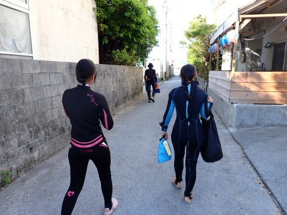
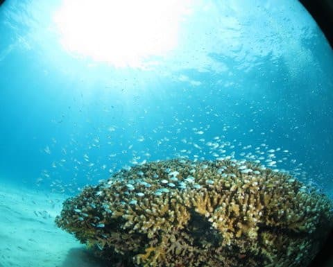
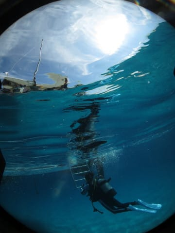

# 2023年8月，座間味で親子3世代ダイビング！その10…旅行3日目のダイビング1本目は大満足！

📅 投稿日時: 2023-09-24 02:50:06

🏷️ カテゴリ: [ダイビング日記](ce3a7a8d424d112fce83ee85c81a0e344.md)

普段なら，徒然ダイバー日記になると

一気にアクセス数が減るこのBlog．

なんだか，ここしばらくは意外とそこまで

アクセス数が減ってないですね…

ってか．

Blogを含めたWebサイトなんて，Google様が

どれだけ人を送り込んでくれるかでアクセス数が

決まっちゃうんですが．

いつもなら，スキーの記事や車の記事だと

大量に人を送り込んでくれるGoogle様．

…なぜかこのBlogはGoogle様にダイビング

Blogだとも認識されてしまったのか…

ダイビングの記事でも，Google様が

そこそこ人を送り込んでくれるように

なってきたようです．

（AndroidのスマホでChromeを立ち上げたときに

　出てくる「Discover」画面に，おすすめ記事

　として表示されるようになる）

いや…

このBlog，徒然ドライバー日記でも，

徒然ダイビング日記でもなく，

徒然スキーヤー日記ですから～！！！

と言っておいた舌の根も乾かぬうちに．

昨日は徒然スキーヤー日記としての

ネタだったのに，

今日は徒然ダイバー日記に戻っちゃうという…

ってなことで．

本日は[前回の続き](eb5e1deaa2eddc1b288fed21a41697c6f.md)，座間味のダイビング

旅行記です～！

ーー

ということで．

明けて旅行3日目の朝…

今朝も貸し切りテラスから座間味の

海を見てみると…いい天気！！

ってなことで．

今日も朝7時から，いつものお食事タイム

ですが…．

星砂さんの朝食は，1日おきに洋食と

和食が交互に出ます．

今日は和食の日ですね！

ちなみに，我々が泊っているスペシャルルーム．

別邸3Fっていうんだ…

で．

朝ごはんを食べ終わったら．

8時15分に船に集合なので．

8時過ぎにはウェットスーツに着替えて．

カメラや身の回りの物を持って，

いざ出発！

港まで100mほど歩いていき…

ティンガーラ号の皆さん，今日も一日

よろしくお願いしま～す！

今日はあさイチからのお客さんが少ないようで，

我々が乗船したら，すぐに船は出発！

あさイチに向かったのは，今日は

阿嘉島方面．

港を出て20分弱の短い時間で，

阿嘉島のビーチ，ニシバマが見えてきました．

ニシバマ前でロープを取ったので．

どうやら今日の1本目は，このビーチの

前のポイントのようです．

1本目のポイント名は，ずばりそのもの，

「ニシバマ」．

軽いブリーフィングを受けますが…

今日も我が3世代5人で1チーム．

朝9時前に，早くも1本目のエントリーです！

ビーチ手前のポイントだけあって，

エントリー直後からきれいな白砂

ですね～！！

…いきなり砂の上で何か動いた！

と思ったら…ヒラメの仲間かな？

（どこにいるかわかりますよね…）

そして，砂地を移動すると…

ぽつぽつとサンゴがついた根が出てきます．

いや…

実に慶良間らしい眺め！！

アカヒメジが群れて固まってたり…

でっかいゴシキエビが岩陰に隠れてたり

したけども．

やっぱり私にとって，慶良間といえば…

こういう白砂の上のサンゴ群がる

デバスズメダイ！

やっぱりこういう絵が慶良間っぽい

ですよね…

そして，今日も元気に潜る我が父親．

…いや．

この歳でよく潜るよな…

そして，また白砂の上を移動して…

次の根に向かいますが．

こちらの根は，地味なフタスジリュウキュウ

スズメダイが多くて…

うーん．やっぱりデバスズメのほうが色合い

的に鮮やかだよな．

とはいえ．

根の下にはキンメモドキやスカシテンジクダイが

まとまっていて…

この奥に大きなニセゴイシウツボ（だと思う）が

いるけど，スカテンとキンメモドキに隠れて

よく見えないほど…

高齢ダイバーの我が両親も，これだけ

穏やかな海なら安心かな．

いやー．

しかし．

今日の一本目は，いかにも慶良間らしい，

南国っぽい見事な癒しの1本…

いやホントに．

これが慶良間だよ…！！

そして．

白砂もきれい！！

そして我が母親は何か不思議なポーズを

してるけど…

なにかの写真を撮ってるのかな？

ってな感じで．

癒しの景色をたっぷりと堪能していましたが．

残念ながら，癒しの1本も終了時間が

近づいてきて，ボートの下に戻って

きました…

今日は天気も良く．

海の中も明るかったので，

すごい満足な1本目．

我が親も満足そうです…

ってなことで．

名残惜しいけど．

1本目も終了．

1本目，エグジット！

満足の1本でした…

（[続く](eadccacdd081cf52435d9d157f88d074a.md)）

## 💬 コメント一覧

### 💬 コメント by (mae)
**タイトル**: Unknown
**投稿日**: 2023-09-24 22:38:47

何度見てもこのケラマの写真はいいですね。

そして宿の朝食も私が座間味で利用していた

民食の朝ご飯の器まで一緒で懐かしいです。

本当にダイビングを再開したいけど、山歩きにスキーと、これ以上趣味を増やすことはできません（泣）

読者が多いのは写真が素晴らしいからだと思います。

心が洗われます。

### 💬 コメント by (Skier_S)
**タイトル**: ＞maeさま
**投稿日**: 2023-09-25 05:04:59

いやー．

慶良間はいいですね～！やっぱり…

石垣とかは白化でやられちゃいましたが，慶良間の海は変わらないです．

4年ぶりに潜って，海が変わってないことに安心しました．

私もコロナで山歩きを本格的に始めましたが，山もいいですよね…

