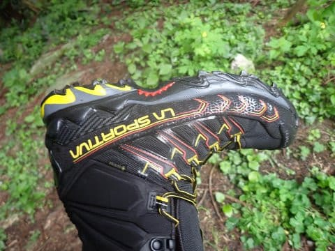
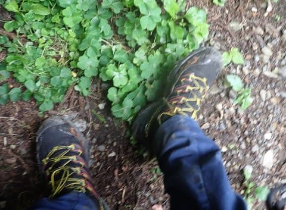
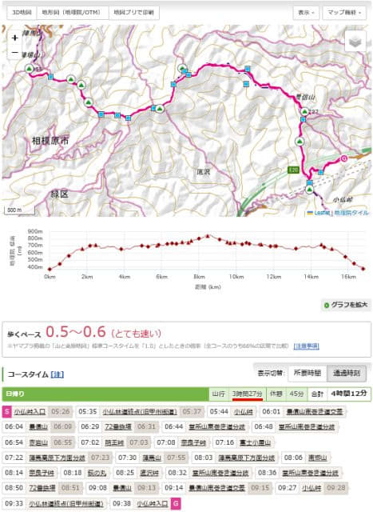
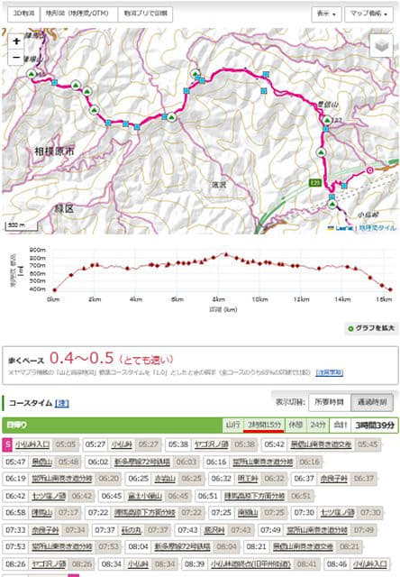
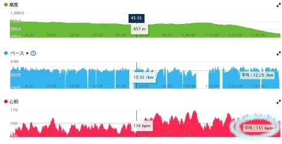
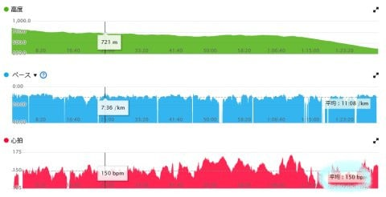
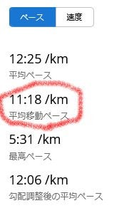
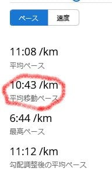

# 山歩き用の新しい靴，La Sportiva Ultra Raptor2 mid GTXを買ったよ！その2

📅 投稿日時: 2023-07-14 00:37:47

🏷️ カテゴリ: [登山・旅行](c1d637a11a25b457ac978d197adbdafc5.md)

というわけで．

このBlogはスキーBlogである

という矜持のもと，←そんな矜持があったんだ

昨日は一日スキーネタをはさみましたが…

今日は，山歩きネタ．

[前回のLa Sportivaの靴を買ってみた話](e7074ed9a623112325f69aef5f0200084.md)の

続きです！

ってなことで，

早速先週末の小仏→景信山→陣馬山で，

Ultra raptorを履いて歩いてみたわけですが…

うむ．

HOKAより100グラム近く重いので，

重量感はありますが…それでも，

普通のトレッキングシューズや登山靴より

ずっと軽いので，軽快に歩けますね．

グリップはHOKAよりちょっと劣るけど…

ウェットや土，木の根っこの上とかでは

TECNICAよりは上．

グリップはまぁまぁ高めでしょうか．

でも，つま先側のロッカーがHOKAより

弱いかな？

とはいえ，つま先側のソールの反りは

歩くにはちょうどいい感じのロッカーで，

歩く時の足運びは楽！

そして，下り坂を走ってみると．

うーん…

インソールは比較的柔らかめで，

クッション性は高いけど…

当然，HOKAのSpeedgoatに比べる固め．

で，下りを走った時のフォアフット着地は

なぜかHOKAのほうがしやすい感じ．

HOKAは母指球部分のソールが厚く，自然に

母指球付近が先に接地する感じだったけど，

Raptorは意識してフォアフット着地しないと

かかとが先に着地します．

HOKAのほうが踵部分のロッカーが強く，

踵の引っ掛かりがないからかな？

Raptorは母指球付近のクッションはそこそこ

あるんだけど，かかと側クッションはHOKAと

比べると結構弱く感じるので，踵着地になって

長時間走っていると踵が痛くなってくるし，

衝撃吸収も弱めなので，下りを走った時の

膝に来る衝撃がHOKAより大きいので…

下りはHOKAのほうがスピードを出せる感じ！

走った際の膝へのやさしさ，走りやすさは

HOKAのほうが上ですね！

で．この靴の一番の長所は．

アッパーは圧倒的にHOKAよりしっかり

しています！！

つま先回りやかかと回りの，足を守って

くれる感はHOKAよりずっといいです！

つま先回りを石や木にぶつけても，

靴は全くびくともしなさそうな頑丈さが

あります…

本格山道で，木の根っこや岩がごろごろ

するところを歩くにはいい感じ！

ソールの材質もしっかりしてそうだし，

アスファルトだとすり減るのは早いかも

しれないけど，ソールが部分的に

はがれたりする構造じゃないので，

HOKAよりは寿命はずっと長そう…

ということで．

まだ1回しか履いてないけど…

今回歩いてみた感じでは，

「歩くなら寿命が長そうだし，

　アッパーもしっかりしている分，

　Raptorは悪くないけど，

　走るならグリップと衝撃吸収性，

　転がりのよさでHOKAのSpeedgoat

　が圧倒的に上」

という感想でしょうか．

ってな感じで．

以上は感覚的比較だったのですが…

今回，数値をもとにした比較もして

みようと思い．

同じコースを昨年HOKAを履いていった時と，

今回のLa SportivaのUltra Raptorを履いた時の

タイムを比較してみました～！！

HOKAのSpeedgoat MID GTXで行った時は…

往復時間，休憩含め4時間12分，

実質移動時間は3時間27分

というペース．

下りは快適に走れたので，コースタイム

7時間のちょうど半分くらいのペースですね．

で．

今回のタイムを見てみると…

La Sportiva Ultra Rapter2 mid GTXでは．

往復時間，休憩含め3時間39分，

実質移動時間は3時間15分

え？

移動時間，10分以上短縮してるよ…！！

HOKAの靴みたいに自然に走りだして

しまうような走りやすさがなかったので．

おそらくHOKAの時よりタイムが悪く

なっているだろうなぁ…と思ってたのに．

5％程度の短縮とはいえ，まさかHOKAより

早く移動していたとは…！

ちなみに，HOKAのほうで移動した場合は，

平均心拍151で…

La Sportivaで移動したときは

平均心拍150と，

どちらも心拍をぴったり150に狙って歩いたのが

わかるかと…

その差，わずか1bpmなので，

両者の身体負荷はほぼ同等．

両者，ほぼ同等の心肺負荷で移動しているのに，

HOKAの時は1㎞移動するのに平均11分18秒．

La Sportivaでは，1㎞移動に平均10分43秒と，

同じ心肺負荷で，La Sportivaの方が速くなって

ます…！！

基本的に私は，心拍数150をキープして

移動すると，平坦なところでは早歩き，

下り坂は走る…という感じになるんですが．

登り・平坦地・下りのタイムを比べてみると．

行き(小仏P→陣馬山)タイムは，

HOKA Speedgoat mid：2時間4分

Ultra Raptor：1時間53分

詳細を見ると…

急な登りの小仏P→景信山はほぼ同タイムだけど，

ほぼフラットな景信山→陣馬山では，

Ultra raptorが大きくタイムを上げてました！！

で，帰りの(陣馬山→小仏P)タイムは，

HOKA Speedgoat mid：1時間33分（景信山5分休憩除く）

Ultra Raptor：1時間29分

帰りの下りもUltra raptor のほうがわずかに

速いけど…

これも，平らなところの陣馬山→景信山で，

Ultra raptorがかなり速いペースのところ．

下りの急坂が多くて，ほぼ走っていた

景信山から小仏Pまでは，HOKAのほうが

速かったです！

とりあえず．

往復タイムはHOKAのほうが圧倒的に

速くなるだろうな…

と思っていたところ．

確かに下り坂を割とハイスピードで

走って下るには，やはりグリップが

強くてクッションが柔らかいHOKAが

圧倒的に速かったけど．

それ以外を見てみると…

割とじっくりゆっくり歩いて，クッションや

シビアなグリップがそれほど影響しない

登りは両者同程度，

早歩き程度のペースで，わりと

平坦な道を歩くときには

Ultra raptorのほうが速い…

という結果が出ました．

…とりあえず．

結果をまとめると．

感覚的にも，数値的にも，

走るならHOKA  One OneのSpeedgoat，

歩くならLa SportivaのUltra raptor2 MID GTX

ということでしょうか．

Speedgoatに比べて，なぜUltra raptorの

歩くタイムがこれほど速いのかが良く

わかりませんが．

防水だし，アウターは頑丈そうだし，

ホールドはしっかりしているし．

走るのではなく，早いペースで歩くのが

メインの人には，La Sportivaの

Ultra raptor MID GTX.

結構いいんじゃないかな？

ということが分かった，今回のデータ

だったのでした…←あなたはホントに何でもデータで調べるのが好きね…

## 💬 コメント一覧

### 💬 コメント by (スシネコ)
**タイトル**: Unknown
**投稿日**: 2023-07-14 13:01:00

冬だけじゃなくて夏もメチャクチャ早っ！

私は関西に勤務していた時、六甲山全山縦走大会に毎年参加していました。須磨浦から宝塚まで約56キロを17時間以内に走破する、というもので、歩きながらの燃料補給が一番のポイントでした（その名残が今でもリフト上での🍙）。

### 💬 コメント by (Skier_S)
**タイトル**: ＞スシネコさま
**投稿日**: 2023-07-15 02:18:23

いや…これ，山歩きと考えると速いですが，トレランと考えると死ぬほど遅いタイムです…

しかし，56㎞ですか！

私はそんな長距離移動したことがないのですが，たぶん13時間くらいかかりそうな予感…

でも，その時の経験が今に生きてるんですね！(笑)

