# え？23日は祭日？とりあえず，2月23日から週末の志賀高原の天気を予想してみる

📅 投稿日時: 2023-02-21 02:54:00

🏷️ カテゴリ: [スキー天気予想](c6554f5c3c106093b511a8daae23757e8.md)

えー．

いまだに「天気関係の仕事してるんですか？」と

聞かれるSkier_Sです…

何度も言ってますが，仕事は天気関係ではなく．

スキー場の天気を知りたい

という執念で毎週天気図を読み続けてた

だけですから…

ってなことで．

今日も志賀高原特派員からの写真が

送られてきましたが…

あさイチの駐車場では積雪5cmほど．

ゲレンデは，コース上は圧雪上に1-2cm，

非圧雪コースは10cm弱の積雪だったようで…

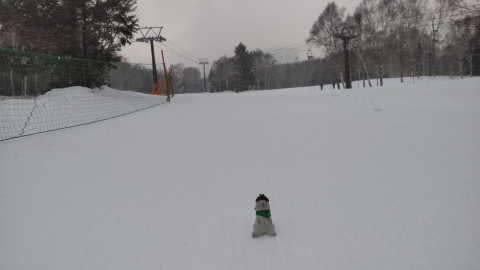

天気は，時折一瞬薄日が差すものの…

基本的に小雪が舞う一日だったようですね．

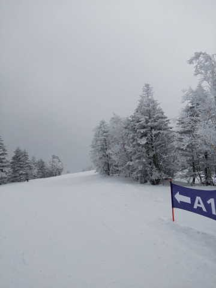

で．

あさイチの焼額山頂の気温は-10℃近くで，

昼間でも-6℃程度と寒い一日だったみたい

です！

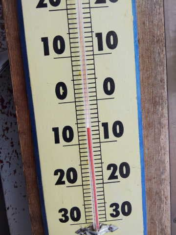

雪は，昨日の雨でとけた下地は結構

硬くなってたみたいですが…

その上に雪が積もってくれたので，

絶叫ツルツルバーンではなく，

意外と滑りやすかったみたいです…

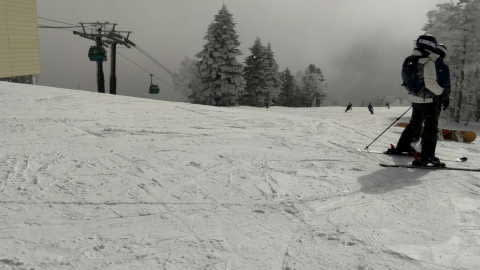

まぁ，でも．

2月のトップシーズンの雪には

見えない感じですが…

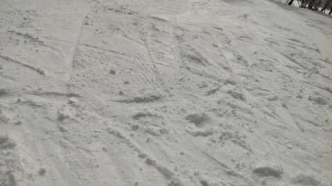

ってなことで．

この10cmの積雪が無ければ，阿鼻叫喚の

全面アイスバーンだったと思うので．

本日の志賀高原，雪が降って救われた感じ…

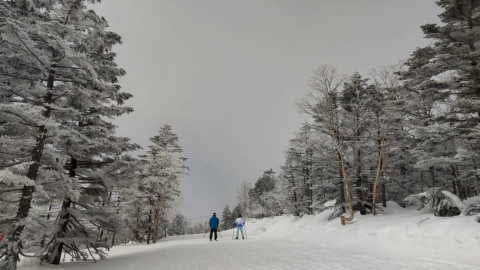

…そして．

今晩から明日にかけても，さらに

そこそこ積もりそうで．

今も志賀高原は雪が降っていて…

気温も-12℃と冷えてますね！

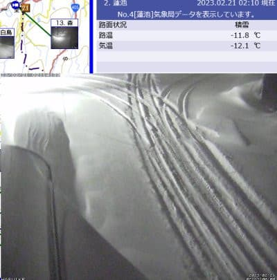

（[北信建設事務所道路気象状況カメラ](http://hokushin.pref-nagano-roadcamera.jp/)より）

ってなことで．

明日までには20cmくらいは積もってくれそうな

感じですが．

…今，カレンダーを見てみて．

23日が祭日だということに気づきました…

なるほど．

23日が休みとなると．

この日までに志賀高原の雪がどうなるか．

天気を予想してみましょう～！

まず．

21日（火）の850hpa気温ですが…

うぉ！！

水色の-12℃線が志賀にかかっているので…

朝は-15℃くらいまで冷える冷え冷え！

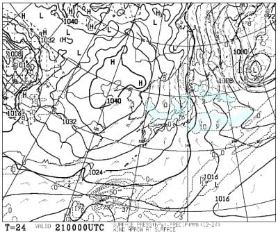

そして，地上天気図では，日本海側に

降水域がかかっているので…

志賀はそこそこ降りますね．

でも，日本海全面が雪雲に覆われる

ほどではないので…

大雪警報が出てるけど，志賀高原は

そこまで積もらないかな？

続いて，22日（水）の850hpa気温を見ると．

この日も-9℃線が志賀にかかる程度なので…

あさイチは-10℃以下．そこそこ冷えそう！

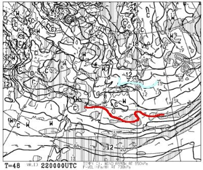

地上天気図は高気圧に覆われているので…

志賀高原は朝から晴れそう！！

絶好のスキー日和ですね！

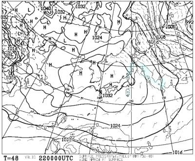

そして，肝心な23日（水・祝）の850hpa

気温を見ると…

この日は水色の線は-3℃．

気温がちょっと上がりますね…

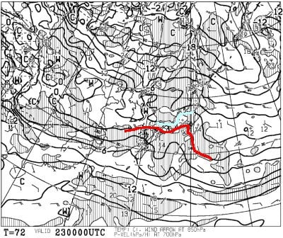

で．地上天気図を見ると…

この日も日本は高気圧に覆われて，

晴れそう！！

昼間はちょっと気温が上がるけど，

まぁいい感じのスキー日和ですね！

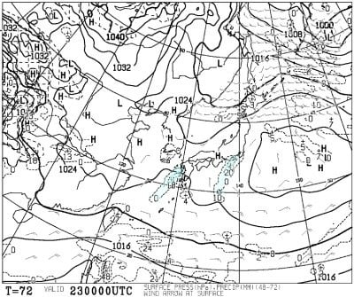

で．

飛び石連休の谷間，24日（火）の

850hpa気温は…

うーむ．

この日も志賀には水色の-3℃線．

この日も昼間は気温が上がりそうで…

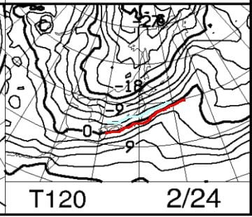

そして．

地上天気図では降水域がギリギリ志賀に

かかっているので．

この日は曇り～小雪が舞う感じで．

志賀にしてはちょっと重めの雪が

降りますが…そんなに積もらないかな．

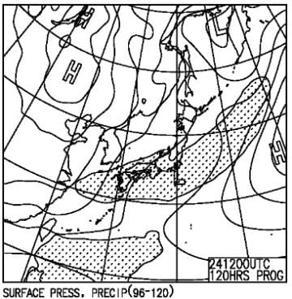

さらにその先，25，26日の土日は…

850hpa気温は25日は水色の-9℃線，

26日は-6℃線が志賀に近づくレベル

なので．

2日ともそこまで気温が上がらず，

終日マイナスキープしてくれそうな

感じ…

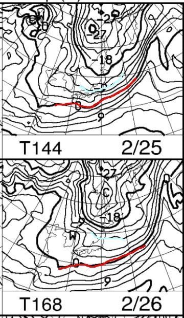

そして，地上天気図はどちらも高気圧が

西から近づいており．

まぁ，大体晴れてくれるかな？？

この週末は，コンディション良さそう…！

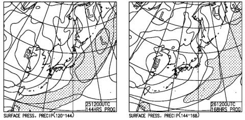

ってなことで．

まとめると．

21日(火)：朝までに20～25cm

　ほどの積雪．

　非圧雪はブーツ～脛パフ，

　圧雪バーンも圧雪の上に5cm程度雪が

　乗ってそう．

　あさイチは-15℃近く，昼間も-10℃

　くらいまでしか上がらず，終日雪が

　降り続ける寒い一日．

　昼間も10～20cmは積もってくれて，

　下地のアイスバーンは急斜面以外

　隠れてくれそう

22日(水)：早朝はちょっと雲が残るか

　もしれないけど，朝から晴れ！

　あさイチの気温は-12℃程度．

　昨晩積もった雪が圧雪された，

　最高シマシマバーン！

　昼間もそれほど気温が上がらず，

　冷え冷え晴天の中滑れる

　いいコンディションの一日．

23日(木・祝)：朝から晴れ！

　あさイチの気温は-5℃程度．

　雲は多いかもしれないけど，

　一日晴れてくれそう．

　あさイチのシマシマは最高！

　昼間は焼額山頂で0℃をギリギリ

　越えそうな気温なので…

　日差しがあったら，標高の低い

　南斜面は雪が緩むかも．

　でも，絶好のスキー日和の一日．

24日(金)：曇り～小雪．

　あさイチの積雪は無し．

　気温は朝-5℃，昼間0℃程度．

　雪は昼間に時々降るが，そんなに

　積もらない．

25日，26日(土日)：25日は朝はちょっと

　曇るかな？でも25，26日とおそらく晴れ．

　気温も結構冷えて，朝は硬めシマシマ

　バーン．

　昼間も気温がそこまで上がらず，

　寒いくらい．

　バーンも荒れないと思うので．

　いい感じの週末かな？

ってな感じでしょうか…

基本的に，ドサドサ降ってはくれないけど．

天気が良い，そこそこ冷えた日々が

続いてくれそうです！！

23日の天皇誕生日も25，26日の土日も

スキーが楽しめるんじゃないかな～…

今のところ，私も23日は滑りに行けそうな

感じだけど…

もし，23日に突発的な仕事で滑りに

行けなくなったら．

その時は，私に，

雨が降る週末にスキーに行けるが，

コンディションが良さそうな時に

滑りに行けない呪い

がかけられていると思わねばなるまい…

## 💬 コメント一覧

### 💬 コメント by (レインボー75)
**タイトル**: Unknown
**投稿日**: 2023-02-21 14:20:51

火曜日の志賀高原情報

志賀高原に単身拉致されている女性から「40は積もった。すごく降ってる」の連絡に、ワクワクして出掛けたものの、大雪と強風で視界が最悪。運転も疲れる。いつものニゴンスタートだけど、決めていたSGSにはすでに人が！やむなくGSサイドに突っ込むも、板が浮かずに進めない膝パフ。諦めてGSへ。悲劇はここからです。めったに行かないゴーゴーウエイブに入ったのが運の尽き。なんと緩斜面の膝パフ。ガスの雪でわからなかった。さらにコースを間違えてえっちらおっちら。ゴンドラから仲間が、奮闘する私を哀れんで見てたとか。

朝の一番で足は売り切れ疲労困ぱい。極寒の拷問に耐えきれずにリタイアする人の気持ちがよーくわかりました。疲れたので西館でステーキ食べて英気を養ったけれど、所用で終了。のんびりする時間も必要ですね。

### 💬 コメント by (a-island4138)
**タイトル**: Unknown
**投稿日**: 2023-02-21 16:35:57

このブログ凄く楽しみにしております、ありがとう御座います。　レインボーさんのコメント読んで…　あるあるで吹きました🤣

パフパフなのに前に進めない!　は、罰ゲーム級ですものね!　それでも志賀高原で滑れる方々が羨ましい広島スキーヤー🎿です。

### 💬 コメント by (レインボー75)
**タイトル**: Unknown
**投稿日**: 2023-02-22 16:49:23

水曜日の志賀高原情報

朝の上林-7℃　蓮池-12℃。寒いけど晴れてて快適。

まずは白樺。それほど走らないけど、柔らくて膝に優しい快楽バーン。GSも昨日とうって変わって軽快。オリンピックはすでにもさもさだったけど、人がいなくて大回りが楽しめました。ついで中回りでおかわり。

この数日の地獄から一転極楽。昼食のあとは寺子屋。何本も至福の時を過ごしてファミリー経由で終了。

ファミリーはもさもさだったけどいたい膝でも大丈夫でした。

いやあ楽しい一日でした。満足である！

### 💬 コメント by (Skier_S)
**タイトル**: コメント回答遅れました！
**投稿日**: 2023-02-22 23:27:37

＞レインボー75さま

完全にゲレンデコンディションは回復したみたいですね…！！！

明日はちょっと気温が上がりますが，晴天のスキー日和です！

ブナ・唐松はちょっとボサボサ雪になりそうですが．

＞a-island4138さま

楽しみにしていただいているようで，嬉しいです…

広島からだとなかなか来られないかもしれませんが，山口県から

シーズン数回いらっしゃるツワモノもいるので，焼額へ滑りに来てください！

