# 2019/5/26(日)，かぐらスキー場ファイナルデー，速報モード…天気は晴れ時々うす曇り．めちゃくちゃ暑い一日．雪は薄くなったけど，まだ一週間は営業できそうだったなぁ

📅 投稿日時: 2019-05-27 01:08:35

ということで．

本日，予告通り日帰りで

かぐらファイナルへ行ってきたわけですが．

本日はいつも通り，帰宅が遅かったので．

日曜深夜定番，速報モードにて！

えー．

まず．

本日は，かぐらメインバーン以外は雪が

解けてしまい．

みつまたやゴンドラ付近はもう雪が

無くなってしまったので．

みつまたからゴンドラへは，

Pislabのマットの上を滑るか，

歩いていくしかなくなってます…

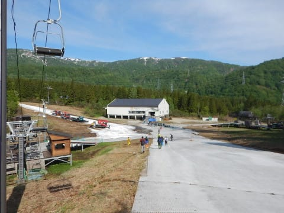

私はPislabを滑るのが嫌だったので，

歩いていきました(笑)．

ロープウェー⇒みつまたリフト⇒ゴンドラ乗り場まで徒歩

⇒ゴンドラ…

と移動して，遥か1時間．

やってまいりました，かぐらメインバーン！！

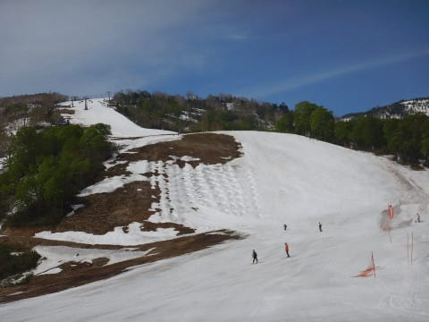

…先週と比べて，一気に雪が減りましたね（涙）

先週は，まったく土が出ておらず，

真っ白だったのに…

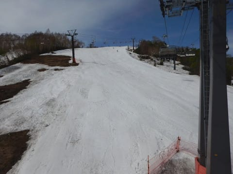

あさイチはコブ斜面にはなっていないものの．

完全フラットとは言い切れず…

そして，朝から長袖Tシャツでも

暑いくらいに気温が上がり（泣）

朝の一発目から，すでに滑りが

悪めの雪でした…（涙）

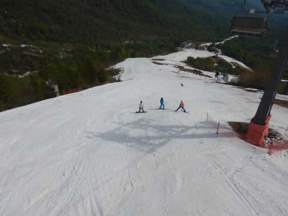

でも，5月最終週，営業最終日と考えれば．

メインバーンをこれだけの幅で滑れるのは

恵まれてますね！

…と，思っていたら．

朝9:30には．

ゲレンデの人口密度が激烈に

高くなってきちゃいました（涙）

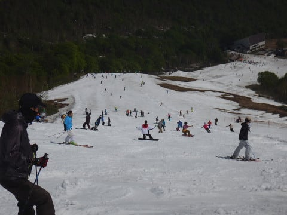

…まぁ，これがいつものかぐらの

定番状態ですね．

でも．

リフト待ちは最大でこのくらいで．

せいぜい3分待ち程度かな…

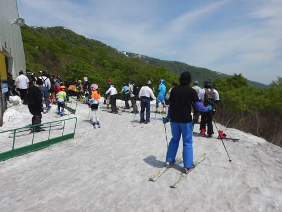

昼近くになると，リフト待ちは

かなり短くなり，午後はほとんど待ちなく

乗れるようになってきましたが．

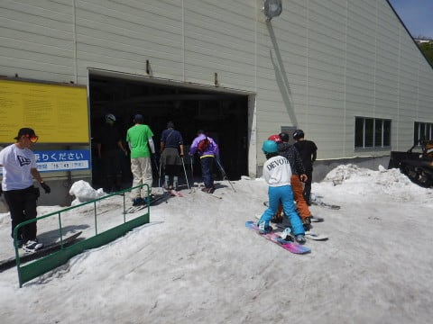

でも，ゲレンデの人口密度は，

午後になっても相変わらず，

かなり高めですね…

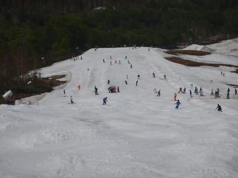

ってなわけで．

今週も，大勢によって掘削作業が進められた

ゲレンデは．

午後にはかなりのコブ斜面になっていきますが．

午後はコブ溝のそこかしこに

土が出てきました（涙）

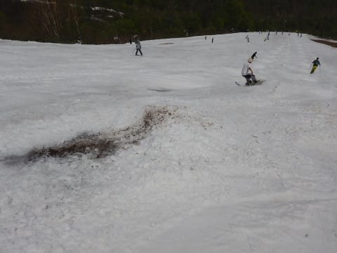

うーん．

結構ゲレンデの幅は広いけど．

意外と雪は薄いみたいですね…（泣）

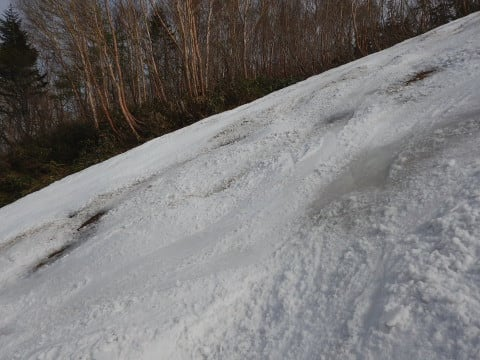

でも．

まぁ．

全面コブコブで，ところどころ土も

出てきてしまったものの．

ファイナルデーの営業終了時間まで．

結構幅いっぱいに雪がついている，

こんなコンディションで滑れたので．

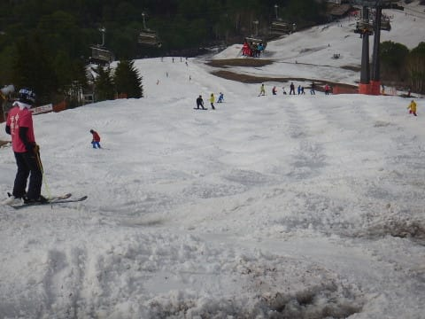

今シーズンはやっぱり恵まれてましたね～…

いや．

まだ雪が結構あって．

昨シーズンの営業終了2週間前程度の

レベルなので．

昨シーズンと同じように頑張れば，まだまだ

滑れるんじゃない！？？

と思ってしまい．

…とても，かぐらの今シーズンが終わって

しまったとは，まだ信じられないのですが．

うーん．

来週はもう，かぐらで滑れないのか…

とりあえず．

明日，詳細レポートやります～！
