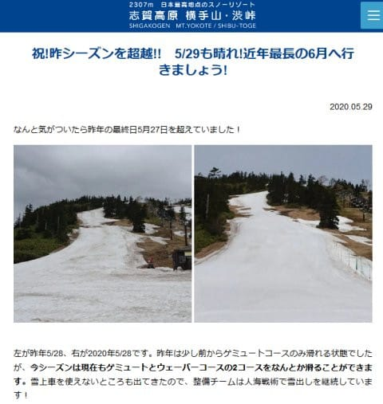
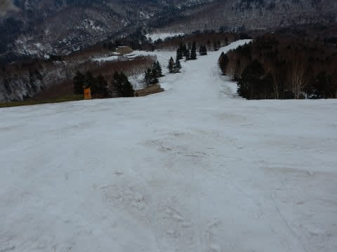
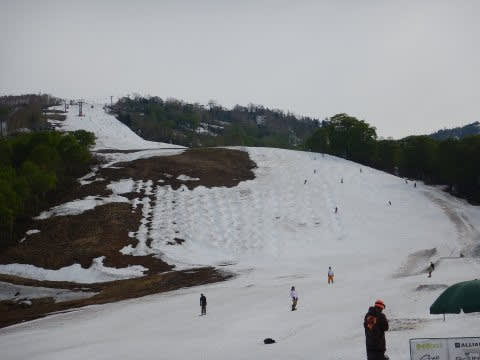
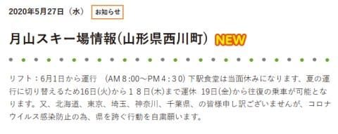
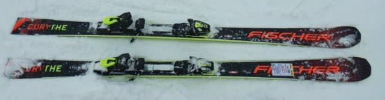
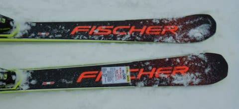
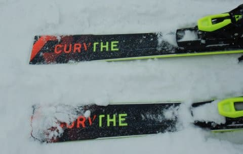
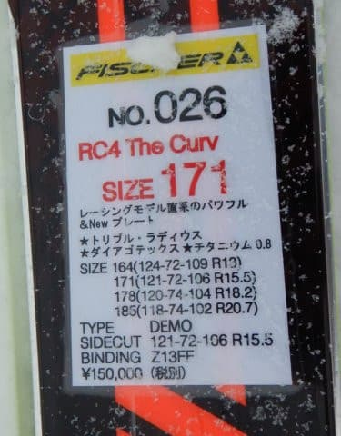
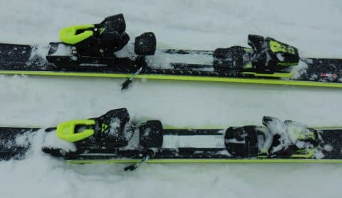

# 2021シーズンモデルのスキー板，試乗レポート 今度こそ最終回…FISCHER The CURV

📅 投稿日時: 2020-05-30 01:22:14

えー．

志賀高原，渋峠スキー場の営業．

今週末までじゃなくて，6月1日の月曜まで

営業するようですね…

しかし，昨シーズンの渋峠，

5月27日までの営業だったのに．

今シーズンはそれを超えて

営業してるということに驚き…！！！

（[横手山スキー場ホームページ](https://yokoteyama2307.com/news/9200/)より）

昨シーズンって，春まで雪がたくさん残った

恵まれた年で．

GW最終日まで，焼額はGSコースの雪が

コースいっぱい残ってたし…

かぐらメインバーンも，5月26日の

ファイナルデーまで，コース下の

キッカーがちゃんと残っていたという，

恵まれたシーズン．

…史上まれに見る雪不足だった今シーズン，

渋峠，まさか去年より遅くまで営業できるとは…っ！！

しかし．

雪はまだあるのに．

そして，全国の非常事態宣言は解除されたのに．

渋峠のラスト営業となる今週末も．

K奈川県民の私は県境をまたいでの移動を

自粛せねばならず，滑りに行けません…（涙）

月山は6月1日から営業開始ですが．

当然のごとく，北海道，東京，埼玉，神奈川，

千葉の人には自粛がお願いされています…

（[月山朝日観光協会HP](https://www.gassan-info.com/news/689)より）

さぁ．

果たして．

私は今シーズン，

無事スキーに行くことができるのだろうか！？？

と，ちょっと悲しい気分になったところで．

今日の本題へ．

2021シーズンモデルのスキーの試乗レポート，

今度こそ最終回．

今回は，またまたFISCHER編です．

では，どうぞ～！

○FISCHER The CURV 171cm

基礎オールラウンド．

前回のThe CURV DTXより心持ち

大回りに寄った感じの板ですかね…

The CURV DTXが，RC4 SCと同じ優し目の

M-TRACKプレート＋Z12 GWビンディング

だったのに対し，

このThe CURVは，RC4 SC PROと同じ

しっかり強いM/Oプレート+Z13FreeFlex

ビンディングになります…

強めのプレートが入っているということもあり．

フレックスはThe CURV DTXよりかなり強めに

感じ，かなり硬めなのでたわみが出にくいです…

R15.5ということですが，

サイドカーブは18mとかそれ以上あるんじゃない？

と思ってしまうほどで，板なりに滑っていくと

かなりまっすぐ目の，縦に縦に落ちていく

滑りになります．

ただ，板の重さもあり，特にトップとテールに

重さが感じられるため，直進安定性はかなり

高め．

スピードを出して行ってもあまり怖さを感じず，

縦に縦に落ちていけます．

しかし，逆に言うと．

気軽に振り回せる感じではないので，

ズラシて小回りにもっていくのはちょっと

ツライ感じ…

板が強めで，かなりのスピードを出さないと

板がたわんで来ないので，カービング小回りも

厳しい感じ．

板の返りもそんなに早くなく，

そして板も強めで，それほど大きなたわみが

出ないので，わずかなたわみがゆっくり

返ってくる…と言った感じ．

そのあたりも，小回り向きではない感じ…

先にも書いたように，トップとテールの

重さもあるので，レールターン気味に

エッジからエッジに繋いでいく方が，

板の性格に合っているかな～．

大回りの安定感はかなりのモノなので，

重さと強さでしっかりグリップさせて，

板なりの大回りでエッジに乗って

縦目に落ちて行く，ハイスピードの

ロングターンで滑るのが気持ちいい

板ですね…

## 💬 コメント一覧

### 💬 コメント by (炎の北海道民)
**タイトル**: Unknown
**投稿日**: 2020-05-30 02:03:08

スキー高いですね…。

スキーが高くなったのか、日本が貧しくなったのか、その両方か。

### 💬 コメント by (Skier_S)
**タイトル**: ＞炎の北海道民さま
**投稿日**: 2020-05-30 23:45:43

スキー，高いですよね…

円がユーロに対して弱くなりすぎているのがひとつの

理由のような気もしますが…

15万もしたら，そうそう買えません（涙）

### 💬 コメント by (西館)
**タイトル**: お願い
**投稿日**: 2020-06-02 00:29:42

我が家の所持している板は、

私･･･ARMADA、GR(フリーライド用ショート)、12年前のHART

相棒君･･･ストリクトリー(フリースタイル用ロング)、GR(フリーライド用ショート)、12年前のHART

相棒君はLINEの太板希望ですが、私はそろそろスピード用板を考えているのですが、これまでに買ったことがありません。

試乗会で試してみてはと教えていただきましたが無くなっちゃったし。

そもそも上手では無いので試乗会で体験したところで、その板が技術を向上させてくれる板とは限らない訳で。

周囲の反応を伺うと、私の周囲では FISCHERを押す声が多いです。

メーカー毎の特徴があれば教えていただきたいです。

来シーズン用板の試乗レポートのメーカー毎の索引を作って頂けたらな～

