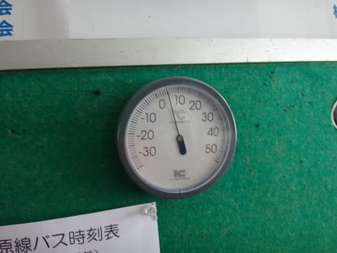
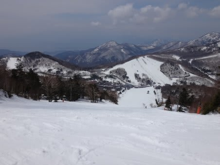

# 4月20日の志賀高原詳細…時折薄日も射す，ガラガラ貸し切りゲレンデ！

📅 投稿日時: 2014-04-22 01:20:47

ということで．

昨日，速報モードで報告した日曜の詳細レポートをば…

えー．

日曜は当然，朝6:30からの

焼額の早朝スキーに繰り出すわけで．

んで．

早朝の山頂の気温は0℃と，ぼちぼちの冷え込みですな．

天気は薄曇り．

そして，ゲレンデは…

うはははは！

固くしまっているけど，カリカリ・つるつるではなく．

表面がかすかに柔らかくなり始めて適度にエッジが

引っかかる，気持ちいい大回りバーン！

そして．

…全然人がいない…

こんな気持ちいいバーンを…

ほぼ貸切状態で滑れていいんでしょうか？？

…経営，大丈夫か～？？（ちょっと心配）

早朝営業が終わって，通常営業の朝9時半ごろでも．

表面は柔らかくなってきたものの．

まだまだ大回り可能で．

んで．

写真にも誰も移ってないことからわかるように．

がらがらっ！

経営，大丈夫か～？？？（かなり心配）

そして，雨が心配だった天気も，

全く雨の気配はなく．

それどころか，うっすらと日が射すという…

これは．

あれですね．

見事に私の祈りが効きましたね．

そうです．

私の祈りのおかげです！←違うって

さすがに午前11時近くになると，気温も上がってきたけど…

でも，せいぜいプラス5度程度．

雪もさすがにちょっとクリーミーな感じになってきたけど…

んでも，人が少なくて荒れてないので，

まだまだ大回り可能！

さらに．

なんと！

昼ごろには，太陽さんが顔を出しはじめ…

時々すっきり晴れるという，気持ちいい春スキーの

天気になってきました！

ふはははははっ！

見たか，私の祈りパワーっ！！！←だから，違うって

今年は雪もたっぷり多くて．

この時期は土が出てくる高天ヶ原コブバーンも．

まだ全然大丈夫ですね～．

…しかし．

なんだか．

どのゲレンデにも，人がいないんですが…

ホントにどこ滑っても貸し切りバーン状態

なんですが…

一の瀬正面バーンでこれだけガラガラって，

経営大丈夫かっ！？（すごく心配）

寺子屋も，貸し切り状態なんですが！？？

ほかの搬器に誰もいないし，

ゲレンデにも誰もいないよ～！！

おかげで．

午後の雪は，水が浮くほどドボドボではないとはいえ，

結構クリーミーな感じに柔らかくなっちゃったけど…

でも，誰も滑っていないので，夕方までコースはそれほど荒れず，

リフトストップまでかなりのフラットバーンを滑れるという，

シアワセの一日だったのでした…

…でも．

ガラガラだったのはうれしいけど．

…経営，ホントに大丈夫か～っ！？？（超心配）
