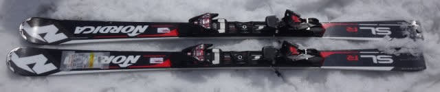
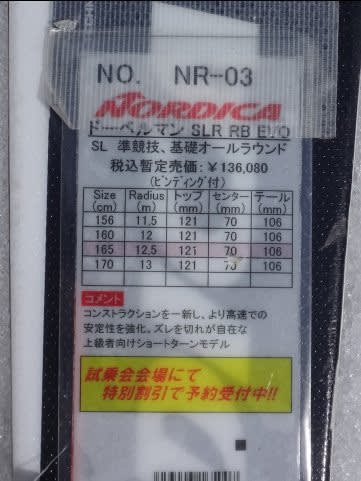
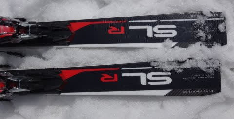
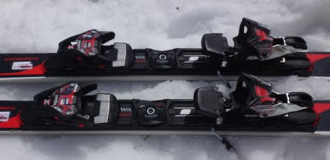

# 試乗レポートも後半戦！2018シーズンモデル，スキー試乗レポート第16回…NORDICA編その2

📅 投稿日時: 2017-06-10 03:00:03

えー．

まだまだ続く，2018シーズンモデルの

スキー試乗レポートですが．

本日の試乗レポートからは，

4月22，23日の週末に，志賀の一の瀬ファミリーで

試乗した板になります…

ちなみに，この日のコンディションは[こんな感じ](eb6f2528537e465fd425d53c1a00075a7.md)で．

雪のしっかり硬い午前中に試乗したので，

4月下旬と思えない結構いい感じのバーン状況で，

板の性能を試すことができました…

ということで．

後半戦に突入したスキー試乗レポート．

本日はノルディカ編です．

では，どうぞ～！

---

○NORDICA Dobermann SLR RB EVO 165cm

SL競技用・基礎小回り用

ノルディカの選手用SL板である，WC SLに次ぐ，

SL用セカンドモデル＆基礎小回り用トップモデルとなる

この板．

これは，去年からの継続モデルになるのかな…？

去年からRaceBridgeとかいう機構がついて，

SLR 「RB」 EVOという名称になりましたが．

今年もその名称を引き継いでおり．

デザインは去年のモデルから結構変わったものの，

構造は引き続き同じのようで．

…ビンディングも昨年と同じっぽく見えますね…

滑ってみたところ．

切り替え直後，まず板のトップ側がぐっと強くグリップして，

トップが内に入ってくるようにターンが始動します．

谷回りからマキシマムまで，板のセンターから

トップ側のエッジがガッツリ食い込んで，

ぐぐぐっと内に回っていくように動くので，

トップを抑えて行けばきれいにカービングして

すごくよく曲がります．

しっかりした張り＆ばね感があり，

スピード耐性はかなりのものです．

しっかり抑えるところを抑えれば，急斜面でも

ずらすことなくきれいに丸い弧を描きながら

落ちて行けて．

アイスバーンでも切り裂いていきそうな

安定感で，しっかり小回りをキメることができます．

どっしりしてるけど，ガッツリグリップしたエッジに乗って

丸い弧を描いていき，小回り～ミドルまで行けます．

しっかり張りが強く，適度などっしり感もあるので，

ゆっくりと動いていけば，ロングも問題なく行ける

懐の深さもあります．

…あまりゲレンデで履いている人は見ませんが．

かなり玄人好みな感じで，

レベルが高い人が履けば，いろんなことができそうな

板だなぁ…と思いました．
