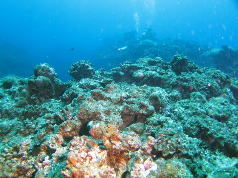
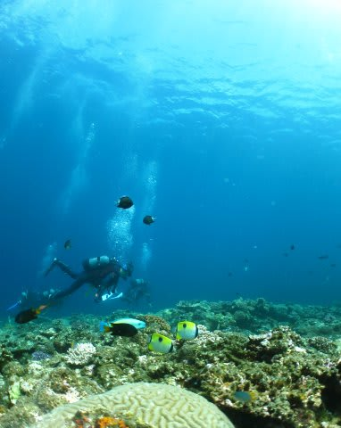
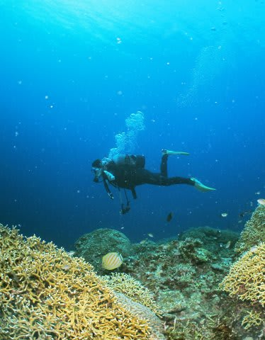
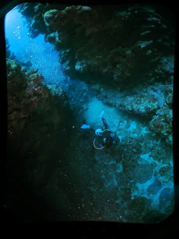
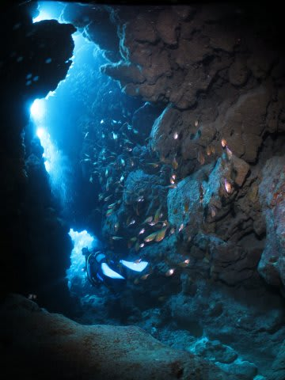
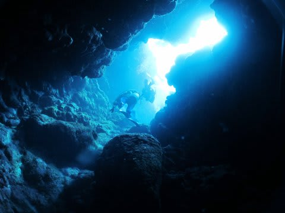
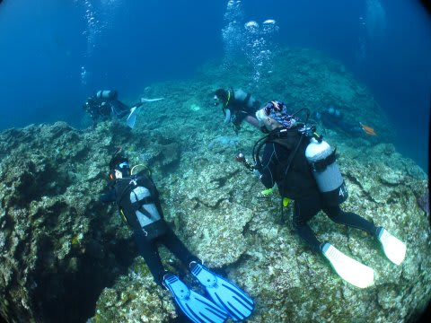
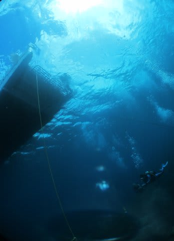
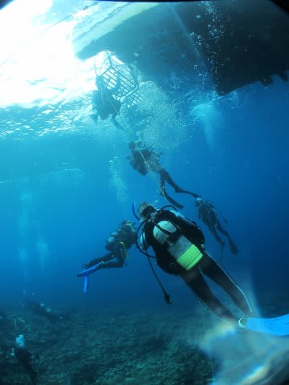
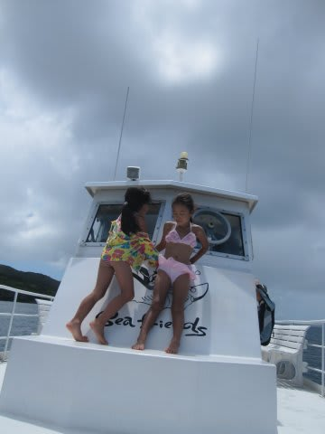

# 2014年9月　3連休，子連れ石垣ダイビング　その14

📅 投稿日時: 2015-06-28 21:16:05

…このブログ始まって以来．

6月のうちに夏モードに入っちゃったことはなかったので．

こんな早い時期から夏モードなのは，ちと違和感がありますが…

＃まだ，スキーシーズンが終わったということを体が受け付けていない

とりあえず．

[昨日](e5dab2a946eec5d929be4779853baa78d.md)，皆さんも復習したはずですので．

夏モードの石垣旅行記の続き．

ダイビング2日目，娘の超ゼイタクなマンタシュノーケリングの

1本目に続く，2本目のダイビングからのレポートです．

では，どうぞ～！

---

ということで．

腹いっぱいマンタ様を堪能し．

娘もたっぷりマンタを見られた，

満足の1本目のマンタダイブに続く，2本目のダイビング．

快く娘に見送られて潜ったわけですが．

…ですが．

…うーむ．．．．．

これは…

…サンゴに，ちょっと元気がありませんな（残念）

…でも．

ちょっとずつサンゴが戻ってきているのか…

こんな感じで，ちょっとサンゴが復活しているところも…

で．

地形ポイントなので．

こんな感じのクレバスに入っていき…

洞窟っぽいところを進んでいきます．

ふむ．

光が差し込む洞窟がきれいですね～．

洞窟を潜り抜けると，

再び，サンゴの跡が残る，浅瀬に出ました…

…

…ここも．

以前は，きれいなサンゴに覆われてたんだろうな～，

って感じですが…

今は単なる岩場ですね（悲）．

…って感じで潜ってると．

うん？

あれ？

なんだか．もう，ボートの下に戻ってきてますね．

え？

もう，おしまいですか．

そうですか．

ってことで．

浮上しますが．

うーむ．

さっきの，マンタじっくりのダイビングに比べれば．

…ちょっと残念な感じの1本だったかな…

船に上がると．

ダイビング中，娘はずっと，船の上でお友達と仲良く遊んでたようです．

うーむ．

せっかく娘が留守番していてくれて，

夫婦そろって潜りに行けたのに．

…ちょっと残念だったかな～
