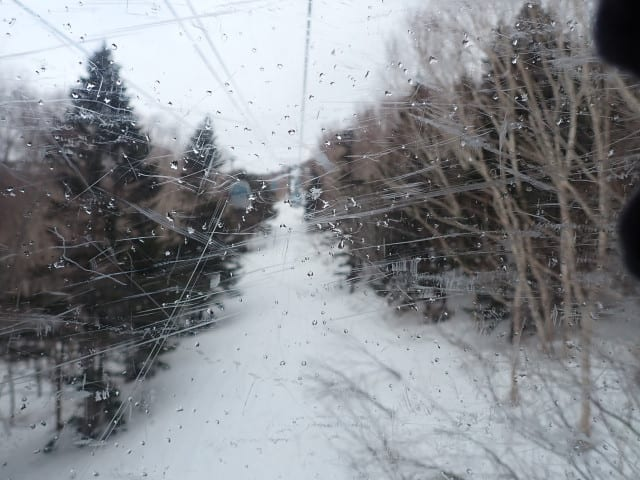

# 2025/4/6(日)の志賀高原スキー場詳細レポート！…雨はほぼ降らず，日差しがなかったので雪はそれほど緩まずフラットバーンのガラガラ！

📅 投稿日時: 2025-04-09 02:02:42

🏷️ カテゴリ: [2025スキー滑走日記](cacd3fbf84d4a679ee61a5894c3f95e14.md)

えー．

今週は11日に雨が降りそうで．

さらに13日の日曜もかなりの雨と

風で，暴風雨になりそうな予感が

する今日この頃．

今週末はちょっとヤバいかも…（涙）

でも．

前の週末の日曜もかなり悪い予想

だったところが，大逆転のいい

状況になったりするので，まだ

あきらめるのは早いのだ！！

意外といいコンディションになるかも

知れないので，スキーヤーの皆様に

おかれましては，日ごろの行いに

くれぐれもお気を付けてくださいますよう，

よろしくお願い申し上げます…

ってなことで．

週末の天気が気になるところですが．

本日の志賀高原は，特派員によると…

朝から終日晴れの一日で…

朝イチは気温が-0.2℃とそこそこ

冷えて雪はそこまで悪くなくて．

午後になっても滑る雪で，結構

いい状態だったようです…！！

うらやましい…っ！！

志賀高原，4月になってもいいコンディ

ションが続きますね～…！

というところで，本題へ．

今日は日曜帰宅後に速報レポートした，

日曜の志賀高原の詳細レポートです…！！

えー．まず．

焼額の2ndシーズン券の恩恵を最大限受けるべく，

今日は朝6時の早朝営業開始前から焼額

第1ゴンドラに並んだわけですが…

いやーーー．

朝6時前からそこそこの人が並んでますね…！

第2ゴンドラも早朝から動いているのに，

第1ゴンドラにこれだけ並んでいるとは！！

かなりの数の人が早朝に来てるんだなぁ…

そして朝6時に営業開始！

山頂に行くと，気温は-2℃ですか…

早朝としては気温が高めかな．

山頂の天気は曇り空．

でも雲は薄く，空は明るめでバーンは

見やすい感じ！

そしてバーンは…

締まり気味だけど完全に固まった

カリカリじゃなく，表面にエッジが食い込む

結構滑りいい感じ…！！

朝イチのシマシマはかなり快適！！

これ，悪くないよ…

というより，かなりいい感じ！！

そして，朝イチのゴンドラはそこそこ

人がいたけど…早朝でもゴンドラ2本と

高速リフト1本が動いてコース全面オープン

なので，人がばらけるからか，どこに

行ってもガラガラ！！

天気は明るめだけど曇り空で…

雪がそれほど硬く締まっておらず，

気温も高めなので，日が射すより

この程度の曇り空が，雪が緩まず

一番いいかも？？

コースもゴンドラもリフトも，ガラガラ！！

なので，営業開始後1時間ほど経っても，

人気がない白樺コースはシマシマが

残ってるし…

唐松コースも貸し切り状態！！

誰も滑ってなくて，1時間たっても

シマシマが残ってる快楽バーン！！

いや…

いいよ…

思ったよりいいよ…

と，思っていたら．

7時過ぎにぽつぽつと何かが降って

来たけど…

ゴンドラのガラスについたら融けてるけど，

空から降ってきてるのは雪だよ！！

この写真だとわかりにくいけど…

雨が降る覚悟でいたのに，降ってきたのは

雪ですよ！！

…ただし，この雪も10分ほどで止んだので，

ちょっとだけパラパラ降った感じでしたが．

でも，雨よりはずっといい…

雪が降ってきたかと思うと，今度は雲の

切れ間も見えて，太陽も顔を出し始め…

バーンに日が射すタイミングも！！

…でも，日が射したのも10分ほど．

日が射さないほうが雪が緩まないので，

日が射した時間が短かったのも良かった

感じ…

通常営業開始の8時になっても雪は

それほど緩まず，

適度な硬さを保ってくれて，

ちょうどいい感じ！！

そして今日は天気予報が悪かったからか，

第1ゴンドラも朝から終日ガラガラだったし…

第2ゴンドラも終日飛び乗りでした！！

ただ，午前中は風が強めで，ゴンドラが

ちょっと減速運転することもあったけど…

減速したのは，1時間程度かな？？

あとは午前中に2-3回ほどパラパラと

雨か雪か微妙なモノが降ったけど…

ゴーグルに水滴がつくかどうかといった

程度で，そもそも降ってることにほとんど

気づかないレベルだったし．

山頂付近では10時ごろに降ったものも

完全に雪だったし…

時折液体が強く降るという最悪の天気を

予想していた自分にとっては．

曇り空ながらも空が明るく，どこに行っても

ガラガラだし，雪も晴天の土曜日より緩まない

しで，予想より100倍楽しいんですが？？

さすがに昼を過ぎると，日差しがなくても

気温が高いのでちょっと雪はしっとりして

来ましたが…

なんにしろ人が少ないので，雪が緩んでも

バーンが荒れない！！

そして…

午後から雨が強くなるかも？？

という予想を裏切り…

午後2時ごろには晴れ始めてきましたよ？？

ただ…

晴れるとちょいと雪が緩んで，

滑りが悪くなってくるのが惜しい…

でも，滑りがちょっと悪くなったけど，

板がはりつくストップ雪ではなく．

緩斜面でのスピードの乗りが悪くなって

来た程度なので，問題なし！

午後になると，もともと人が少なかった

けど，ホントに怖いくらい誰もいなく

なってしまったので…

雪は緩んでも，まったく荒れてませんよ！

なので，今日は最後まで大回り板で

滑れるレベルでした～！！

…しかし．

第2高速が今日で今シーズン営業終了なので．

唐松コースと白樺コースが今日で滑れなく

なるなんて…

こんなに雪が残っているコースが明日から

滑れないなんて，もったいないお化けが

大群で出てきますよ！？？？

もったいない…っ！！

ってな感じで．

最悪の天気を予想していたのに．

ガラガラで午前中はかなりいい感じの

雪で，午後も雪は荒れず，それどころか

晴れてくるという予想の100倍楽しい

コンディションだったので，

今日も朝6時半から15時半までの9時間半．

ひたすら休むことなく滑り続けたのでした…

いやーーー．

良かった．

やっぱり私の日ごろの行いが良かったからに

違いない…

この日滑った皆さん，私に感謝してください…！！
