# 12月14日の志賀高原は…思ったよりいい天気！

📅 投稿日時: 2013-12-14 17:02:13

えー．

ついに本日．

久しぶりの焼額ゴンドラ再会の挨拶ができました…（感泣)

…

朝．

中野の街中は雪がなくて．

「うむ．そんなに積もらなかったのかな(涙)」

…と思っていたら．上林チェーンベースの

チョイ下，渋温泉辺りから路面は完全積雪路面．

そして，スキー場に着くと．

前日からの積雪はこの程度だったようですね～．

今日は子連れなので，一の瀬からスタート．

一の瀬クワッドも本日動いてましたが…

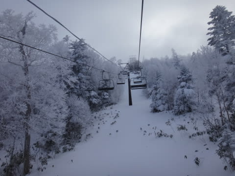

滑れるのは天狗コースだけ．

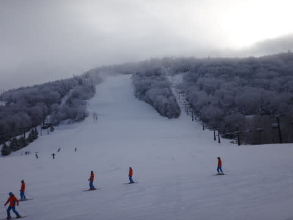

メインコースは滑れず，山頂付近は必死に人工雪をつけてましたね～．

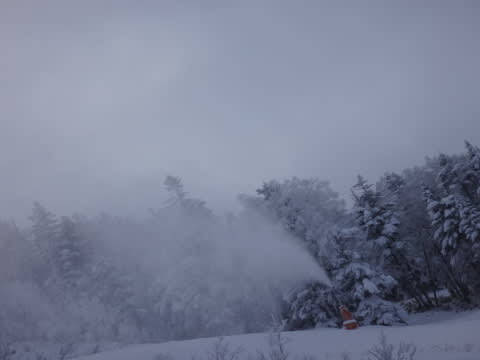

そして，朝イチの一の瀬クワッドに乗ったわが親子．

…今シーズンの，天狗コース第一号のお客さんでした．

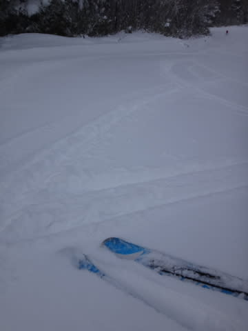

ふはははは．

今シーズン第1号の客として，まだ誰も今シーズン

滑っていないゲレンデを滑ってきたのだ！

(この写真は，数本滑った後のもの)

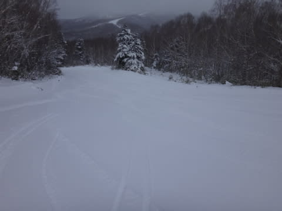

その後は，ダイヤから焼額へ移動しましたけど．

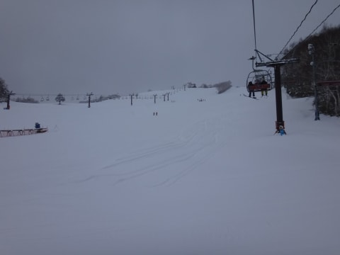

うおおお！

ダイヤも，もう全面ぜんぜん問題なくOKですね．

それどころか…

コース脇は圧雪されてないパウダーじゃないかっ！

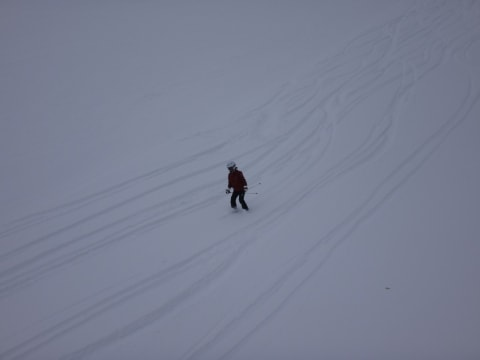

そしてダイヤモンドを通過して．

やってきました，焼額．

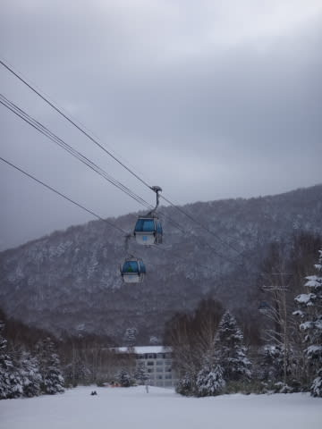

久しぶりだの～，第2ゴンドラ！！！

山頂に出ると…

気温はマイナス7度程度．

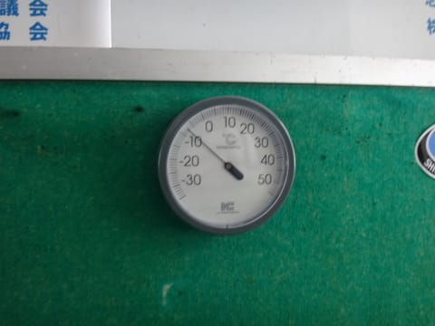

うむ．

十分冷えひえで，雪も十分．

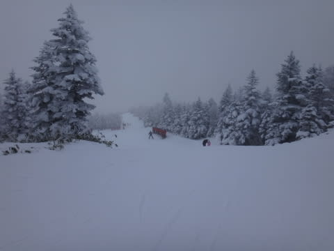

ブッシュも出ていなくて，ゲレンデコンディションは

この時期としては良いではないかっ！！

雪のコンディションはいいではないか．

…雪はいいんだけど．

…混んでるよ．コース．

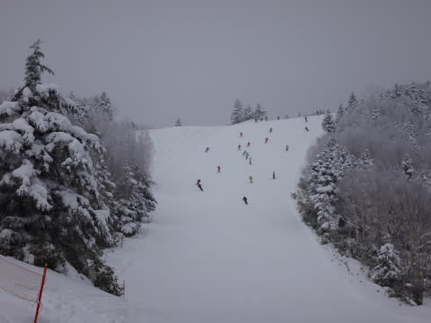

うーむ．某都道府県連の指導員研修会で，

かなり大勢の人数が入っていて…

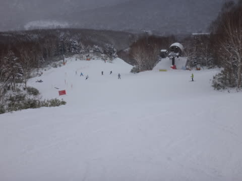

ちょっとゲレンデの人口密度が高いのが惜しい(かなりの涙）

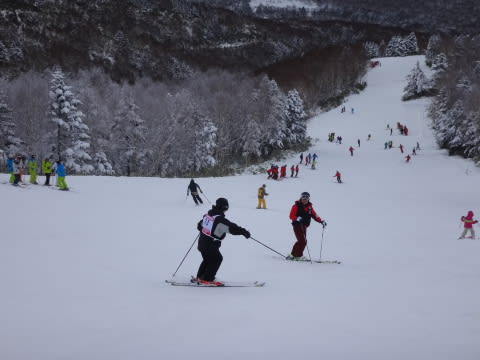

でも，ゴンドラはほとんど待たないし．

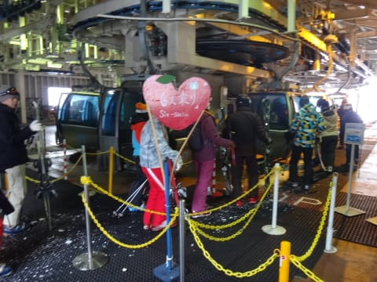

タイミングを見計らえば，クリアなときもあるし．

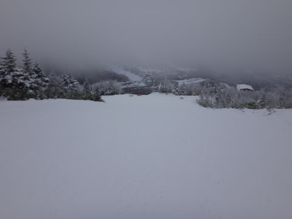

まー良しとしましょう．

…で．

天気予報では時々止むものの，終日雪がちらつく…

といっていたのに．

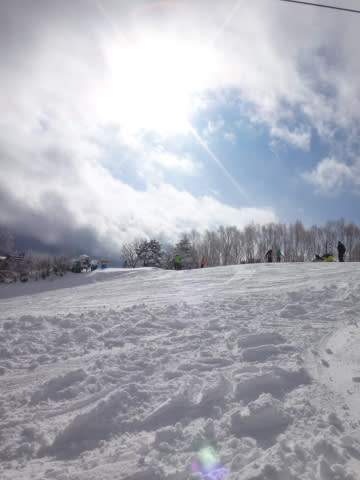

あり？

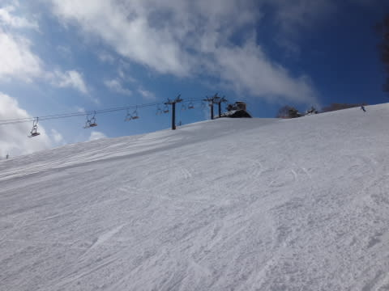

ありり？

…午後は，時々日が射すタイミングが．

…まぁ，天気予想，いいほうに外れたからこれも

良しとしておきましょう．←ごまかしている

って感じで．

タイミングが悪いとこんな感じだったけど…

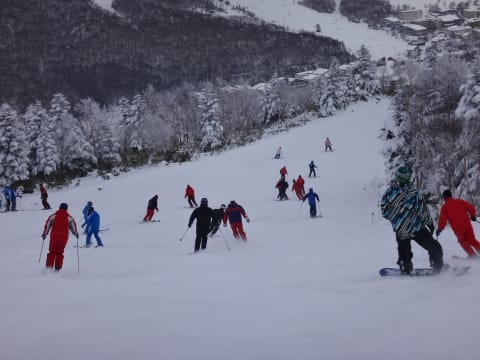

タイミングがよければこんな感じで．

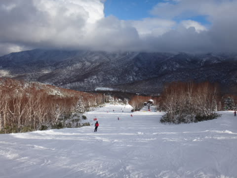

日が射した快適なゲレンデを滑ることができたのでした．

…ゲレンデ，ところどころ人工雪の硬いのが出てきた

ところもあるけど．

雪自体は，もうハイシーズンですねっ！！！

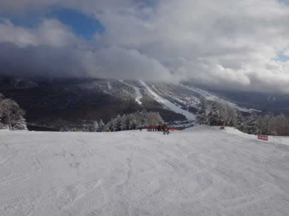

## 💬 コメント一覧

### 💬 コメント by (komu)
**タイトル**: 富士見は
**投稿日**: 2013-12-15 07:36:18

やはり志賀高原、天然雪モサモサですね

富士見パノラマはゴンドラ上部しか開いていないため滑走距離は少な目です。まあ17日には下まで開通するらしいので今度の3連休は3kmコースでサル化出来ますが。

いよいよシーズンイン。怪我なく楽しみましょう。

### 💬 コメント by (Goku)
**タイトル**: Unknown
**投稿日**: 2013-12-15 07:57:23

やっぱりヤケビは赤く染まっていましたね～！

昨晩はたくさん降ったから今日はパウダー三昧ですね。

### 💬 コメント by (ゆうこ)
**タイトル**: 白馬八方行きました！
**投稿日**: 2013-12-15 19:15:20

昨日今日は、八方行ってきました。

天気はずーっと雪で昨日はほとんど何も見えないけど、パウダー祭りでした。

今日は山頂は風が強く吹雪で、ゴンドラから下は比較的視界もよくてよかったです。

来週は、志賀高原行くのでよろしくお願いします！

### 💬 コメント by (Sker_S)
**タイトル**: 帰ってきました
**投稿日**: 2013-12-16 01:57:09

>komuさま

富士見パノラマ，行ってきましたか．

ヤケビはゴンドラが滑れて快適でしたよ～．

また，志賀にもすべりに来てください！

(行ってください，じゃなく「来てください」に

なっているところが，すでにヤケビが地元感覚)

>Gokuさま

いやー．

ゲレンデは真っ赤でしたよ…

(血の海みたいですね(笑））．

パウダー三昧，ってほど積もらなかったのが

残念！

でも，コンディションはこの時期としては恵まれて

いるかと．

>ゆうこさま

あー．

八方は良かったみたいですね～．

しがは，パウダー祭りとまではいきませんでした…

ぼちぼち，って感じです(ちょっと残念)．

でも，焼額ゴンドラ動いたので満足！

また来週，お会いしましょう～！

