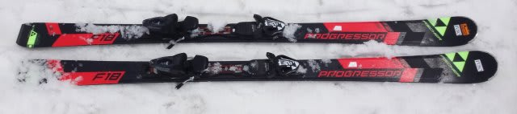
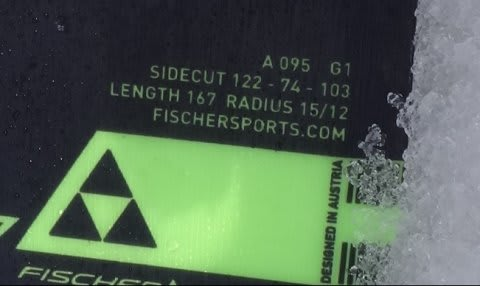
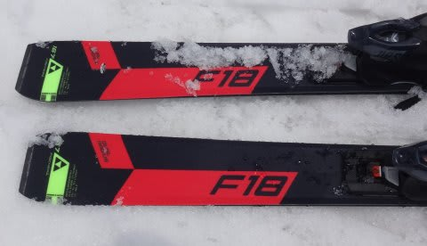
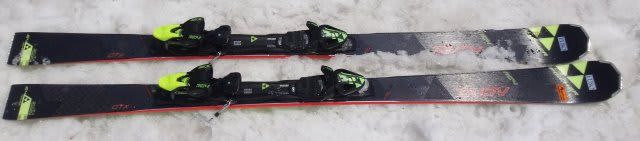
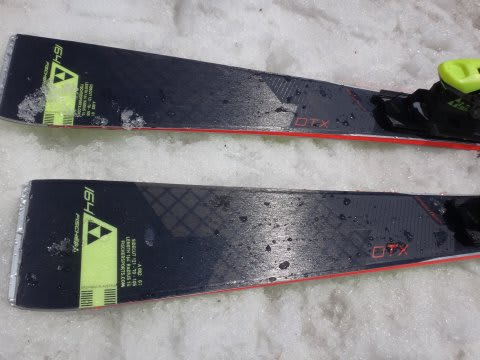

# 2017シーズンモデル，スキー試乗レポート第18回…FISCHER編その2

📅 投稿日時: 2016-06-16 01:39:26

ということで．

今シーズンのスキーは終わりましたが．

…まだしばらく続く，冬モード．

ってことで，まだ残っている2017シーズンモデルの

スキー板試乗レポート．

本日はフィッシャー編です．

では，どうぞ～！

○FISCHER PROGRESSOR F18 167cm

基礎オールラウンド…かな？

履いた感じは…意外と軽い！

R=15/12mの複合ラディウスみたいで，167cmだけど特に

小回りに特化した感じの板ではなく，無難にオールラウンドに

履ける板です．

CURV DTXと比べると，ターン後半でググッと回ってくる

旋回力は弱い感じ．

さらに，グリップさせていけばグリップしますが，

ガッツリ強烈なグリップの板ではなく，

割と簡単にエッジを外して板を動かしていけます．

軽いので，板はかなり動かしやすいです．

比較的たわませやすいのと相まって，

優し目の板に感じました．

トップスピード耐性はちょいと落ちるかな…

ギンギンにスピードを出さない人向けの，

無難なオールラウンド板ですね…

○FISCHER RC4 The CURV DTX 164cm（2回目）

小回りベースオールラウンド

[前回の志賀](ec14bcfb00dde81784374c104b1984444.md)で好印象だったので，

今回の固いコンディションで2回目の試乗です．

荷重ポイントは結構前めですね．

タングを抑えていくくらいの前め荷重が調子いいです．

谷回りでタングを抑えるようなポジションへ動くと，

すごく軽快に回りはじめ．

エッジが効いて，たわんで良く回って

キレイに抜けていきます．

履いた感じかなり軽く，板を動かす自由度も高く，

荒れた雪でも好きなところに板を差し込める

コントロール性の良さがあるのに．

きれいにトップとテールのエッジが効いて，

たわみを出せてスーッと回って，抜けもいいです．

動かしやすいのに，この日の固い雪でも負けない

しっかりしたフレックス・エッジグリップで，

十分なスピード耐性もあり．

やっぱりこの板．

小回りベースのゲレンデ用板としては，

結構いい板ですね～．
