# 2021/2/8の志賀高原スキー場特派員情報＆11日の祝日までの志賀高原の天気を予想してみる

📅 投稿日時: 2021-02-09 02:26:16

🏷️ カテゴリ: [日記](cc4b5682fb7b8b144980957a978653fb0.md)

えー．

緊急事態宣言が出てから，しばらく営業を

休止していた苗場＆かぐらスキー場ですが．

無事，2月8日より営業再開されたようです！

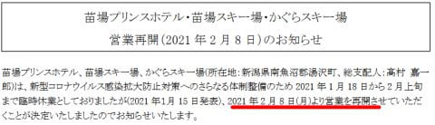

（[かぐらスキー場ホームページ](https://www.princehotels.co.jp/file.jsp?id=335382)より）

緊急事態宣言の延長に伴い，苗場・かぐらも

お客さんが減るのを見越して，営業開始を

遅らせるんじゃないかと心配してましたが．

無事，予定通りの2月上旬に再開してくれて，

良かった…

で．

8日深夜…

というか，　日付が9日（火）に変わった

深夜1:30現在．

志賀高原は雪が降ってます！

かなり降っています…！

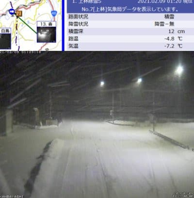

この雪は，今からそこそこの勢いで

降り続き．明日も一日降り続けそうなので…

明日の朝はパウダーデーになりそうです！！

あぁ…滑りたい…パウダー滑りたい…（禁断症状）

ってなことで．

昨日から雪が降り続け，8日月曜も

そこそこのパウダーデーだったんじゃないかと

思いますが．

志賀高原の特派員によると…

朝の積雪は，駐車場で20cmほど！

（最近は，もうこのおこみん人形が必須登場キャラとなってる…）

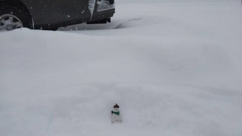

そこそこ積もりましたね…！

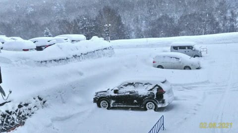

あさイチの気温は-12℃と．

今日も冷えてますよ～！

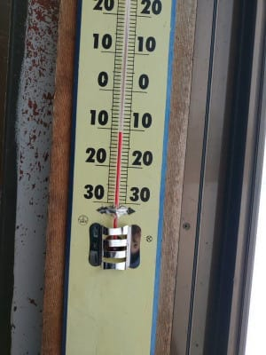

雪は昼間もずっと降り続けていたようで…

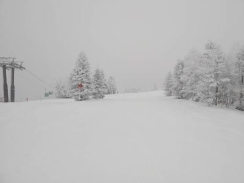

ゲレンデの積雪は，場所によりけりだけど，

15cm～40cmの新雪！

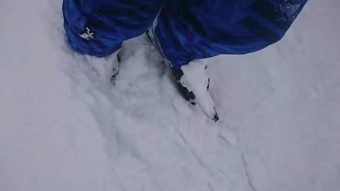

朝は，ブーツパフのそこそこ軽めの

パウダーが楽しめたようです…！

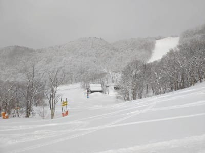

これは，営業開始前の西館とのことですが．

…いいなぁ…

こんなバーン，滑りたいなぁ…

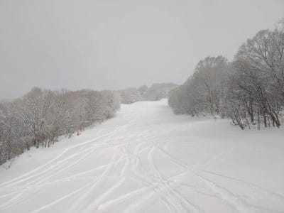

一の瀬正面バーンは，柔らかいのの下の

硬いバーンが出てきていたみたいだけど．

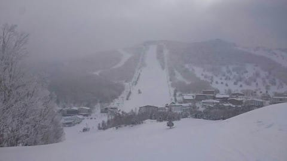

焼額方面では，硬い下地はほとんど

出て来てなかったようです…

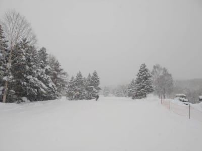

そして．

今日もガラガラで．

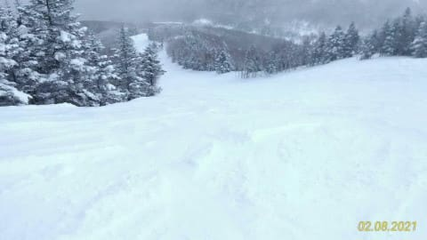

ゴンドラ待ちもなく．

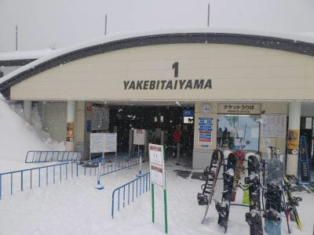

冷え冷えいい雪を，ガラガラバーンで

楽しめたようです…！

さらにボーナスで，午後になると

雪も止み，雲も切れて来て…

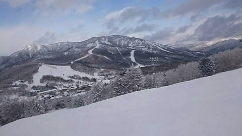

夕方は日も射したようです！

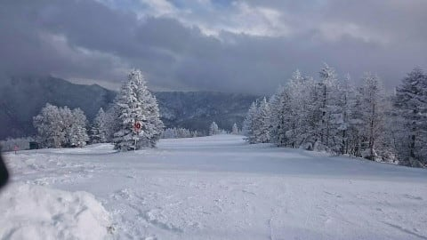

うーん．

なんだかんだ言って，今日もいい

コンディションだったんだなぁ…

うらやましい！！

ってなことで．

どうせスキーに行けない私には関係の

ないことですが．

今週の11日の木曜，祭日だということに

気づきました…！

だもんで．

雪が降り続け，このままトップシーズンの雪のまま

11日の祭日を迎えられるのか？

11日までの天気をざっと見てみましょう…

えー．

まず，9日の火曜は．

もう，気温は激烈な冷え冷えです！

850hpa図では，水色の-12℃の水色の

線が志賀に達してますので，朝は

-15℃レベルを覚悟した方がいいでしょう…

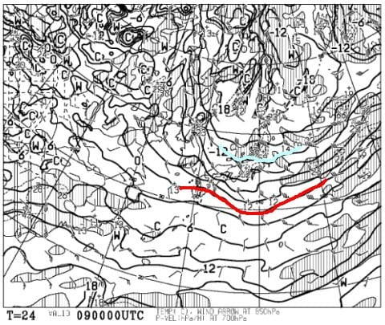

で，地上天気図を見ると冬型の，日本海への

吹き出しの雲が出ているので…

9日も朝は冷え冷えのパウダーが

20～30cmほど積もり，終日

雪が降る一日になりそうです！

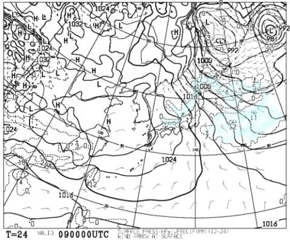

そして，10日の水曜は…

850hpa図では，水色の-6℃線が志賀に

かかっているので．

9日よりは冷え込みが弱まりそうだけど．

でも，朝は-10℃近くまで冷えそう…

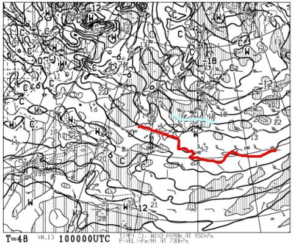

そして，この日の地上天気図を見ると．

うむ．

概ね高気圧に覆われるので，

朝のうちは雲が多いかもしれないけど，

昼間は晴れそう！

この日は，朝までに降り積もった雪が

圧雪されて，冷え冷え最高勘違い雪の

絶好のスキー日和かな…

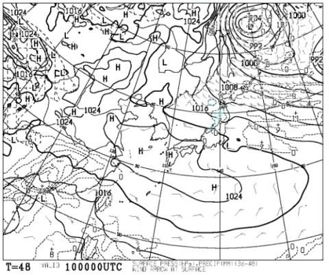

絶好のスキー日和のまま，

11日の祭日を迎えてくれるのか…？

と，11日の850hpa図を見ると．

まぁ，この日も水色の-6℃線が志賀に

かかるレベルなので．

そこそこ冷えた一日になりそう…！

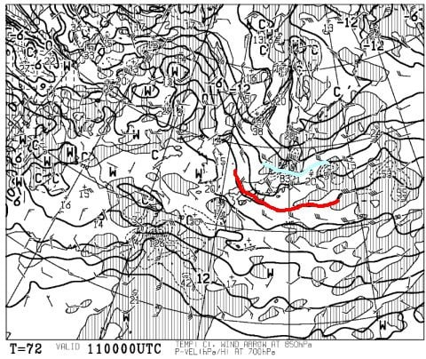

そして，地上天気図は．

うーむ．

水色の降水域が日本海側にかかってますね…

この日は，志賀は午前中は雪がぱらつくかな？

ただ，高気圧が近づいているので，午後は

晴れてくれそうだけど…

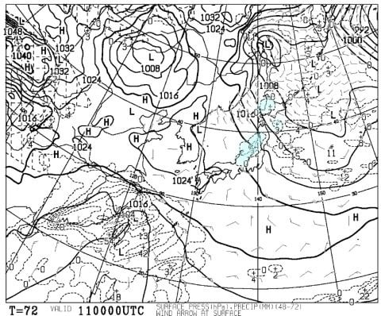

ってなことで．

まとめると．

9日（火）：朝までの積雪は20～30cmで，

　脛パフパウダー！

　あさイチの気温は-15℃と，冷え冷えの，

　軽いパウダーが楽しめそう！

　昼間も気温が上がらず，雪が降り続ける．

　かなり寒くて雪が降り続けるので，

　根性の無いスキーヤーふるい落とし機能が

　フルで働く日になるか…

　午後はちょっと雪は弱まるかも？

　終日冷え冷えの軽い雪が滑れそう！

10日（水）：明け方まで雪がぱらつき，朝には

　止んでいるか…

　曇り空でスタート，午後に向かって晴れていく．

　あさイチの気温は-8～9℃程度，昼間も-3℃くらい

　までしか上がらない．

　あさイチは昨日までに積もった柔らか

　雪が圧雪された，やわらか圧雪バーン！

　昼間も天気が回復していくのに雪質は

　最高をキープする，見事な勘違いバーン．

　結構ねらい目の一日．

11日（木）：夜の間に雪が5～10cmほど

　積もってるかな？

　朝は-7～8℃，朝は雪がぱらつく天気．

　あさイチはこの日も柔らか圧雪！

　昼ぐらいには雪も止み，午後は晴れ間も

　広がっていく．最高気温はこの日も　

　-3℃くらいまでしか上がらないかな？

　雪質は良いけど…人が多いバーンは

　午後はちょっと荒れ気味かも．

　

ということで．

これから11日の祭日までは，結構

冷え冷えのいいコンディションが

続きそうですよ～！！

…

だけど．

週末の13，14日は…

ん？

んんんん？？？

赤い0℃線が…

志賀より北にありますよ！？？

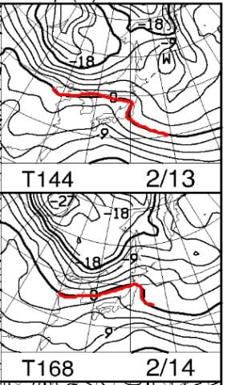

…これは…

降ると液体の可能性が…

地上天気図はどうだ！？？？

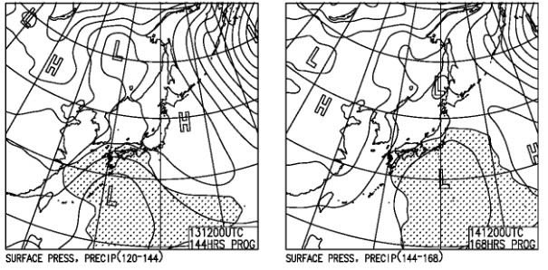

…び，微妙…

13日は網掛けの降水域が志賀にかかってないので，

液体が降ってくることは無さそうだけど…

14日は，もう少し低気圧が北上すると

ヤバいです（涙）

とりあえず．

11日まで続くいい雪が週末までも

続いてくれるよう，（スキーに行く皆さんは）祈りま

しょう…←あなたは槍かミサイルが降るように祈るのね…

## 💬 コメント一覧

### 💬 コメント by (レインボー73)
**タイトル**: Unknown
**投稿日**: 2021-02-09 07:58:08

火曜日のぱふぱふ志賀高原情報

湯田中で15cmさらさら積雪。上は50cm超え。

今日は昨日より短い、来期モデルの試乗板、ヘッドCORE99 180cm Ｒ17 134 99 120

昨日と逆にすればよかった。

降りすぎてニゴンのスタートは遅れそう。まだしんしんと振り続いてます。エス様、ごめんなさいね。

今日も期待に胸が膨らみますが、明日の勘違いバーンも滑ってみたーい。

### 💬 コメント by (レインボー73)
**タイトル**: Unknown
**投稿日**: 2021-02-09 12:00:17

火曜日の志賀高原情報２

朝の上林ー６℃　蓮池ー12℃　ニゴン上ー14℃。皆が新雪に胸を躍らせてる。私は膝リハビリ中の友人とシラカバへ。これが正解。最後の圧雪なのかシマシマファースト。寒い二高に乗ってカラマツ。ここは風で真っ平らになった極上ファースト。二人でごちそうさまでした。

次いでお目当てのＧＳサイドへ。

あれれ、ゴキブリホイホイ状態だ。5匹（失礼）捕獲されてる。入ってみたものの深くて進まない。必死でこらえて脱出セーフ。よかった、最初に来なくて。

念の為オリンピックへ。あれれ、ただの荒れ斜面だ。なんも楽しくない。片栗粉のような細かすぎる雪で、最初から少しの積雪で重かったとか。（私の動きの完璧さに自己満足）

10時過ぎに、期待のダイヤモンドへ。あれれ、ここでもホイホイ多発。身体がしっかり埋まっている。

ポールの向う側に入ったら、下の方で力尽きた人が。おかげで助かりました。あとはポール手前の土手。浮く浮く、快適、この板いい。ここを回してからファミリー。ボコボコだけど雪はこちらの方がいい感じ。

高天の非圧雪でもホイホイ大流行。この板は深くて浮く浮く。余は満足じゃ！（しまった、身分がバレる）。

世の中には大嘘つきもいるもんですね。

久しぶりに高天ヶ原ホテルのピザを食べて、余は満足じゃ。

だけど、西館詣でもしなくっちゃ！

### 💬 コメント by (レインボー73)
**タイトル**: Unknown
**投稿日**: 2021-02-09 17:43:50

火曜日の志賀高原情報３

12時過ぎ、お目当ての西館を滑る。うっそー！上から下まで、極上踏まずのパウダーばかり。しかも最高雪質ふっかふか。板は浮くし取り回しも楽。昨日の189cmでは苦戦したけど、私にはこの180cmが整地も含めてばっちり。ああ、エス化だけは食い止めないと。ウエアも４着買って、また一つ頂いちゃった。

西館リフトは13時始動なので、ブナや東館で時間をつぶして、西館をまた。

目的を果たすと、もう足は売り切れ。レインボーに遅刻するという失態でした。

それにしても、シーズン67日目で一番楽しかった！

### 💬 コメント by (Skier_S)
**タイトル**: 冷え冷え新雪だったようですね…
**投稿日**: 2021-02-10 02:15:57

＞レインボー７３さま

今日も詳細レポートありがとうございます～！

朝は激軽いパウダーだと思ったのが，意外と重かったんですね．

でも，だんだん良くなったようで…

シーズン67日で最高とは！

てっきり，根性の無いスキーヤーふるい落とし機能全力展開かと思ってたんですが，

残業まで行ったんですね…

明日も雪は最高だと思いますよ！

