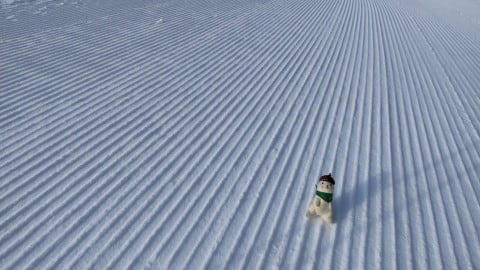
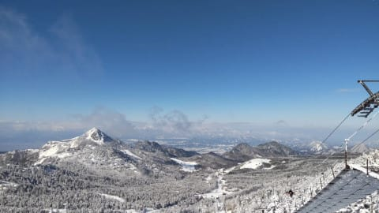
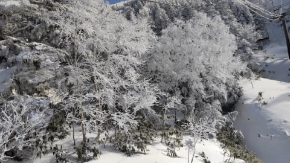
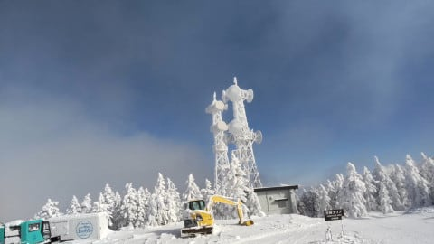
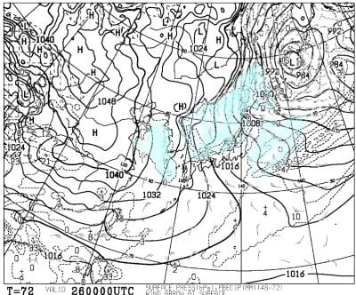
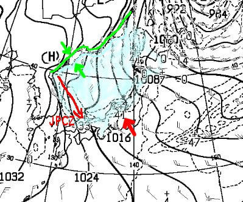
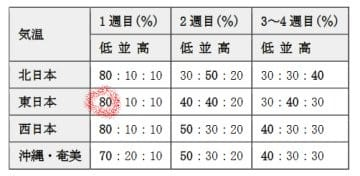
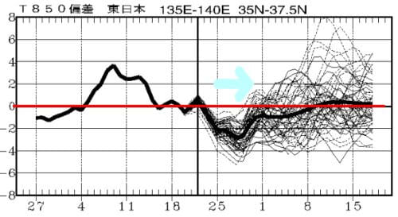

# 12月26日(日)はパウダー当たり日の予想！…そして今日発表の1か月予報を見ると，1月中旬まではいいコンディションが続きそう

📅 投稿日時: 2021-12-24 01:37:24

ということで．

本日も，おこみん特派員から志賀高原

の写真が送られてきましたが…

今日は予想通り，朝イチは晴天の最高

冷え冷えシマシマだったようです…！！

天気も良くて．

雪も冷えてて最高の雪質だったようで．

いいなぁ…

でも．

この景色からわかるように．

一日かなり冷え冷えで，

遅いリフトに乗っていると

凍死しそうな寒さだったようです…

でも，レインボーさんから，これまで

スキーをやってきた中で最も楽しかった

一日というレポートもやってきていたので，

いい一日だったようですね～．

うらやましい…

ってなことで．

昨日の予想でかなりの雪になりそうと

予想した今週末ですが．

最新の，26日の地上天気図を見ると…

うおおお！すごい雪が積もりそうな

天気図だ…っ！！！

拡大してみると．

まず，緑色で示した中国の海岸線と

水色の降水域が始まるところの隙間が，

むちゃくちゃ狭いです…

つまり，大陸からの冷たい空気が日本海に

触れたらすぐ雪雲になるほど激烈に

冷えてるってことで，これ，大雪の目安．

さらに，JPCZは能登半島の西に向かって，

ほぼ真南に伸びてるので．

これは，北風の証拠．志賀にも雪が積もる

完全北風です！！！

そして，上の図の赤矢印で示した先に

41って数字が見えますが…

これ，日本海側で41cmの降雪になるって

予想ですね…

さらに，JPCZが直撃する山陰で33cmの

積雪になりそうなので，山陰はすごいことに

なるかも？？？

とりあえず，26日の日曜は積もります！！

冷え冷えの軽い雪が激積もりです．

多分，膝パフ～太ももパフ！

今週末から志賀高原は，ジャイアントを

除く全面可能になりそうなので．

いろんなところでパウダーが楽しめそう！！

…ただ．

寒くてゴン積もりの天気なので．

根性の無いスキーヤーふるい落とし機能が

フルパワーで発揮される日曜になりそうですが…

でも．

2週連続パウダーって，めぐまれた12月だな！！

というところで．

さらに本日木曜，気象庁の一か月予報が

出る日なので，こっちも見てみると…

うおおお！？

12月25～31日の1週目，平年より冷える

確率が80%！！？？

これまで，長いこと一か月予報を見てきたけど．

80％って数字は初めて見た気がする…！

これはすごい．

これから一週間，激冷えになること間違いなし！

そして2週目，1月1日～7日も冷える確率が

40％と，まぁ冷えてくれそうですね…

3-4週目の1月8日から21日は平年並みですが，

1月に入ると，平年並みなら十分寒くて．

むしろ平年より冷えちゃうと，寒すぎて

辛いので，平年並みで十分…

気温傾向を見ても，

これから30日くらいまでは水色矢印で

示したように，冷え冷えウィークになりそうだけど．

それ以降は大体平年並みになりそうですね…

まぁ，1月に入れば，平年並みなら問題なし！

平年比でぐっと気温が上がる日がなければ，

平和に過ごせます…

ということで．

この12月は冷え冷えの恵まれた12月でしたが．

1月も前半はいい感じのまま行ってくれそう！

…うむ．

これはやはり，私の日ごろの行いが

神様のように良かった賜物だな！！！←寒いギャグを言い続けた効果じゃないの？？

## 💬 コメント一覧

### 💬 コメント by (レインボー74)
**タイトル**: Unknown
**投稿日**: 2021-12-24 16:11:13

金曜日の志賀高原情報

朝の上林-1℃　蓮池-2℃。今日は暖かい陽射しが歓迎してくれている。

パノラマ、唐松、GS、オリンピック。どれも非の打ち所がない。

GSから奥志賀への連絡道が、ガタガタながらも開いてくれたので、久々に奥志賀へ。

ダウンヒルもエキスパも、これまた非の打ち所なし。

戻りは必死に漕いで一ノ瀬へ。パーフェクタが開いたので飛び込んだら、日陰で見にくいうえにガタガタ。

寒くない寺子屋では、昨日に続いて1000円サンド。美味しい！

午後のファミリーは少し荒れ始め。

やけびに帰ると、やっぱり快適。もう帰ろうと二高を降りたら、子供が転んで泣いている。初心者の母親と小２の女の子。放っておくわけにもいかず助け起こし、あとはゴンドラまで仲間のスキー名人がマンツーマンレッスン。最後は滑れるようになって大喜びしてました。よかった！

てなわけでレインボー(２時まで)の禁を破ってしまっただめ親父達でした。

### 💬 コメント by (Skier_S)
**タイトル**: ＞レインボー74さま
**投稿日**: 2021-12-24 22:53:33

今日もコンディション良かったんですね…

うらやましい…

そして，人助けお疲れ様です．助けられた親子にとっては，

レインボーさんがかっこいいスーパーヒーローに見えていたに違いありません！

