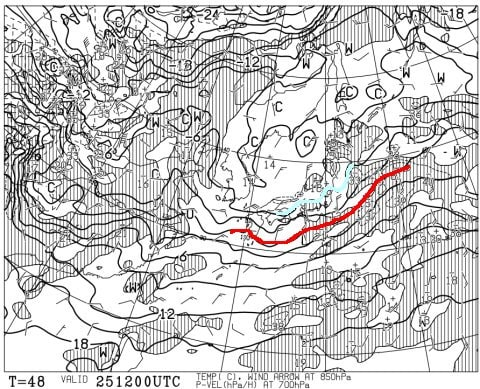

# 1月25，26日の週末の志賀高原スキー場の天気は…土日とも曇り～雪がぱらつく天気．日曜朝は10cm積雪があるかな

📅 投稿日時: 2025-01-24 00:58:49

🏷️ カテゴリ: [スキー天気予想](c6554f5c3c106093b511a8daae23757e8.md)

ということで．

昨日は水曜深夜というのに，記事を書く

まで起きていられず，週末の志賀高原

スキー場の天気予想をできませんでしたが…

本日は一日遅れで，週末の天気予想です！！

とりあえず，週末が最高だった志賀高原．

それから積雪は全くなく，昼間の気温が

プラスにまで上がる日もあったようですが．

志賀高原は雪は締まり気味ながらも

ガチガチアイスバーンになることはなく，

いいコンディションをキープして

くれているようですね…

果たしてこのコンディションをキープ

し続けてくれるのか？？

今週末までの天気を，天気図から

読み解いてみましょう…！

まずは，24日の金曜の850hPa気温ですが．

志賀高原には水色の-6℃線がかかっている

レベルと，まぁこの時期としては平均的な

ところで，キチンと冷えてくれる感じ．

そしてこの日の地上天気図は…

うーん．

かすかに新潟付近に降水域はあるけど．

志賀にぎりぎりかかるかどうか…

まぁ，基本的に曇り，ときどき雪が

ぱらつくかも，という天気ですね．

続く25日(土)の週末の850hPa図ですが．

この日も志賀にかかっているのは水色の

-6℃線．

土曜も平年並みに冷えてくれるので．

志賀の1月の平年並みなら十分寒い

感じですね．

そしてこの日の地上天気図は…

この日も新潟から東北の日本海側に

降水域がかかってますが．

余り内陸まで水色の降水域は入りこんで

無いので…

土曜も雪が時折パラパラ降る程度かな．

さらに26日(日)の850hPa図を見ると．

この日も志賀にかかっているのは-6℃線．

3日間，暖かくなる日もすごい冷える日も

ない，だいたい平年並みの寒い日が

続きそうな感じ…

で，この日の地上天気図は．

うーん．

この日も日本海側に雪雲が

かかっているので…

降りますね．

終日小雪がぱらついたり止んだり…

という感じの降りですかね．

ってなことで．

まとめると．

24日(金)：朝の気温は-7℃くらい？

　朝までにうっすら1-2cm積雪か．

　終日曇り空，ときおり雪もぱらつく．

　朝イチはいい感じのバーン！

　気温は昼間はそんなに上がらず

　しっかりマイナスキープ．

　雪はしっかりしているので，

　終日それほどバーンは荒れない．

25日(土)：朝の気温は-9℃程度，

　昼間も気温は-5℃程度までしか

　上がらない．

　朝までの積雪はほぼ0．

　終日曇り空，ときおり雪が

　ぱらつく感じの天気．

　朝イチは締まり気味のいいバーン！

　視界が良ければ最高なので，

　ガスがかからなければいいんだけど…

　下地の雪がしっかりしているので，

　終日バーンはそこまで荒れない．

　

26日(日)：朝の気温はこの日も-9℃

　程度．前日から10cmくらい積もってる

　かも．

　朝イチは圧雪の上に数㎝の新雪が

　乗った，トップシーズンらしい

　滑りいいバーン．

　この日も視界が良ければいいんだけど…

　天気は朝から雪が降ったりやんだりの

　一日．

　午後は急斜面はバーンがわずかに

　荒れ気味になっていくか…

という感じでしょうか．

先週末のようにすっきり晴れとは

いかないけど，1月らしい冷え込みで

日曜はちょっと雪が積もってバーンを

覆ってくれそうだし．

雪の状態はいい週末になると思いますよ～！！
