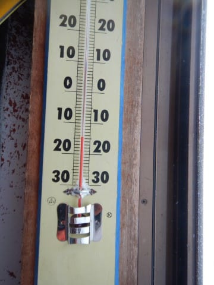
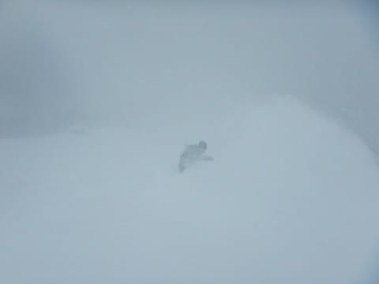
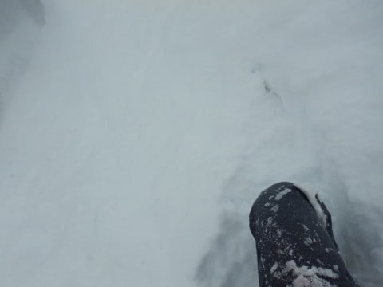

# 2022/2/6(日)の志賀高原スキー場詳細レポート！…終日雪降りのエンドレスパウダーデー！でも寒かった…

📅 投稿日時: 2022-02-08 01:04:07

🏷️ カテゴリ: [2022スキー滑走日記](cc9cb73e4320f6a97af6fccc37587a61a.md)

本日も，志賀高原から特派員情報が

送られてきましたが…

朝までは結構な雪降りで，

積雪40cmほど！！

だもんで，焼額はゴンドラもリフトも

営業開始が20分ほど遅れたようですが…

でも，圧雪コース上はそれほど積もって

無いように見えますね…

朝の気温は-13℃とそこそこの冷え込みで．

で，リフト営業開始からしばらくすると…

なんと！朝まで大雪だったのに，

晴れてきたようです！

いや…午後からは晴れるかも，と

思ってたけど．

まさか午前の早いうちから晴れるとは…

ただ，結構コース上はモサモサに

なっていったようですが…

でも，今日滑った人は，

晴れの新雪を滑れたので，

かなり恵まれてたかと…

うらやましい…！！！

ってなことで，本題へ．

大雪だった日曜の志賀高原の

詳細レポートです！

えー．

まず．

昨晩からはかなりの雪がつもり，

朝は宿の前に停めた車の発掘作業

からスタートです…(涙）

いや…ナイター終わった後から一晩で

これだけ積もったのか…

そして，ひたすら雪が降り続ける中，

焼額へ向かいますが…

なんと．この大雪でもファーストトラックを

営業していたようです…！！

とりあえず自分は通常営業からの

参加ですが．

通常営業開始時でも激しい雪が

降り続け，視界はあんまりよくないです(涙）

そして，山頂のあさイチの気温は-15℃と，

予想通りの冷え込み！

寒いよ！！

昨晩からの積雪は50cmを超えたようで．

圧雪バーンにも10cm程度の積雪が

乗っていて…

圧雪コースもパウダー状態！！

うむ．

この写真，圧雪バーンには見えませんね…

こういう日は，新雪バーンのオリンピック

コースへ直行するのだ！！

今日のオリンピックコースは…

太板を履いて，太ももパフ！！

細い板だったら，もう少し潜るかも…

110cmのストックがこれだけ

埋まってるので…

おそらく積雪は50cm越え！！

もう，パフパフ！！

久しぶりの太もも～腰パフ！！

うほーーー！！

パフパフ！！

ディープパウダー！！

太ももパフ，楽し～！！！

でも…

思ったほど軽くない(涙）

ちょい重めの雪で，緩斜面では

ブレーキがかかる雪だったので…

もう少し軽い雪だと良かったんだけど…

…あと，激しい雪降りで，

視界もわるかったのが残念…

視界が良ければ最高だったんだけど…←注文の多い料理店か！？

ってなことで．

しばしオリンピックコースをパフパフしたら…

朝10時に，ヤケビウォールがオープン！！

だもんで，ヤケビウォールへGo！

ヤケビウォールは…

センター108mmの太板を履いても

完全に腰パフ！！！

全然底付きしないので…

細い板を履いたら，どのくらいまで

埋もれるのかな？？

これは，太板じゃないと怖くて

突っ込めないレベルのディープパウダー！！

1本目はまだほとんど跡がついてない

コースを，おいしくいただきました～！！

ただ，3本目以降はかなりガサガサに

踏まれまくって，ちょっとおもしろく

無くなっちゃいましたが…(涙)

でも，今日はGSコース脇も，ミドルコースも，

あるいはSGSコースも，どこに行っても

パフパフで…

これらは滑る人が少ないからか，

午後になってもまだまだ頭まで

雪煙が撒きあがるようなディープ

パウダーが残ってます！！

さらに，今日は昼間の最高気温も

-11℃までしか上がらず，寒かったうえ…

ひたすら雪が降り続け，視界も悪かった

からか…

とても日曜とは思えないゴンドラの

空きっぷり！

当然，ゲレンデも滑ってる人が少なく…

これで雪がひたすら降り続けてるので．

圧雪バーンでも全面，午後になっても

プチパウダー状態だよ！！！

これ…

どう見ても圧雪バーンを滑ってる

ようには見えないよね…！？？

ってなことで．

新雪が嫌いな人には，どこに行っても

新雪という，地獄のようなコンディション

だったかもしれないけど．

新雪大好き人間にとっては，

多少天気が悪かろうが，視界が悪かろうが，

ひたすら新雪を滑れる，天国としか

思えない一日だったのでした…

いやー．

今日はひたすら一日太板で滑った．

お腹いっぱい新雪を滑ったよ…

とりあえず，これからの天気図を見ると．

金～月まで続いた冷え冷え雪降りデーは

月曜で一旦終了のようです…

8日(火)，9日(水)と，雪が降らず，

時折雲が出るかもしれないけど，

基本的に晴れて天気が良さそうな

日々が続きます…！

10日は，朝は晴れてるかもしれないけど…

昼ごろから南岸低気圧っぽい，

湿った雪が降るかな．

そして3連休は晴れそうな予感…！！

なんだけど．

天気よりも，コロナの勢力拡大の方が

ヤバそうな感じ…(泣）

## 💬 コメント一覧

### 💬 コメント by (新米パパ)
**タイトル**: Unknown
**投稿日**: 2022-02-08 10:43:54

お疲れ様です。

Sさんは、今、何滑走日こなされたんですか？

年間滑走日はどのくらいいけるものですか？

我が家で14回です。

娘が中学生になったら、終わった人になるべく今から仕事と財政を調整しようと思ってます。

### 💬 コメント by (Skier_S)
**タイトル**: ＞新米パパさま
**投稿日**: 2022-02-09 00:50:02

えーっと．

今シーズン滑走日数は，多分33日ですかね…

私はいつも，大体シーズン70日くらい滑ってます．

10月下旬から5月いっぱいまで毎週滑ればそのくらい行けますよ～！！

