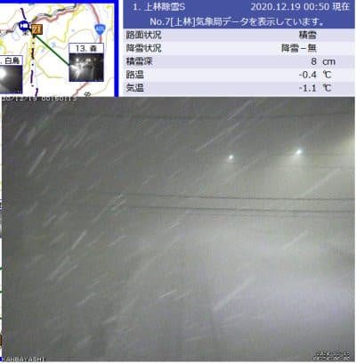

# 今週末も志賀高原で滑ってます…19日土曜は終日激冷え大雪，20日も終日降りそう

📅 投稿日時: 2020-12-19 01:32:02

🏷️ カテゴリ: [日記](cc4b5682fb7b8b144980957a978653fb0.md)

えー．

そろそろ，

「雪が降ってくれてうれしいなぁ♡」

と，のんきに喜んでられないほどの

ハンパない降りになってきた今日この頃．

皆様いかがお過ごしでしょうか．

（[北信建設事務所道路気象情報カメラ](http://hokushin.pref-nagano-roadcamera.jp/)より）

…いや．

ホントに降り方が半端ない．

ってか，

降り方が極端すぎるんですけど…

とりあえず．

今晩もひたすら降り続き，土曜は朝から

パウダー，昼間もエンドレスパウダーデーに

なりそうですが．

この半端ない降りで，焼額は今日から2ゴンが

オープンし．

明日は白樺，ビギナーズコースもオープン

するようです！

（[焼額山Facebook](https://ja-jp.facebook.com/yakebitaiyama/posts/3509055049189816?__tn__=-R)より）

奥志賀も本日から第2，第3高速ペアが

動き出し．

明日は第1も動くようですね…

ゴンドラは残念ながらこの週末は

動かないようです…

（[奥志賀高原スキー場ホームページ](http://www.okushiga.jp/ski/20%ef%bc%8d21%e3%82%b7%e3%83%bc%e3%82%ba%e3%83%b3%e5%a5%a5%e5%bf%97%e8%b3%80%e9%ab%98%e5%8e%9f%e3%82%b9%e3%82%ad%e3%83%bc%e5%a0%b4%e3%82%aa%e3%83%bc%e3%83%97%e3%83%b3/)より）

焼額の第1ゴンドラも奥志賀ゴンドラも，

突然の雪で，コース整備とスタッフの手配が

間に合わなかったんだろうなぁ…

で．

中央エリアは…

一の瀬クワッドが動き出し，正面・天狗コースがオープン．

高天ヶ原もクワッドが動き，NHK&中央バーンがオープン．

あと，西館はクワッドが動きますが，フード付きは動かないようです…

発哺クワッドも動きますね．

そしてついに，パルスゴンドラ（正式名称は志賀高原リゾートゴンドラになったようです）も動き．

後は，サンバレーと丸池も営業です！

（[志賀高原リゾート開発ホームページ](https://shigakogen.co.jp/archives/8857)より）

…けど，

ジャイアント・蓮池・寺子屋・東館ゴンドラ・西館トリプルは動かない

のか…

そして．

山の神も動かさない

という，どう考えても焼額で滑るスキーヤーに

対する嫌がらせとしか思えない仕打ちが

今シーズンも続いてますね…（涙）

とりあえず．

この土日の天気は，概ね水曜の予想通りで．

9日土曜：朝までの積雪30cm以上か？

　志賀高原の登り道路はかなりの積雪

　なので，注意！

　あさイチはコース脇は脛～膝パフの

　パウダー．

　気温も朝イチは-12℃以下と冷え冷え．

　昼間も-10℃近くまでしか上がらず，

　終日かなりの勢いで雪が降る．

　…というか，吹雪？

　昼間も20cmくらい積もるかも…

　終日パウダーが供給され続ける

　エンドレスもふもふパウダーデーだけど，

　吹雪気味で寒くて死ぬかも

20日日曜：この日も土曜ほどじゃないけど降る．

　朝までの積雪は10~20cm程度か…

　朝の気温は-10℃以下．

　昼間も-7℃程度くらいまでしか上がらない．

　終日曇り～雪降り．時折強く降る．

　昼間も5cmほど積もるか…

　雪が柔らかいので，ゲレンデは

　午後は荒れ気味．

という感じです…

ってなことで．

これから2時間半後に出発で，

今週末も志賀で滑ってます…！

…また，今日も2時間くらいしか寝られない（涙）

## 💬 コメント一覧

### 💬 コメント by (Northfox)
**タイトル**: Unknown
**投稿日**: 2020-12-19 20:19:44

今日は吹雪覚悟で熊の湯に行きましたが、降雪もそこそこで風も少なく意外と穏やかでした。

ゲレンデも適度に新雪が積もったGoodコンディションで楽しめました（笑）

終盤は寒さと雪が強まってきましたがきっちりリフト終了まで滑って務め？を果たしました！

### 💬 コメント by (Skier_S)
**タイトル**: ＞Northfoxさま
**投稿日**: 2020-12-20 02:23:59

雪はそこそこの勢いで降ってましたが，風がそれほど強くなくて

思ったほど寒くなかったですね…

熊の湯はどうでした？

今日は焼額は寒くてみんな途中でくじけていったので，焼額の終礼は5人と

ちょっと寂しめでした(笑)

### 💬 コメント by (ikkun)
**タイトル**: Unknown
**投稿日**: 2020-12-20 05:38:43

こちらも( *´艸｀)やはり初日？しかもなかなかの雪吹雪 までは行かないけど………お客様が少ない土曜日でしたよ  今年の講習の為の講習?でしたがキツかったですよ(泣)

ちなみにレグザムはまだです(笑)

### 💬 コメント by (Skier_S)
**タイトル**: ＞ikkunさま
**投稿日**: 2020-12-21 00:54:50

講習お疲れ様です．

土曜は予想より雪が少なかったですが，それだけ分日曜に降りましたね…

