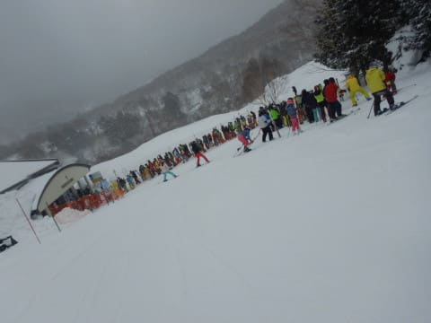
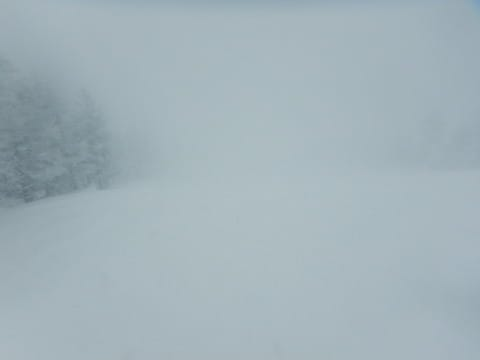
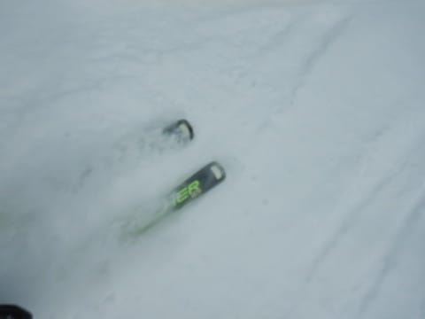

# 2022/3/6(日)の志賀高原スキー場，詳細レポート！…午前中は小雪ながらも混雑．午後は-10℃以下の吹雪(涙)．でも雪は良かったよ

📅 投稿日時: 2022-03-08 01:28:39

えー．

昨日の記事で，12，13日は高温になりそう…

と書きましたが．

どうも，最新の予想を見ると．

14日以降も高温が続きそうですね（涙）

12，13日の週末は降らなさそうですが．

14日の夜から15日くらいにかけて，

空から恐怖の大王…じゃなくて．

液体が落ちてくるかも…←まぁ，空から降ってくる液体もスキーヤーにとっては恐怖の大王みたいなもんだ

そして，2週間予想を見ると…

…

…ダメだこりゃ．

19日ごろまではずっと高温が続き．

ヘタをすると，15日の頃なんて

赤く囲ったように，グラフをはみ出るほど

なの高温なんですけど…（戦慄）

今週末も高温になりそうですが．

その次の週末の19，20日もかなりの

高温になる可能性が…（激涙）

これまで冷え冷えだったのに…

なぜこんなに極端に気温が上がるの？？

願わくば，この予想は外れてほしい…

ってなことで，本題へ．

日曜の志賀高原，詳細レポートです！

えー．

まず，あさイチの志賀高原．

昨晩から積雪があり，志賀への登り坂は，

本格的雪道だったわけですが．

今日は第2ゴンドラ運休との案内が

第2ゴンドラ駐車場に出てたけど．

第1ゴンドラは予定通り8:30に営業開始！

2ゴン運休だったわりに，営業開始前の

第1ゴンドラの営業待ちの列は

そんなに長くなかったですね…

ってなことで．

朝イチゴンドラで山頂に出ると…

山頂の気温は-12℃！

　朝の気温は-12℃程度と激冷え．

という予想ぴったりの激冷えです！

そして，あさイチの天気はうす曇り．

そこそこ風はあったものの吹雪にはならず，

そして曇りでもわりと明るくて凸凹が

よく見える，割といいコンディション！

朝までに積もったのは，

　朝までの積雪は5~10cmあるかな？

という予想の少ない方，5cmだけだったけど…

圧雪バーンも薄っすら雪に覆われていて，

結構固めのしっかりした下地に，

軽い新雪がうっすら乗った，

結構スピードが出る滑りいい雪ですよ！

あさイチはうっすら日差しもあり…

バーンも見やすく，コンディションも意外と

良かったかな！！！

…でも．

天気が穏やかだったのは，わずかな時間のみ．

残念なことに，9時半には天気が崩れて

雪が降り始め…

さらに，第1ゴンドラの待ちも10分くらいに

伸びちゃいました（泣）

第2ゴンドラが運休なので，第1ゴンドラ側に

人が集中しちゃったってのもあり．

天気が悪いにもかかわらず，GSコースは

ちょっと人口密度が高めでした…（ちょい涙）

でも，第2高速リフトはそれほど待ち時間が伸びず．

こっちはひたすらグルグルできましたね～．

そして昼休みタイムになると，第1ゴンドラも

ガラガラになり．

これはゴンドラグルグルしないと！！

と，喜び勇んで1ゴンに乗りますが…

なぜかゴンドラが空く昼ごろになると，

嫌がらせのように，雪もかなり気合を入れた

降りになってきて…

さらに午後2時ごろになると…

吹雪もひどくなり，視界もかなり悪化し，

おそらく焼額を滑ったことの無い人だと，

「どっちがコース？」

と分からなくなるレベルになってきたん

ですが？？（泣）

吹雪のせいで，リフトに乗ってられるか！

と，第2高速リフト側から人が流れてきたのか…

リフトはガラガラなんだけど，ゴンドラは

時々列が伸びることもあり．

日曜の午後にしては，列が長め（泣）．

まぁ，ゴンドラが動いてくれているだけ

ありがたい．

今日はフード付き第3高速は運休なので，

もしゴンドラが止まったら吹きさらしの

リフトに乗るしかなく．

昼間の最高気温も―10℃だった今日．

ゴンドラが運休だったら，リフトの上で

冷凍人間になること必至でした…

ってなことで．

まだゴンドラで滑れたから良かったけど．

午後の雪の降りはハンパなく．

コースの両脇の木すら見えない

ホワイトアウトになることもあり，

目をつぶってもヤケビを滑れるはずの

自分でも，野生の勘と経験といい加減な足裏感覚で

なんとか滑り降りてくるのが精いっぱいの

感じになることも時折あり．

根性の無いスキーヤーふるい落とし機能

がフルで発揮された天気だったのでした…

そのおかげで，

　昼間も雪が降り続け，昼間だけで

　5~10cmくらい積もるかも…

という予想通り，圧雪コース上にも

5～10cmほど雪が積もっていき…

まぁ，そんなに重い雪じゃなかったので

まだ良かったけど．

バーンの表面状況も良く見えない中，

新雪がモサモサ積もったバーンを，

野生の勘と経験といい加減な足裏感覚で

ひたすら滑り倒し…

自分は悪天候にもふるい落とされることなく．

営業終了まで生き残ったのでした…

そして．

結局今日は使うことなく，ゲレンデ脇に

昼間ずっと立てっぱなしだったショート板に

積もった見事な雪を見て．

あぁ，今日はこんなに積もったのね…

と認識できた，Skier_Sだったのでした…

ってなことで．

天気はちょいイマイチだったけど，

土曜は意外と冷えて締まった感じの雪で．

日曜は締まった雪の上にうっすら冷えた新雪，

…と，雪質は良かったこの土日．

なんと．長岡のエキップさんが焼額で試乗会を

やってくださったので，

来シーズンモデルの板を試乗しまくって

きました～！

こんな雪のいい時期に，滑りなれた

焼額で試乗ってのがありがたい…

今回は新雪もあったので，ファットや

セミファットも乗ってきましたよ！！

ってなわけで．

また今シーズンもスキー板試乗レポートやりますので，

お楽しみに～！！

## 💬 コメント一覧

### 💬 コメント by (新米パパ)
**タイトル**: Unknown
**投稿日**: 2022-03-08 10:45:44

お疲れ様でした。

あの視界ゼロの吹雪の中、どういうメンタルの持ち方で続けるのか！？が課題です。

もはや、レジャーでなく修行の境地ですか？笑

### 💬 コメント by (西館の息子)
**タイトル**: Unknown
**投稿日**: 2022-03-08 16:39:54

レインボーさん昨日は西館山までお越し頂きありがとうございました。＆Sさん試乗会でお世話になりました。（Volkl106の板を履いて欲しいという無茶ぶりに答えて頂き感謝です。）

今年ゴーグル&ヘルメットを物欲選手権にて敗北した結果、吹雪でも視界がクリアになって、吹雪の常に供給されるスーパーパウダーの虜になってしまい、リフトが動いてる限り帰りたく無い病に発症してしまい困っています。むしろ毎日吹雪でも嬉しいくらいに･･･

### 💬 コメント by (レインボー74)
**タイトル**: Unknown
**投稿日**: 2022-03-08 19:12:59

火曜日の志賀高原情報

朝の上林-4℃　蓮池-9℃。晴れてる。今日も絶好のスキー日和だ。

ニゴンは今日まで運休とか。イチゴンスタート。昨日の50cm

が圧雪されたオリンピックが今日の狙い目。来シーズンモデルの買ったばかりの小回り板が快調。オリンピックも、GSも、ちょっかり以外は全て小回り。オリンピックやGSをずっと小回りしたのは初体験。

白樺でもエキスパでも小回りばかあり楽しんでいたら、もうヘロヘロ。その後の高天では、身体に力は残っていませんでした。

### 💬 コメント by (アツシ)
**タイトル**: Unknown
**投稿日**: 2022-03-08 23:44:25

やっぱ4ロマですよ、昨日の午後の吹雪は。たまに滑ってる人はいてもそのまま上がってしまうのか、誰もリフトに乗らないのでリフトは待ちなしです！こんなん、リフト終了まで帰れません。楽しすぎて。常に新雪リセットです。視界のなさはコース横の立木を目安に野生のカンと足裏感覚で。寒かったので、昼前にTシャツ脱いでトレーナーにしたら結構ホカホカになりました。午後、2高降り場で「待ち0分」の表示になったので1ゴンの様子を見に行きましたが、やっぱり混んでたのでリフトに戻りました。結局、朝からラストまでほとんど4ロマと2高で回しました。終日Sさまの姿は見つけられずでしたが、来週は見つけます！

### 💬 コメント by (Skier_S)
**タイトル**: 10日まではコンディション良さそうかな
**投稿日**: 2022-03-09 00:45:34

＞新米パパさま

いや…雪があればどんなコンディションでも滑れますから！

雪があればどんなコンディションでも楽しいですから！

ものすごい交通費と移動時間をかけて，さらに土日休むために平日に死ぬ気で仕事終わらせて

来てるんですから，滑らないともったいないんです…

＞西舘の息子さま

私は日曜の午後はゴーグルが曇って結構苦しみました…

曇ったのがそのまますぐ凍り付く寒さでしたから，なかなか曇りが取れず…

あのゴーグル，曇らないんですか？？

＞レインボー74さま

今日は良かったみたいですね~．

明日の水曜までは最高のコンディション，

木曜もそこまで悪くないと思います（一の瀬より下，西舘・ブナ・ジャイアントあたりは

ダメかも）

雪の良いうちにたっぷり思う存分滑っておいてください！

＞アツシさま

…さすがの私も，日曜の4ロマは乗る気が起きませんでした…

すごい…

あの日の4ロマに乗ろうというのが，すごすぎる…

