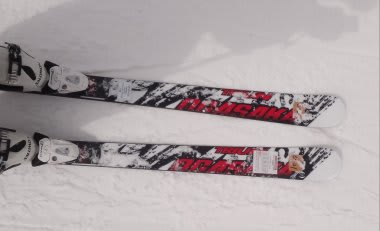
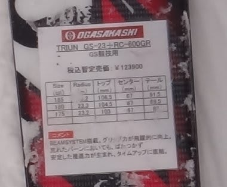
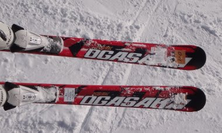
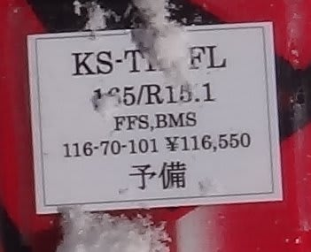

# まだ続く！2012/2013シーズンモデルのスキー試乗レポート　OGASAKA編2

📅 投稿日時: 2012-04-18 02:35:16

🏷️ カテゴリ: [スキー板試乗](c0bd8048615710cee890e403a36cc9a2b.md)

えー．

昨日はちょいと更新できませんでしたが．

本日は皆さんお待ちかね（なのかな？）の試乗インプレッションです．

まだまだ続きます．

今回は，オガサカ編パート2です…

-----

○Ogasaka

Triun GS-23 RC600GR 180cm

GS競技用．

競技用というより，大回りベースの基礎板っぽい乗り心地…

大回り～中回りまで行けますね．

フレックスは基礎板と考えると張りがあって強い感じ．

RC600GRプレートが結構強いのかな？．

でも，昔のGS板みたいに，メタルの返りの強さは全くなく，

GS用としては比較的マイルドかな．

サイドカーブにも乗っていけますし，板をずらして弧の調整も可能です．

しっかり板を動かしていけば，中回りまで問題なくいけます．

フレックスもそこそこ張りがあるのに扱いやすいので，

中回り以上なら何でもできそう．

予想外に，荒れた斜面でも行けます．

ゲレンデ用の大回り板としても十分使えますね～．

比較的張りのしっかりした大回り板が好きな人なら，

ゲレンデ用として十分使えると思います．

KS-TK+RC600FL 165cm

オールラウンド基礎板．

オールラウンドってことですが…

R=15という数字にだまされてはいけない．

得意なのは小回り．

R=12くらいかとおもうくらいくるくる回ります．

でも，X-KARTみたいにどうしようもなくくるくる回るのではなく，

プルークもきれいに操作できて，

ずらし小回りがきれいに決まる．

あんまりエッジでキーンときっていく板ではないけど，

エッジグリップでカービング小回りもスパスパ決まります.

そこそこ高速安定性もあります．

トップロッカーらしいんだけど…

板を押さえるポジションはかかとのラインではなく，

土踏まず～拇指球って感じがするし．

プルークもきれいに決まるし．

ロッカー系とは思えない操作感．

まぁ，R=15なのに，ずっと小さい半径で回ってくるところが

ロッカーぽいか．

でも．

乗り味は間違いなくOGASAKAのものです．

これまでOGASAKAを履いている人は，安心して乗れます．

OGASAKA乗りで，あんまりがんがん飛ばす人じゃなく，

ゲレンデで気楽に履ける楽な小回り板を探しているって

ならこれでしょう．
