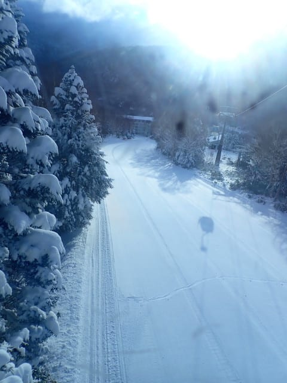
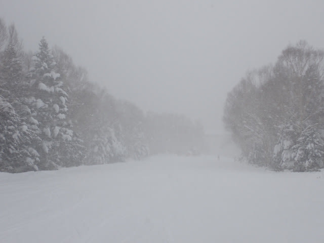

# 2024/12/14(土)の志賀高原焼額山スキー場は…朝の新雪15cm，気温冷え冷えで雪はGood！でも雪はすぐ荒れちゃった…

📅 投稿日時: 2024-12-15 00:23:36

🏷️ カテゴリ: [2025スキー滑走日記](cacd3fbf84d4a679ee61a5894c3f95e14.md)

ということで．

今日も志賀高原で滑ってきました～！！

まず．

今朝もいつも通り早朝4時前に家を出て，

志賀高原に向かったわけですが…

横川を過ぎた先で早くもチェーン規制（涙）

高速道路の積雪はそれほどでもなかったですが．

除雪車や融雪剤散布車などの作業車に

先導されての移動が続きました…

当然，中野の町中から本格的雪道ですし．

志賀への上り坂は，完全にトップシーズンの

積雪道路なので，志賀に行く方はしっかり

雪道対策していってください！

ってなことで．

いつも通り，朝8時半のオープン前に列に

並びますが…

今日は第2ゴンドラが運転！！

なので，第2ゴンドラの列に並びます．

結構並んでますが…

ゴンドラにこれだけ並んだのは朝の1本目

のみ．

これ以外は，ゴンドラもそんなに待たなかった

ですよ～！

いやーー．

昨晩からの積雪は15cmくらいと，

ぴったり水曜の予想通りでしたが…

朝はきれいに圧雪が入り，ゴンドラから

見たバーン状況もかなりよさそう！

で．あさイチの山頂の気温は-9℃と，

おおむね予想通りで，いい感じで冷えてます！

ゲレンデの雪は…

これも予想通り，新雪が圧雪されて，

圧雪コースも上にうっすら新雪が乗った

トップシーズンのバーン！

圧雪が遅めの時間に入ったバーンは，

上に新雪が乗っておらず，きれいなシマシマで…

朝イチはトップシーズンでもいい状況に

ランキングされるレベルのいい感じのバーン！！

いや…

ホントに2週間前まで，激狭のイエティで滑って

いたとは思えない，志賀高原のトップシーズンの

雪質で，幅いっぱい滑れるこのシアワセ…っ！！

ただ．

あさイチはいい感じのバーンだったけど．

雪が柔らかすぎるのもあり…

午後から雪は荒れると予想したけど．

午後からどころか，2－3本滑ると

柔らかいバーンはかなり凸凹に

荒れ始めてきました（泣）

この写真ではバーンが荒れてるのが

わかりませんが…結構凸凹してて，

飛ばされる感じのバーンです．

ちょっと荒れるのが早すぎる…（涙）

そして，朝イチは薄日も差すいい天気だった

けど．

今日は時折雪が強く降る，基本的には

雪が降る一日で…

あと，今日は大阪府の指導員研修会の

団体さんも入っていたこともあり…

第2ゴンドラと第4ロマンスのみ営業で，

パノラマーサウスの1コースしかオープン

してないところにちょっと人が多めに

集まっていた感じはあったけど…

でも，今日は一日，ゴンドラ待ちはほぼなく．

コースは荒れていたものの，ガラガラなゴンドラを

ぐるぐるできたのでかなり満足度は高め…！

雪は時折強く降り，昼間もバーンに雪が

積もってモサモサ凸凹していき，

結構疲れるバーンだったけど．

それでも，時折日が射すタイミングもあったり

して…

こんな感じの凸凹だけど．

トップシーズン並みの冷え冷え雪質の雪を

滑れる，このシアワセと言ったら…！！

（この段階で，あまりにも

バーンが凸凹で疲れるので，私の知り合いの

焼額常連はほぼ帰っていることに注意）

いやーーー！

雪質は冷え冷え最高だし，

人工降雪のおかげでブッシュの心配なく

ゴンドラ一本滑れるし．

素晴らしいじゃないですか！！（繰り返すけど，

ほかの知り合いはほとんど凸凹バーンにやられて

帰っていることに注意）

いやーーー．

吹雪いてもゴンドラは寒くないし．

ロングコースは滑れるし．

2.5ｋｍのコースを幅いっぱい滑れるなんて．

イエティに比べると，超シアワセ…！！

（しつこいようだけど，知り合いはみんな

あまりにもコースが凸凹で疲れるので

帰ってしまっている）

ということで．

予想の昼過ぎではなく，朝の早い段階からバーンが

結構荒れてきちゃったけど．

でも，雪はパノラマの急斜面にちょっとだけ下地の

硬いのが出てた以外は冷え冷え最高だし．

コース幅いっぱい滑れるし．うひょーーー！！

これは楽しい～！！（繰り返すけど．知り合いは

みんなあまりにも疲れる凸凹バーンに

やられて帰ってしまっている）

ってなことで．

トップシーズン並みのいい感じの雪質が

あまりにもシアワセすぎて．

今日も16時の営業終了まで，

いつも通り昼休みも取らず，ひたすら

滑り倒してきたのでした…

ちなみに．

帰るときは車の上に5－10㎝くらい雪が

積もってましたが．

今は志賀高原は全く雪が降っておらず．

明日までの積雪はなさそうです…（ちょい涙）

でも．

雪が積もらないということは．

今日のように雪が柔らかすぎてひどい

凸凹になることはないので．

明日のほうがこんな凸凹にならず，

良いバーン状況で滑れるかも…？？

ってなことで．

また明日，焼額滑ってます～！！

## 💬 コメント一覧

### 💬 コメント by (知り合いのスキーヤー)
**タイトル**: Unknown
**投稿日**: 2024-12-15 06:29:04

土曜日の志賀高原情報

ニゴンからの一本道は朝一から柔らか目。二本目には雪溜まりができてとばせない。この後、人も増えるので、軟弱な私なんぞは三本で終了しました。まもなく店終いする湯田中の仲良しラーメンへの忠誠もあります。

なおこの日、奥志賀が第一から第三まで解禁され、いつも早帰りする常連が遅くまで粘ってました。

### 💬 コメント by (Skier_S)
**タイトル**: ＞知り合いのスキーヤーさま
**投稿日**: 2024-12-16 01:08:33

今回はまたいつもと違う名前で投稿されてますが(笑)．

混雑して雪もすぐに荒れたので，平日も滑れる方は無理して滑らなくても

いい感じでしたね…

明日からも冷えて時々雪が積もってくれるので，いい感じの日々がしばらく続きそうです…！

