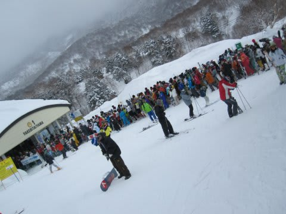
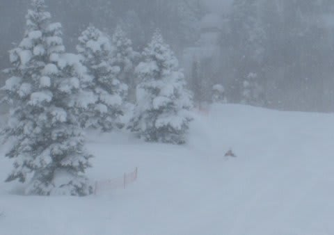

# 3連休の志賀詳細レポート

📅 投稿日時: 2011-02-15 01:39:19

🏷️ カテゴリ: [2011スキー滑走日記](ca488c98cfb9169941c3e73770dcefb56.md)

というわけで．

3連休は…

っていうか，3連休も，マイホームゲレンデの志賀高原

焼額山に行ってきたわけですが．

状況としては結構恵まれた3日間でしたね～．

1日目，金曜日は．

朝から小雪が舞う天気．

朝の気温はマイナス8度と，1月から比べると

ちょい高めですが，十分な冷え込みですね～．

前日からの積雪はなく，朝イチのゲレンデは

かなりふわふわのやわらかめの圧雪．

スピードは出ないけど，いかにもハイシーズン！！！

といったゲレンデです．

朝，人の出だしが遅く，いつもなら人が増える10時になっても

それほど混まないなぁ…

と思っていたところ．

さすが3連休．11時ごろには，焼額第1ゴンドラは10分弱の

待ち時間．

ただし，このゴンドラ待ちも一瞬．11時半にはゴンドラ待ちが

なくなってしまい，その後は待っても最大5分以下．

ゴンドラ乗り場の建物から列が外に伸びたのは，30分くらい

だったでしょうか…

でも，全体的に人は多めですね．

コース上の人口密度は多少高め．

でも，比較的急斜面のオリンピックコースはすいてたなぁ．

雪がやわらかかったので，午後はちょっとコースが荒れてき

ましたね～．

でも，夕方には薄日も射し始め，一日中結構いいコンディションで

滑れました．

で．

明けて2日目，土曜日．

朝の山頂の気温はマイナス10度．

いい感じの気温です．

前日からの積雪はなく，朝はきれいな圧雪斜面．

雪はやわらかめで，きれいな2本のシュプールが

ゲレンデに残るような，最高の状況です

朝は曇ってたけど，天気予報に反して午前中は日も射してきました．

うぉぉぉ！

今シーズン1，2を争う好コンディション！！！！！！

晴天，いい雪，人がいない！

と思っていたら．さすが3連休中日．

10時ごろには，ゲレンデの人口密度が結構上がってきました．

10時半には，第1ゴンドラの待ち時間も10分を越えます…

でも，このゴンドラ待ち，昼には解消してました．

昼間気温上がってあったかくなってきました．

気温が上がったっていっても，マイナスなので，雪が

溶けちゃうことはなく，コンディションは上々．

後は人が少なければ文句のつけようがないんだけどなぁ…

しかし．

午前の日が射す天気から一変，昼前には雪が降り始め，

午後3時ごろからはかなりの勢いでつもりはじめます．

そのせいか，午後はゴンドラ待ちも全くなくなり，

コースもがらがらに．

夜は10m先が見えないほどのものすごい勢いで雪が

降り始め，次の日のぱふぱふパウダーに期待が

高まります…

最終の3日目，日曜日．

…結構積もってます．

車はこんな感じ．

朝イチの山頂はマイナス15度．

結構冷え込んでます．

圧雪コースは明け方に圧雪を掛けなおしたため，

コース上に10cmほど新雪が乗ってる程度．

ほとんど圧雪バーンの感じで滑れます．

しかし，オリンピックコースは非圧雪．

ひざパフ！

…腰パフを期待したんですが…

ちょっと，明け方に降りが弱まりましたか．

でも，今シーズン何度目の新雪かな～

結構冷え込んでいるので，雪も軽く，舞い上がった雪が首元から

入り込むくらい．

（真ん中に人が写ってるんですが…雪煙で見えなくなるくらい）

でも，1時間ちょいでおいしいところは食べられちゃって，

昼前には固めの下地がところどころ顔を出すコブ斜面に

なっちゃいましたが…

しかし，昼ごろには日が射しはじめ…

さあこれから！

といった感じでしたが，残念ながら今回，

昼にはゲレンデを後に．

ああ．午後は天気が良くて楽しめただろうなぁ…

とりあえず．

しっかり冷え込んで，雪もよく．

金・土は午前1時間ほど，10分待ち前後のゴンドラ待ちがあったけど，

それ以外は5分以上待つことはなく．

楽しめた3日間でした．

しかし，3連休で混雑がこれだけって，やっぱり

スキー客が減ってるのかなぁ…
