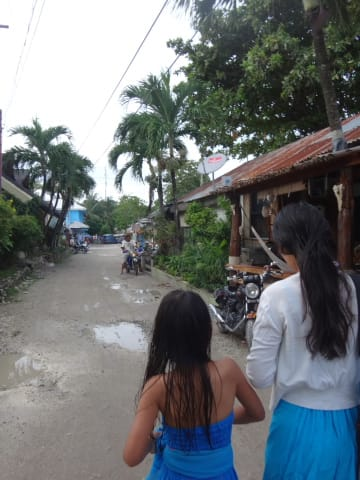
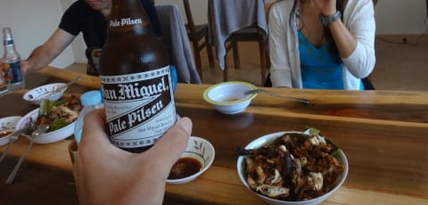
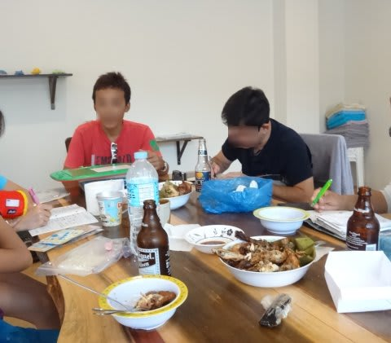
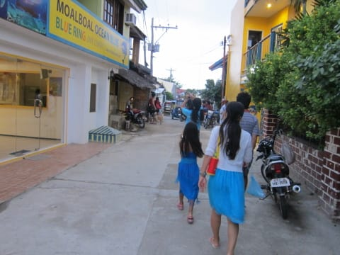
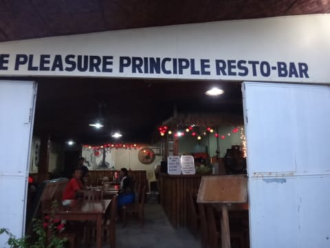
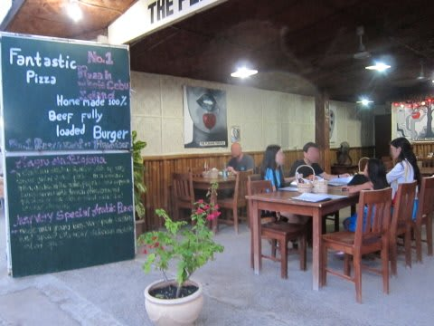
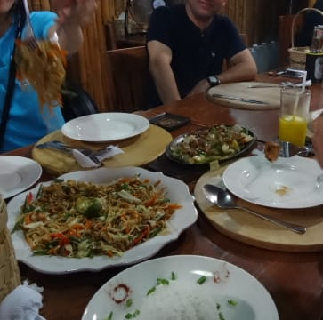
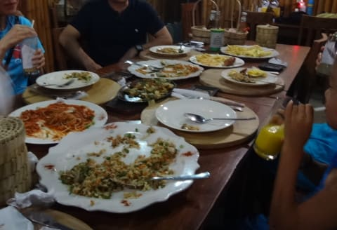
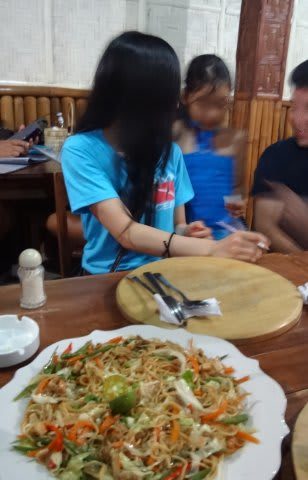

# 2015年8月　子連れでモアルボアルでダイビングその22…ダイビング2日目の，夜

📅 投稿日時: 2016-07-22 01:38:45

🏷️ カテゴリ: [ダイビング日記](ce3a7a8d424d112fce83ee85c81a0e344.md)

ということで．

プールで1時間ほど，娘と戯れたら，

ダイビングショップへログづけに行く時間です…

いつも通り，ホテルから3分ほど歩いてショップへ到着したら．

まずはビールで乾杯！

乾杯の後は，ダイビングのログづけタイム…

ビールを飲み，おつまみをつまみつつ．

今日のダイビングを振り返ります…

そして．

ログづけのあとは．

昨日と同じく，ショップオーナー小宮山さんと，

仲良し親娘の二人と一緒に…

モアルボアルの街に繰り出しての夕食タイム！

…今日のお店は，ショップから5分少々歩いた

所にある「THE PLEASURE PRINCIPLE REST-BAR」

とか書いてあるお店です…

こんなオープンな感じのお店で．

食事も種類とボリュームがあって，

結構良かったかな．

でも…昨日のお店の方が良かったかも？？

…とか思いつつも．

しっかり食べました．

これだけ食べても，価格はリーズナブル．

…いや，モアルボアルはフィリピンの中でも

観光客向けなので．

ちと，物価が高めですが…

それでも，他の国と比べると格段に安い．

いいですね～．

…しかし．

やっぱり．

このお父さんと娘さん．

お二人，仲が大変よろしくて．

いろいろなところに，親子で潜りに行ってるようで．

話を聞けば聞くほど，うらやましぃ…

うらやましいのだ…！！

大学生の娘さんと話し込んでいたうちの娘も，

「ダイビングできるようになったら，親と一緒に

いっぱい潜りに行きたい！」

というようなことを言っていたけど．

…

…

…その言葉，忘れるなよ…

と，100回ほど繰り返し娘に言っておきたい気分だった，

Skier_Sなのでした…
