# 11/30,12/1の週末のスキー場の天気は？…土曜，日曜とも志賀は曇り時々晴れ，軽井沢スキー場や菅平，イエティは晴れるかな

📅 投稿日時: 2024-11-28 02:17:19

🏷️ カテゴリ: [スキー天気予想](c6554f5c3c106093b511a8daae23757e8.md)

ということで．

昨晩から今朝にかけて…

というか，火曜夜から水曜朝にかけて，

予想通り高温＆雨が降りましたが…

心配したほどの降水量ではなかった

ようで．

各スキー場の雪はそこそこやられたものの，

営業中止に追いやられたところはなかった

ようで．

水曜昼間の志賀高原，気温は+6℃まで上がり

ながらも路肩の雪は残っており．

熊の湯，横手は雪が薄くなりながらも

営業中止にはならず，無事営業が続いて

いるようです…

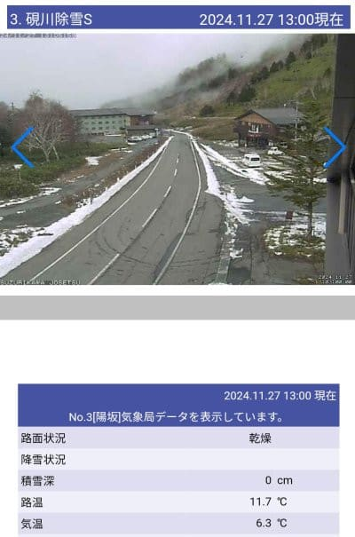

（[北信建設事務道路気象状況カメラ](http://hokushin.pref-nagano-roadcamera.jp/)より）

かぐらもライブカメラを見る分においては

コース脇にひどく土が出てくることもなく

乗り切った感じですね…

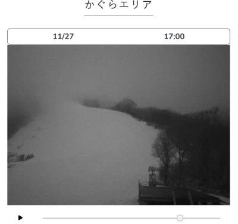

（[かぐらスキー場ライブカメラ](https://www.princehotels.co.jp/ski/kagura/livecamera/)より）

営業をいったん中止していた菅平は，

むしろ28日木曜から営業再開するみたいです！

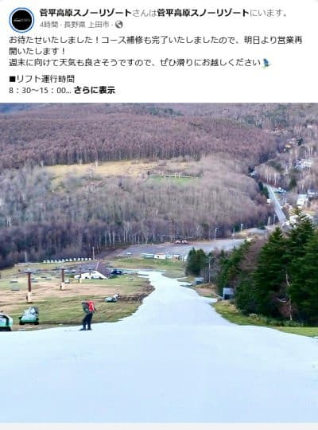

（[菅平高原スノーリゾートFacebook](https://www.facebook.com/sugadairasnowresort/posts/pfbid02JBMSTS8Vq8mu4hWYWWDrNn6TTWC8mfPrbDZYS9quZGvW4R3ALzR6RKd2ReeUQLMul?locale=ja_JP)より）

ってな感じで．

12月に向け，1か月予想をいい方向に外して

結構冷えていた11月下旬に水を差すような

高温の雨でしたが．

これから12月に突入するこの週末まで，

果たして冷えるのか？

この週末のスキー場はいいコンディションで

迎えらえるのか？？

天気図を読み解いてみましょう…

まず，28日(木)の地上天気図ですが．

日本海に降水量を示す水色領域があり，

雪雲が出る冬型に近い感じですが…

ただ，等圧線が縦縞じゃなく，志賀高原で

全く雪が降らない強烈西風ですね(泣)

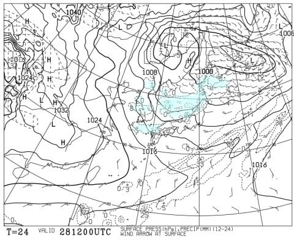

この日の850hPa気温を見ると，

赤い0℃線は太平洋側まで下がっているので，

降れば雪．

まぁ，天然雪が降らなくても，人工降雪機は

頑張れる気温ですね．

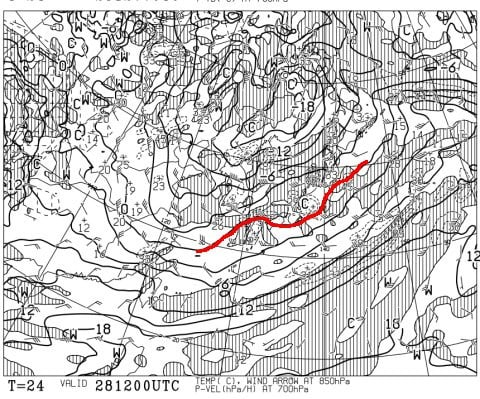

そして，翌29日(金)の地上天気図は．

この日も日本海側に降水域があり，

冷えているんだろうなぁ…という天気図ですが，

いかんせんこの日も見事な西風(涙)．

志賀高原はそんなに降らないでしょうねぇ…

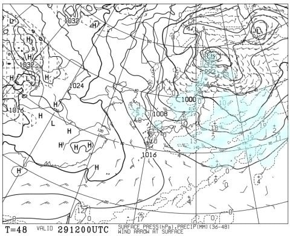

この日の850hPa気温図も，赤い0℃線は

太平洋側まで下がっているので．

雪が降らなくても人工降雪機はフル稼働

できそうな感じですね．

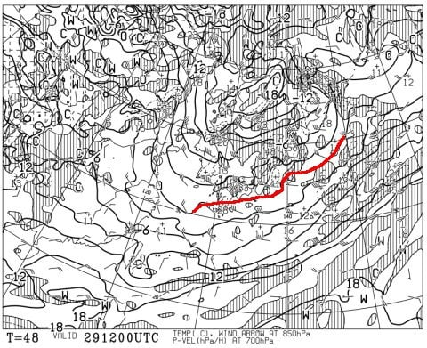

…ただ．

この日の500hPa気温を見ると．

そこそこの雪が降る目安の-30℃という寒気が

志賀の手前まで降りてきているので…

もしかすると，根性のある雪雲は北アルプスを

越えて志賀まで届くレベル．

そんなに積もるレベルではないけど，

西風の志賀でも雪は降ってくれるかな．

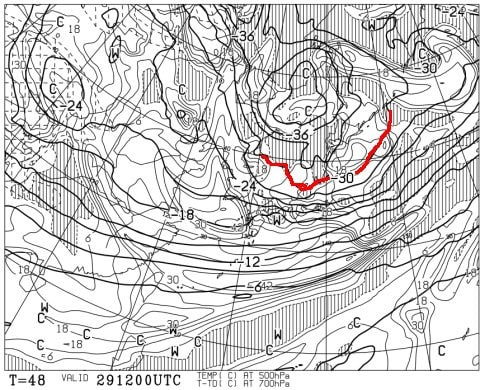

そして，肝心の週末の30日の地上天気図は．

この日も日本海の寒気の吹き出しの雲が

見えるので，引き続き冷えてそうですが…

相変わらず西風（涙）

志賀はほとんど積もらなさそう…

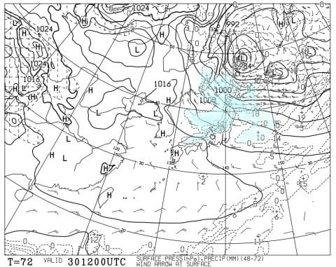

この日の850hPa気温は，引き続き赤い

0℃線が太平洋近辺まで下がっているので，

人工降雪機は動かせそう…

標高が低いところは昼間の人工降雪は

きついかな．志賀は終日人工降雪行けるはず．

さらに，12月に入った1日の日曜は…

地上天気図を見ると，わずかに東北に

降水域が見えるけど．

新潟，長野方面は曇り～晴れですね．

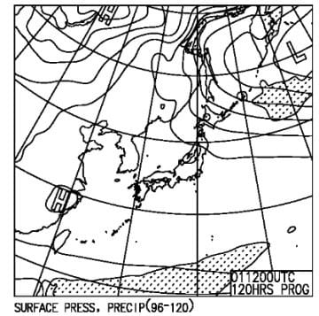

日曜の850hPaの0℃線は，ちょっとだけ

北上するので．

志賀高原でも昼間は人工降雪機は

動かせないかな…

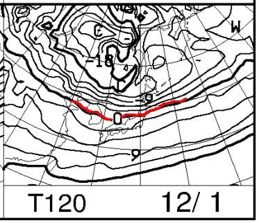

ってな感じで，まとめると．

28日(木)：志賀は曇り～晴れ，朝はうっすら

　積雪もあるかも．軽井沢・菅平・

　鹿沢なんかはおおむね晴れそう．

　雨のあとの冷え込みでゲレンデは硬そう．

　気温は低め．人工降雪機頑張れ！

29日(金)：この日も西風で志賀は曇り時々

　晴れ間も．

　ただ強めの寒気が入るので，根性のある

　雪雲が北アルプスを越えて時折雪を

　降らせる．

　軽井沢・菅平・鹿沢などは終日おおむね

　晴れ．

　気温は冷えるので人工降雪機フル稼働！

30日(土)：この日も西風．

　志賀高原は晴れ～曇り，ときおり雪も舞う．

　もしかすると朝1cmほど積雪も？

　一ノ瀬，高天ヶ原は冷え込みのおかげで

　ぎりぎりオープン可能か…？

　雪は薄く幅もそこまでなさそうだけど．

　かぐらは曇り～雪が降る一日．

　軽井沢・菅平・鹿沢などは引き続き

　晴れ．　

　この日も冷えるので人工降雪フル稼働！

12/1(日)：引き続き西風で志賀高原は

　晴れそう．時折曇るか．

　かぐらは終日曇り，ときどき雪かな．

　朝まで人工降雪機フル稼働なので，

　人工降雪バーンはコンディション

　悪くないかも．

　軽井沢・菅平・鹿沢などは引き続き

　晴れ．

って感じでしょうか…　

まぁ，天然雪はそこまで期待できないけど，

人工降雪機が日曜まではずっと動かせそう

なので，天然雪のスキー場は無理だけど，

人工降雪バーンはぎりぎりオープン

できそうかな…

来週もあんまりドサドサ天然雪が

降りそうな天気図じゃないけど，

今のところ，そこまで気温が上がらなさ

そうなので…

来週も人工雪頼りではあるものの，

人工降雪コースは順調にオープン

していってくれそう．

…でも．

そろそろ，山にどさっと雪が降る

冷え込みが来てほしい…
