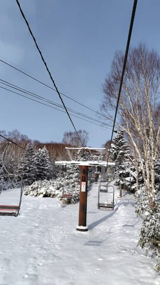
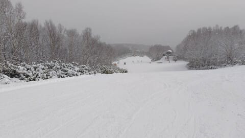
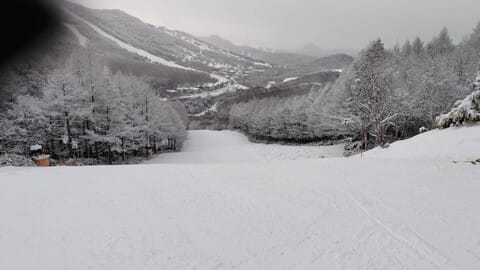
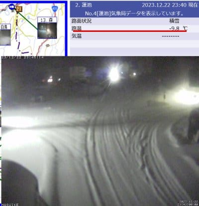
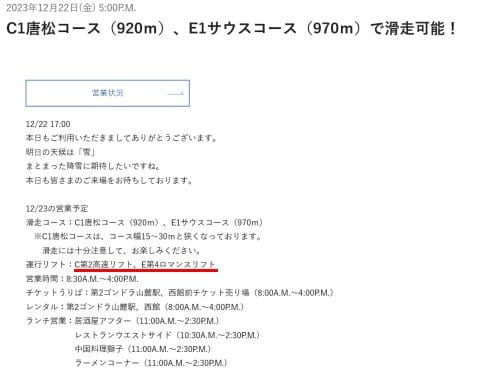

# 今週末も志賀高原！明日の朝までにたっぷり積もってくれるといいんだけど，そうじゃないと正月は恐ろしいことになりそう

📅 投稿日時: 2023-12-23 00:02:04

ということで．

今日も先ほど，23時過ぎに帰宅しました…（涙）

これで明日4時出発で志賀高原に行こうっ

てんだから，ヤバい感じ…

ただ，昨日は5時間以上寝てるから，

まだ大丈夫かな？？

で．

今日の志賀高原特派員情報によれば．

焼額は朝までに積雪10cmほど積もった

みたいですね…

団体さんが入っていてちょっと

リフト待ちがあったようですが，

雪質は激冷えで結構よかったみたい

です…

ただ，気温が寒すぎてリフトが辛い

というコメントがありました．

でも，第2高速リフトの唐松コースも，

そこそこ雪が積もったように見えますね…！

で．今，0時前の志賀高原ですが．

ドサドサと言わないまでも，そこそこ

降ってるみたいです！

気温も-9.8℃と低く，

明日までにはかなり雪質がいい雪が

積もるんじゃないかな…

（[北信建設事務所道路気象情報ページ](http://hokushin.pref-nagano-roadcamera.jp/)より）

ただ，雪が積もってほしい今としては，

風で飛んでいく粉雪より，しっかり積もる

重い雪が降ってくれた方がありがたいん

だけど…

ってなことで，

明日までにはそこそこ積もりそうだけど…

焼額は明日のゴンドラ営業開始をアナウンス

してませんね（涙）

第2高速と第4ロマンスのみです（泣）

（[焼額山スキー場ホームページより](https://www.princehotels.co.jp/ski/shiga/winter/)）

うーーーーん．

明日は今日より冷えるから，ゴンドラが

動かないと厳しそう…（泣）

明日は無理だとしても，日曜には

動いてくれないかな～…

もし，日曜までに動かないと．

そのあとは気温が上がって雪がそんなに

降らなさそうなので．

正月明けまでほとんど積雪がなさそう…

…となると．

恐ろしいことが起こるかも…（恐怖）

そうならないように，今晩から明日にかけての

冷え込みのチャンス．

どっさり積もって第1ゴンドラも動くことを

願いましょう…！！（期待薄）

でも，ホントにこのままだと，正月休みに

第1ゴンドラが動かない恐怖が現実に

なりかねない…

とりあえず，明日から志賀高原に

行ってきます～！！

あと4時間後に出発なのに，

これから準備してシャワー浴びて…

3時間寝られるかな（涙）←だからブログ書いてる場合じゃないでしょ

## 💬 コメント一覧

### 💬 コメント by (1kamakura)
**タイトル**: Unknown
**投稿日**: 2023-12-23 05:29:44

「雪やまに　

　雪や降れ降れ　

　　　フレーッフレーッ‼️」

寒寒俳句

　　　　　　　　　　　江戸の秋

### 💬 コメント by (アリス)
**タイトル**: Unknown
**投稿日**: 2023-12-23 17:20:02

Ｓkier_S様

こんばんは。

今日はヤケビ出遅れて10時過ぎの参戦でした。お会い出来ず残念です(^_^;)

今日のヤケビですが、板が全然走らず唐松もサウスも不完全燃焼です。

（雪は触ってみましたが乾き雪です）

それは、私の板の手入れの悪さかなと自問自答しながら、15時過ぎに一の瀬に移動したところバッチリ走りました。

皆さんの板は、ヤケビで問題なかったでしょうか?

### 💬 コメント by (Skier_S)
**タイトル**: 明日も焼額はゴンドラ動かず
**投稿日**: 2023-12-23 23:42:05

＞江戸の秋さま

地球冷却にご協力ありがとうございます．

さらにハイペースな連発をおねがいします（笑）

＞アリスさま

あれ！？？

今日いらしてたことに全く気付かず…すみませんでした．

ちなみに，私は板は結構滑りましたが…

おそらく，雪温高めのワックスを入れていたんじゃないでしょうか？

雪温が結構低く，積もりたてだったので，かなり雪温が低めの硬めのワックスを入れたほうがよく滑ります…

