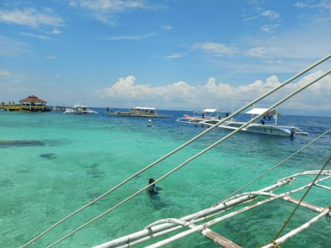
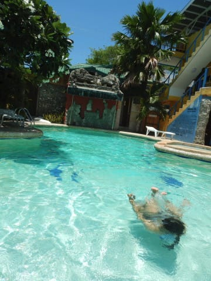
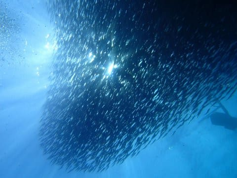
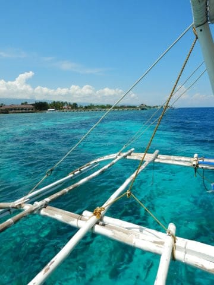
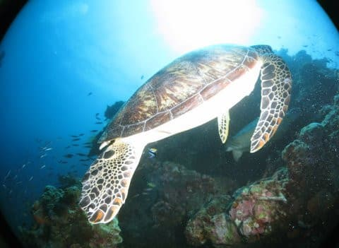
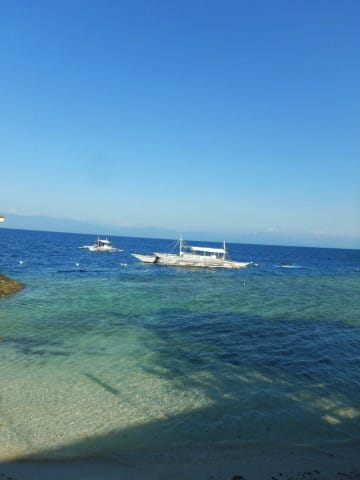
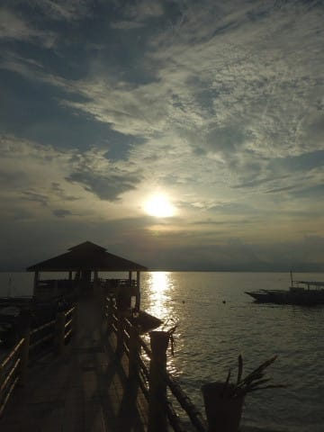

# 2019年8月，4度目のモアルボアル・小6の娘Cカード取得1周年！…エピローグ

📅 投稿日時: 2020-09-26 01:34:41

えー．

この旅行記．

昨年8月，娘の小学生最後の夏休みに

行った旅行だったわけですが．

もう，娘もCカードを取って丸1年．

ダイビングは完全に親と一緒の

ペースで潜り，

身体もこの1年で母親と同じくらいに

成長して，食事も大人と同じように

食べるようになり．

…もう，旅行に連れて行っても，

子供って感じがしなくなりました…

お酒が一緒に飲めないくらいで，

完全大人ですね…これ．

[こんな頃](ed1a0981df33d8e447e4cb50a3f342544.md)が懐かしい…

あの頃を振り返ると．

一緒にダイビング旅行に

連れていくのに，こんなに

楽になるとは思わなかったよ…

（プール好きはそのころから変わってないけど）

ってなことで．

夢の親子ダイビングができるようになり．

今年も行くぞ！！！

と，思っていたら．

思わぬコロナ禍（涙）

まさか，今年，ダイビング無しで終わろうとは…っ！

ダイバーになってからかれこれ20年近く．

ついに1本も潜らない年が来るとは…（涙）

ホントなら，今年もモアルボアルに行って，

またイワシとアジの大群を眺め．

…そして，

娘の12歳未満の12m制限がなくなることだし，

オープンウォーターの講習をしてもらった

アサミさんにお願いして，今年は娘に

ジュニアアドバンスを取らせ，最大深度21mだ！！

…と思っていたのに．

そんな計画も，水の泡…←ダイビングだけに？

まだ2年で30本ちょっとしか潜ってない娘．

来年の夏に無事潜れたとして，

2年のブランクダイバー．

来年まで，ちゃんとダイビングのやり方

忘れないで覚えてるかな？

（器材セッティングは絶対忘れてるだろうな…）

…そして．

来年，娘が中2の夏休みは潜りに行けたとしても．

中3の夏は，さすがに受験だからいけないだろうし．

娘は中学生3年間で，ダイビング遠征に1回しか

行けないのかも…！？？

高校になると，一緒に夏休み潜りに行って

くれない可能性も考えると．

娘が潜りに行く気マンマンだった今年．

ダイビングに行けなかったのは痛かった…

まだ，娘がダイバーになる前は．

「早く娘と一緒に潜れるようになれたらいいな」

と，思っていたけど．

願いが叶って娘がダイバーになった今．

「あと何回，一緒に潜るチャンスがあるんだろう」

と，寂しく感じてしまうのは．

人間のわがまま，

なんだろうか…

　

　

　

　

　

　

　

## 💬 コメント一覧

### 💬 コメント by (アツシ)
**タイトル**: Unknown
**投稿日**: 2020-10-02 21:22:03

お気持ち、よく分かりますよ。

ウチも子は１人、現在中2の男子ですが、最近あまり親と遊んでくれないし(まあそんなもんでしょうが)、ここ数年は毎年スキーに行ってますが、来年の冬は受験だし、その次は高校生となると、あと何回一緒に滑りに行けるのかなと寂しくなりますね。

### 💬 コメント by (Skier_S)
**タイトル**: ＞アツシさま
**投稿日**: 2020-10-02 22:59:13

中学生になったら，だんだん親とは遊んでくれなくなりますよね…

そして，高校受験，大学受験というイベントもあり．

大学で親元を離れちゃったら，のこされたチャンスはわずか

ですよね…

ちょっと寂しさが漂います…

