# 2014年10月，小学生の子連れでパラオへダイビングに行ってみた，その17…3本目のお留守番

📅 投稿日時: 2015-08-19 01:24:17

そして．

ブリーフィングを終えたダイバーが，

3本目のために，船から飛び込んできますが…

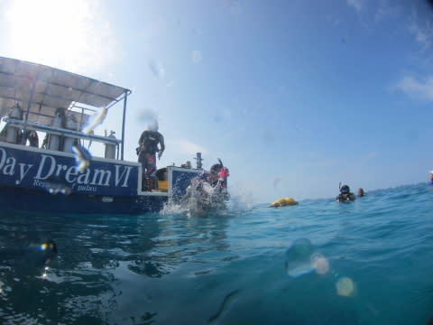

水面のブイ集合らしく．

ダイバーが集合しているブイめがけて，

まっしぐらに泳いでいく娘．

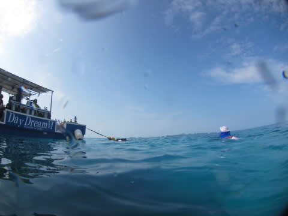

そして，ママを捕まえて喜んでます．

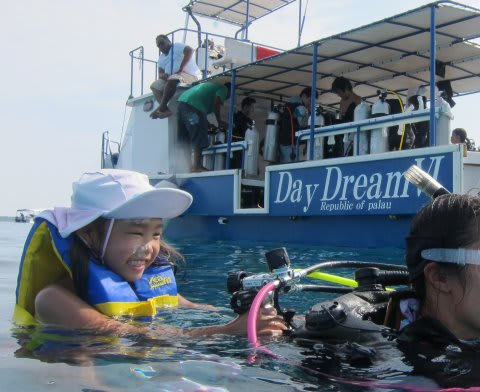

…お前，ダイバーの邪魔したらいかんぞ．

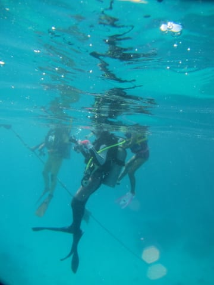

ママと一緒でご機嫌の娘．

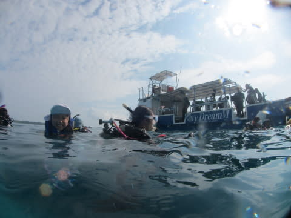

ダイバー全員が集合して，潜行準備ができるまで，

わが娘はダイバーと仲良く一緒に

海面に漂ってましたが…

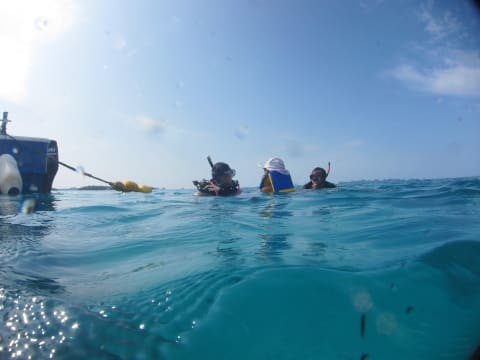

ガイドの潜行開始の合図で．

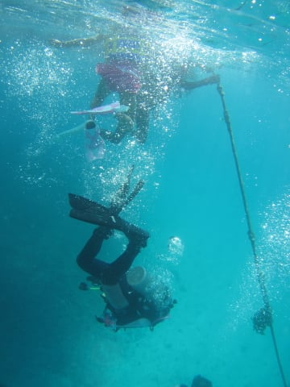

「ママ―！行ってらっしゃい～！」

顔の怪我で，水面に顔を付けられない娘．

しばらく，水面につけた水中マスクで，

潜っていくママを見ていましたが…

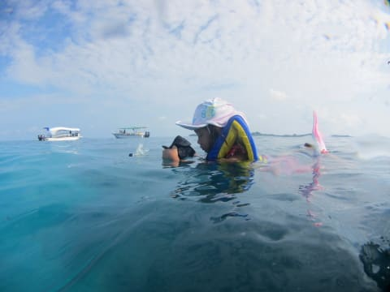

じきに見えなくなったので．

また，大海原を好き勝手に漂い始めました…

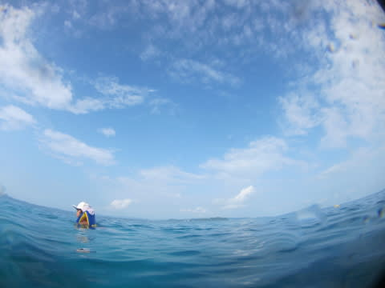

まぁ，シュノーケリングはできないとはいえ．

ただ何もせず，ライフジャケットに身を任せて

海面を漂うという．

これはこれで，またゼイタクな時間かもしれない…

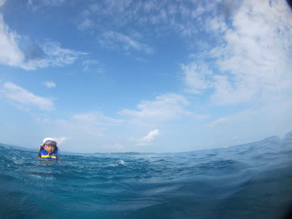

…しかし．

他のダイバーもいなくなってしまい．

お昼ご飯が終わってから，1時間以上漂っていたってのもあり．

さすがに飽きたのか，疲れたのか．

「上がる」

といって，3本目ダイビング組が潜っていってから，

20分ほどで．

珍しいことに，自ら船に上がっていきました…

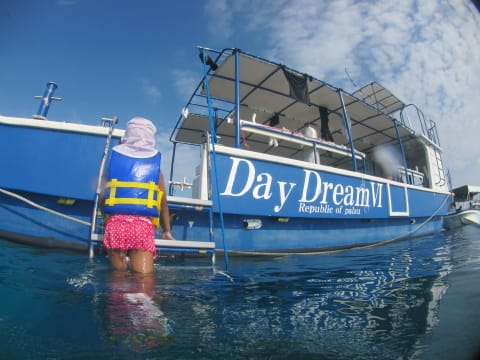
