# スバルのリモコンキーの電池交換をやってみた…そして2021/5/19(木)志賀高原渋峠スキー場特派員レポート！

📅 投稿日時: 2021-05-20 01:03:55

えー．

我が家のVMG LEVORG君．

[あの激戦の日々](ecdca7ac058e50b9e3a2a3ae04e18b623.md)から2年10か月と，

そろそろ車検の3年目が近づいてきている

わけですが…

車のインフォメーションディスプレイに，

「キーの電池を交換してください」

と出るようになってきました…

以前のBR レガシィ君も，3年ちょいで

リモコンキーの電池が切れてきたので．

まぁ，大体3年で電池の交換時期と

なるようですね．

ってなことで．

以前のBRレガシィの時と同じく，

リモコンキーの電池を交換してみました～！

っていても．

[手順は前のBRレガシィの時と同じ](e87e6a3bcdadc493c98245a1632f25fff.md)で，

今さら記事にするほどのものでもないんですが…

まぁ，参考までに．

こいつが，レヴォーグ君のワイヤレス

キーですね．

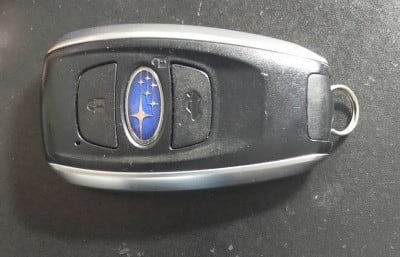

この面にある銀色のボタンを押して，

リモコンキーに突き刺さっている

物理キーを取り外します．

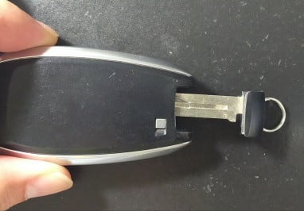

物理キーが刺さっていた面を覗くと，

矢印で示した部分に溝が見えるので…

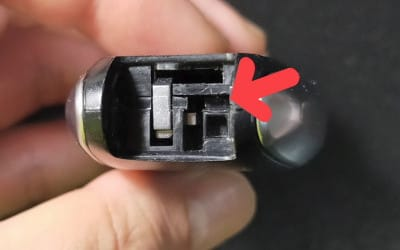

ここにドライバーを差し込み．

何のためらいもなく押し広げましょう！

バキっと行っちゃって大丈夫です！

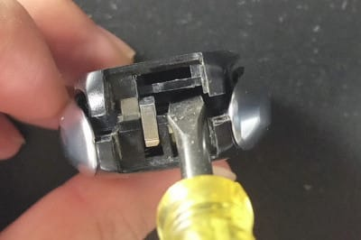

そうすると，本体がパカッと開きます…

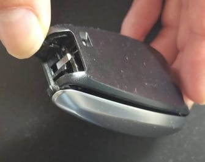

中身とご対面～！

本体の中には，電池が着いた基盤が

入っています．

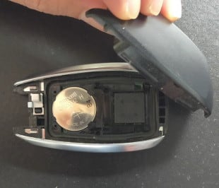

こいつを取り出して…

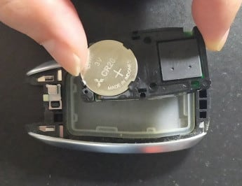

電池を抑えている爪を外すと．

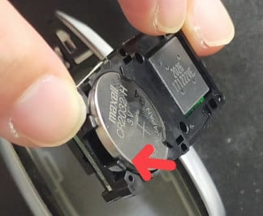

ハイ．古い電池が取り外せました．

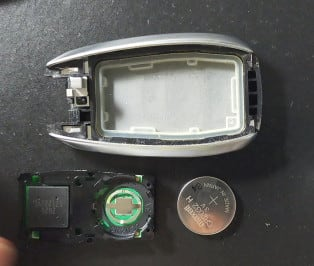

交換する電池はCR2032．

まぁ，ホームセンターでも，

大きめのスーパーでもどこでも

普通に買えると思います．

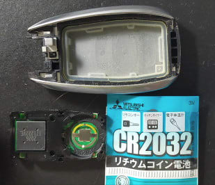

新しい電池をパチンと嵌めたら…

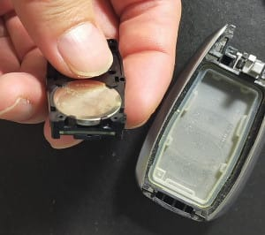

元通り，本体の中に置いてあげて．

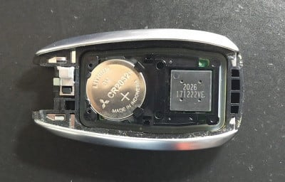

あとは蓋をはめて…

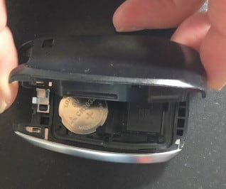

こんな感じでぐっと抑え込むと…

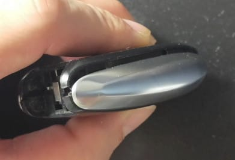

パチンとはまります．

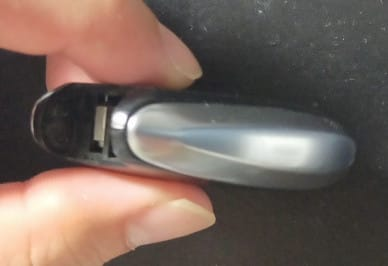

以上で電池交換は終了！

慣れれば1分で終わります．

…多分，どこのメーカーのリモコンキーも

ほぼ同じ手順で電池交換できると思います．

車の取扱説明書に交換方法が書いてある

くらいなので，基本的にユーザーが交換する

前提ですから，簡単に交換できますよ～！

…ってなことで．

ここからは定番の，本日の志賀高原

渋峠スキー場，特派員レポートです！！

本日も．

朝は一応シマシマゲレンデでスタート

したようですが…

朝から霧(涙)

今日も，山に向かって右側のウェーバー

コースは，コース整備のためか，

滑れなかったみたいです．

気温は+11度と高かったけど，霧で肌寒く感じ．

板は結構滑ったようです…！

硫安で結構バーンを固めていたよう

なんですが…

でも，コース真ん中に結構やばいところが

出てきてますね（涙）

とはいえ，スタッフが全力でゲレンデに

雪付けをしてくれているみたいなので．

なんとか今週末まではもってくれそう…

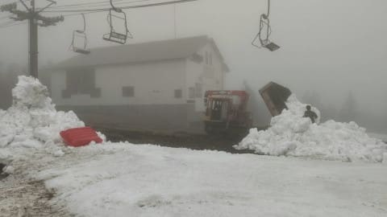

…でも，今週末．

ホントに海和ゲレンデ，オープンして

くれるのかな…？

うーん．

今シーズンから海和ゲレンデに人工降雪機を

設置したけど．

海和ゲレンデじゃなく，渋峠に人工降雪機を

設置すれば，もう少しシーズン延ばせそう

だけど．

…渋峠側，水を引っ張ってくるのが

大変なんだろうな…

あ，ちなみに．

今のところ，志賀＆かぐらとも．

22日の土曜は午前中は雨がぱらつく

かもしれないけど，基本的に曇り．

日曜は晴れそうな感じです～！

## 💬 コメント一覧

### 💬 コメント by (アリス)
**タイトル**: 梅雨でもスキーが可能
**投稿日**: 2021-05-20 16:33:44

S様

ブログ更新ありがとうございます。

新型LEBORG試乗の際、読者のかたから新車契約おめでとうございますのお声がかかっていましたが、現在のLEBORGまだ車検前なんですね？

個人的には、まだまだ買い替えには早い気がしますが・・・

特派員様はI様とY様でしょうか？

情報提供には本当に感謝です♪

ブログ読みながらいつ滑りに行こうか考えています。

来シーズンの索道協会の投資に危惧しております。ジャイアント～東館山へのゴンドラを設置した場合、間違いなくリフト料金が値上がります・・・

ゴーストタウン化したブナ、東館山に集客をとの対策だと思いますが、横手山、渋ヘルプの二の舞の感がします。

### 💬 コメント by (しんちゃん)
**タイトル**: 電池交換しました
**投稿日**: 2021-05-20 22:39:04

私も車もインフォメーションディスプレーにリモコンの電池交換サインが出てきたので、自分で交換しました。やり方は、ほぼ同じでした。

リモコンの電池交換しただけで、なんとなく車が元気になった気がするのは私だけでしょうか(笑)

### 💬 コメント by (Skier_S)
**タイトル**: 今週は行けるけど…渋は来週までもつかな？
**投稿日**: 2021-05-21 02:46:28

＞アリスさま

今のLEVORGはまだ初車検通してません…

いつもなら3年目の初車検の頃には10万km近く走ってますが，

コロナの緊急事態でスキーに行けなかったせいで，まだ7.3万kmしか走ってませんので，

買い替えはまだ早いです(笑)．

そして，特派員は…謎のおこみん特派員です(笑)

＞しんちゃんさま

やっぱり同じくらいの時期に車を買っただけあって，電池切れもほぼ同じ時期ですね．

リモコン電池を交換して車が元気になるなら，私は毎日電池換えるかも(笑)．

### 💬 コメント by (ほっぽ)
**タイトル**: リモコン電池
**投稿日**: 2021-05-21 21:19:52

Ｓさん

ＢＰレガシィの時は数年に１回の交換頻度でした。

スマートキーになったゴルフ７やＢ８アウディは、ほぼ毎年交換です。

外車だからなのかＶＷだからなのか、１年経たずに電池が少ないと警告が出ます。

電池はＣＲ２０３２だし、交換も１分程度と簡単なのが救いです。

