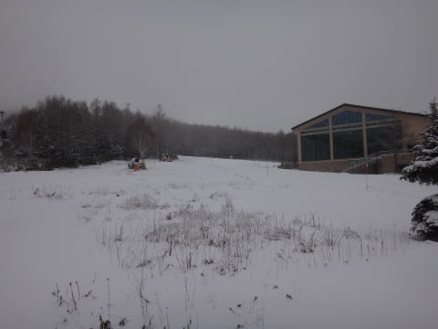

# 12月8日の志賀高原，焼額のゲレンデコンディションは？？

📅 投稿日時: 2013-12-09 00:06:06

🏷️ カテゴリ: [2014スキー滑走日記](c992167609b6415052179ee69ea1ea7d8.md)

ということで．

志賀高原2日目の日曜．

昨晩からの，

どっさりどさどさの積雪を期待したところですが…

が．

皆さんの日ごろの行いが悪かったようで←自分じゃないのか？

昨晩からの積雪は，この程度…

…5cm程度かな(涙)．

この日も朝からわずかに雪がちらつく中…

朝8時半からの朝イチリフトに並んで．

ゲレンデに出ますが…

うーむ．

人工雪がないところは，まだ雪が薄い…

もう一降りほしいなっ！！！！

しかし．

ゲレンデは，昨晩から積もった雪がきれいに圧雪された…

うほうほなシマシマバーンっ！！！！

朝イチは，ガラガラうほうほ大回りバーンっ！！

…だったけど．

2-3本滑ったら，

リフト待ちがちょっと出てきたかな～．

第2高速沿いも，コース幅ほぼいっぱい滑れて．

朝はかーなりいい感じだったけど．

このコース．

朝イチのやわらかい雪がはげてくると…

うむ？

昨日と同じで．

氷のころころがいっぱい…

恐怖のジャガイモ畑状態．

ちと板がたたかれて怖いかも．

第2高速側は，ジャガイモ畑だったので，人が少なめ．

リフト待ちもほぼ0だったけど…

第4ロマンス側は，ジャガイモさんはいらっしゃらず

滑りやすいかわりに．

うーむ．

人口密度が．

ちょいと滑りにくい…

雪はいいんだけどな～．

まぁ，リフト待ちが1-2分程度で済んだのが救い．

ということで．

雪がいいけど，ちょっと人が多い第4ロマンスと

雪が難しいけどがらがらな第2高速を行き来しつつ滑っていると…

予想通り，昼過ぎの1時ごろから日が射してきました！

＃もう少し早くから日が射すと思ってたけど…

でも．

日が射しても，気温はマイナス5度程度．

第2高速側，ゲレンデは硬く，ころころが大量に出たまま…

だけど．

人が少なめの気持ちいいコースを．

リフトストップまで楽しんだのでした…．

PS.

帰り道はこんな感じ．

昼間の気温が低かったので，雪が解けて水びたしにならなかったため，

つるつるブラックアイスにはならなかったですね～．
