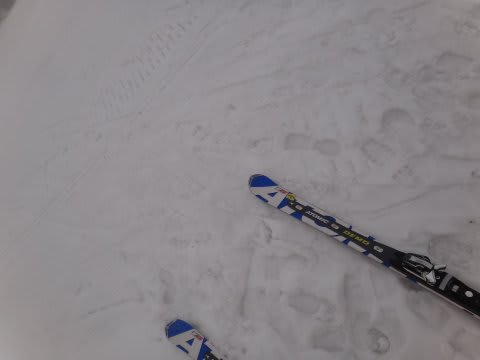
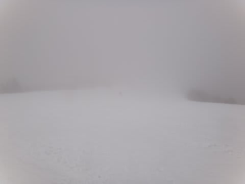
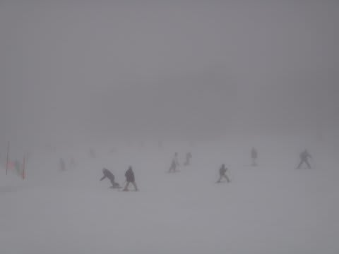

# 3月18日　日曜日の志賀高原速報

📅 投稿日時: 2012-03-18 21:59:49

今度は日曜ですが．

あーーーー．

激しく天気予報，外しました…(謝）．

雲が多いですが，日が射すかも…

と書いていたけど．

日は射しませんでした…

というより．時々小雪～小雨が降りました…

まぁ，大はずれでは無いですが，外しました(涙)．

朝から気温は0度前後と高めで．

昼間は気温プラス3度くらいまで上がっちゃいました…

当然雪は完全春の雪．湿った重い雪です．

んで．

終日ガスって視界は悪く．

時折小雨もぱらつき．

コンディションは激悪…

それなのに，人は結構多かったという…

焼額第一ゴンドラは最大5分待ちほどになりました．

まぁ，待ちがあったのは午前中の10時～11時までの1時間だけで，

あとはほとんど待ちはなかったですけど．

とりあえず，

人が多め．

雪はどぼどぼ．

視界は悪く．

今日はコンディションが悪かったよ～(涙)

## 💬 コメント一覧

### 💬 コメント by (雪上の翁)
**タイトル**: 残念
**投稿日**: 2012-03-19 20:20:02

２日前はあんなに良い雪だったのに、

やっぱり雨は厳しいですね。

4月一の瀬ダイヤモンドのアルペン試乗会に行こうと思ってるんですが、

それまでもつか、心配です(-。-;

### 💬 コメント by (Skier_S)
**タイトル**: 今日はいい雪
**投稿日**: 2012-03-19 22:10:03

昨日の夜から雪が降り，今朝はマイナス12度．

今日のゲレンデ状態は結構良かったです…

でも，今後またあったまったり冷えたりの繰り返しで，

だんだん冷える頻度が減っていくんですよね…(涙）

とりあえず，明日もコンディションよさそうです！

