# 2014年10月，小学生の子連れでパラオへダイビングに行ってみた，その36…陸上探索＆シュノーケリング

📅 投稿日時: 2015-10-02 01:38:12

🏷️ カテゴリ: [ダイビング日記](ce3a7a8d424d112fce83ee85c81a0e344.md)

10月です！

10月になりましたよっ！！！

ついに，スキー場がオープンする月がやってきましたよっ！！！

で．

[Yetiのオープン日](https://twitter.com/snowtownYeti/status/649421806047072256?ref_src=twsrc^tfw)が出ましたね～．

イエティは，10月16日（金）オープンです！

…ってことなので．

私の今シーズンの初滑りは，

予定通り，10月17日の土曜となりそうです…

あと2週間だっ！

しかし，今はまだ夏モード．

だもんで，パラオダイビング日記．

ラストスパート!

-----

ってことで．

シーカヤックは終わりましたが．

これからは，陸上探索タイム．

カヤック上陸地点から，こんな道を歩くこと，

5分ほど…

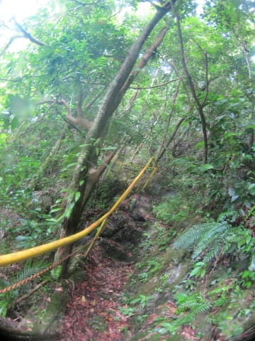

…やってきたのは，昔の「お金」として

使われていた，

巨大な石．

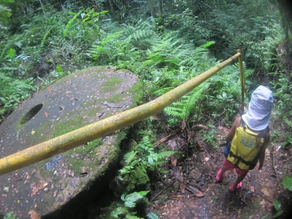

古代のヤップ島では，石がお金がわりに

使われてた，というのは有名な話ですが．

…実はこのパラオがその石の産地の一つで，

ここからヤップに送られていたんだそうで…

…しかし，これは巨大すぎて，通貨としての流通は不可能では？？

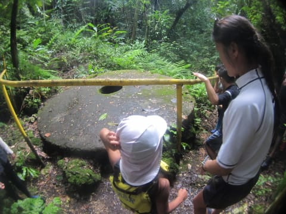

と，思ったら．

やっぱり冠婚葬祭とかの時に贈与するものだったようで…

でも，実はこの石．

自然の風雨にさらされて，単なる巨大な石に見えますが．

これは，普通の石ではなく，石英っぽい感じで，

ちょっと削ると半透明な大理石のような，

きれいな石になるようです…

へーーーー．

ってことで．この石を見た後は，また，元来た道を

ひいこら戻って…

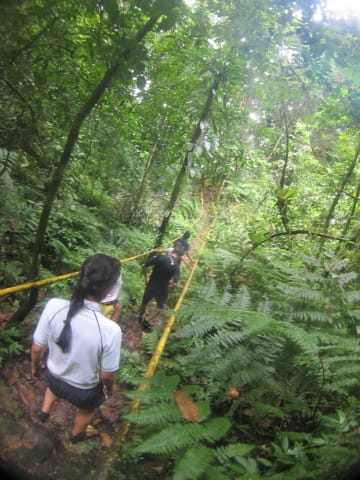

そして，またボートに乗って，海へ繰り出します．

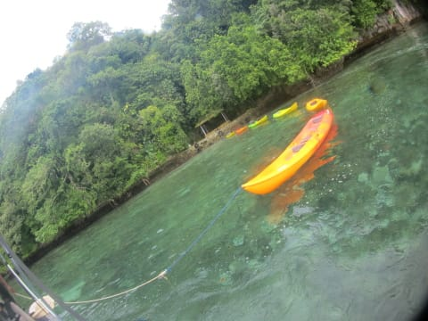

乗ってきたカヤックは，またボートの後ろで，

カルガモ状態…

しばらくボートで走ったら…

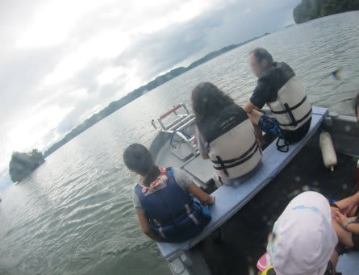

今度は，シュノーケリングポイント，到着っ！

…そう．

このツアー．

シーカヤック＆陸上探索＆シュノーケリングを半日でこなすという，

結構な盛りだくさんツアー．

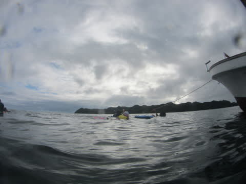

嬉々として，海に飛び込む娘．

お前は…

昨日まで，あれだけ散々泳いだというのに．

飽きないやっちゃ…（感嘆）

で．

このポイント．

結構浅めで，ダイビングには向かなさそうだけど…

実にサンゴがいっぱい！

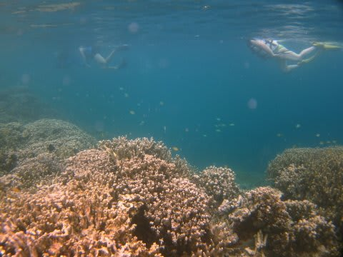

浅いので，シュノーケリングには最高のポイントですね～．

…いつもダイビングのお昼ご飯休憩時に泳いでいた，

ジャーマンチャネル近くの，底がまともに見えないほど深い海よりは，

シュノーケリングしてて楽しい感じ！

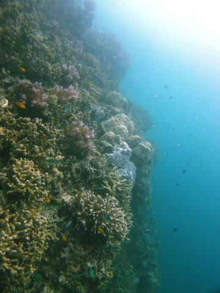

実は．

この日．

ほぼ怪我が治りかけてきた，娘は．

ついに，シュノーケル復活です！

まだ，何があるかわからないので，ライブジャケットは

着けたままですけど…

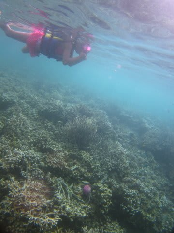

久しぶりに，サンゴいっぱいのきれいな南国の

海を見れて，かなりハイテンションでした…

時間的には30分もないくらいの，シュノーケリングタイムでしたが．

娘としては，シーカヤックもシュノーケリングもできて．

大満足だったようで．

…良かった．

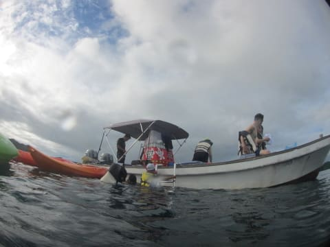

でも．船に上がって．

「もう少し泳ぎたかったな…」

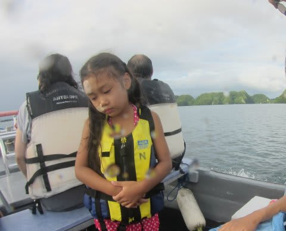

そうだよね．

お前には，ちっと泳ぎたりなかったかもね…

＃でも，顔にテープを付けたまま，よく水中マスクつけて泳いだな…

ってことで．

船は，ショップへ戻ります…

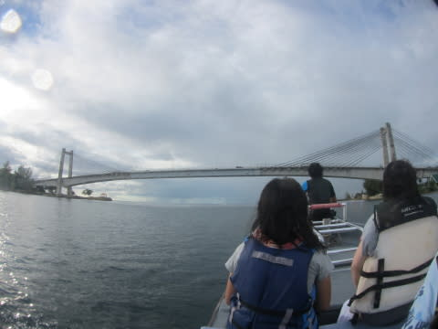

…このKBブリッジにある水道管が…（以下略）

## 💬 コメント一覧

### 💬 コメント by (マルハバ)
**タイトル**: サンゴの森
**投稿日**: 2015-10-02 10:27:11

ニシキテグリでもいそうなポイントですね・・♪

### 💬 コメント by (Skier_S)
**タイトル**: マルハバさま
**投稿日**: 2015-10-03 01:28:44

そうですね～

ニシキテグリがいそうな感じですね～

マンジュウイシモチはいっぱいいましたが，

ニシキテグリは見かけませんでした…（残念）

