# 2023/12/10(日)の志賀高原焼額山スキー場，詳細レポート！…晴天春スキーの一日．そして11日深夜の志賀高原は雨（涙）

📅 投稿日時: 2023-12-12 04:15:53

🏷️ カテゴリ: [2024スキー滑走日記](c453f687e8a0f05679e95831d0a02cd0c.md)

えー．

昨日の記事で予想したことではありますが．

大変残念なことに．

11日深夜…というか，12日午前3時現在．

志賀高原は雨

です．

志賀3号トンネルのライブカメラを見ても…

気温+3.5℃とこの時期の夜中としては

異常に高く．

路面の雪が雨で融けていってます…（泣）

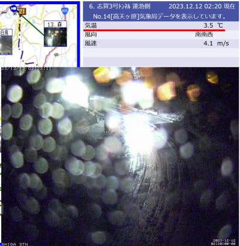

（[北信建設事務所道路気象状況カメラ](http://hokushin.pref-nagano-roadcamera.jp/)より）

この雨は，12日の午後には雪に変わり，

13日まで雪がぱらつきそうですが…

積もるほど降りません．

天然雪の積み増しは期待してはいけません．

ただ…12日の夜から14日の朝くらいまで

ぎりぎり人工降雪機が動かせるかな…

その後，15，16日と雨になる予想ですが．

うーん．

今の低気圧の位置だと，南～西風になるので，

志賀高原はそこまでひどい雨にならなさそうな

パターン…

思ったより被害は少なくて済むかも？？

と，期待．

で．

やっぱり17日の日曜からは激烈に冷えます！！

日，月は積もりそう！！

…これがあと1日早ければ…

ってなことで，本題へ．

日曜の志賀高原，詳細モードでのレポート！

まず．

今日も朝の志賀高原の上り坂をスキー場に

向かいますが…

道路の雪はかなり減りました…

スキー場に近づくまで全然雪がなく，

ドライ路面です（泣）

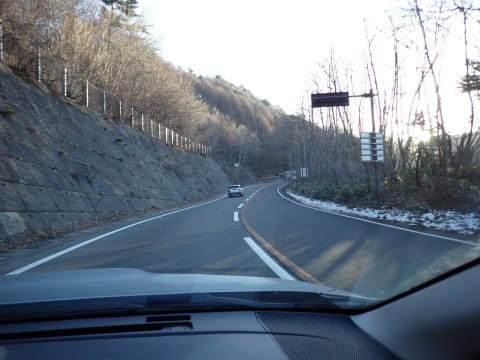

でも，スキー場に近づくと雪が残ってますので

ご注意を！

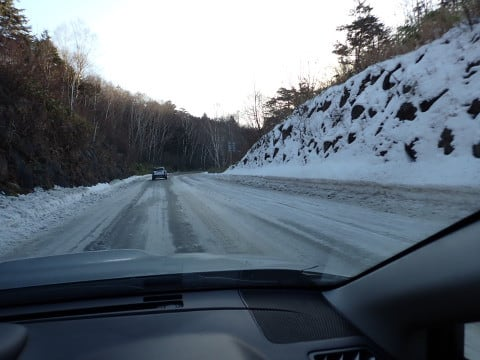

ってな感じで，営業開始の8:30前に

4ロマのリフト待ちに並びますが…

今日もお客さんはそれほど待ってなくて．

そんなに混まなさそうな感じ…

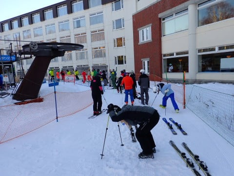

で．

今日もあさイチはすっきり晴天で…

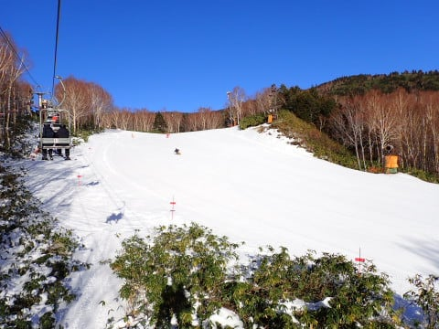

ふおおおおお！！

あさイチのバーンはすげーーー気持ち

よさそう！！

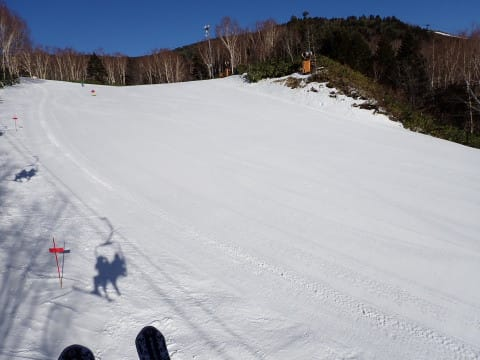

でも．

今日はまずは朝の雪がいいうちに，高速

リフトをぐるぐる滑るぞ！！

…と，まずは第2高速側の唐松コースへ！

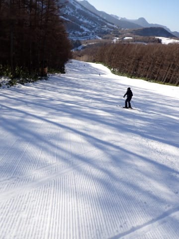

昨日の午後は荒れていた唐松コース．

あさイチはシマシマっ！！！

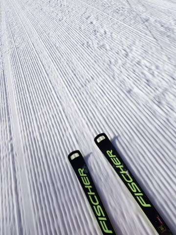

圧雪車でしっかり整備されて，

昨日は穴が開いたところも隠れてた

けど…

雪質は昨日融けた雪が固まった感じで，

すぐにコロコロになりそうな予感…

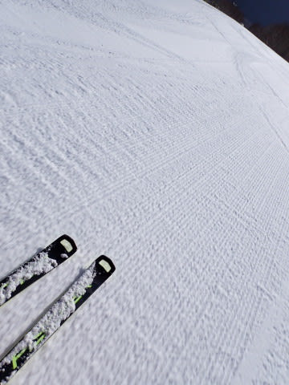

と思ったら．

やはり2本目には半殺しコロコロが大量

発生し始めてきて．

雪が少なくて整備しきれなかったのか，

コースの凸凹も結構多かったので，

残念ながら数本で第2高速はあきらめて…

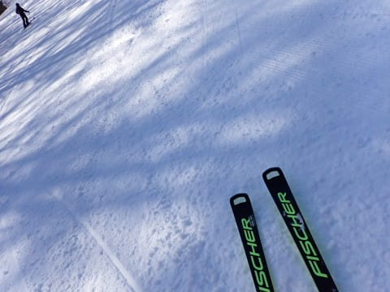

4ロマ側のサウスコースに移動！！

サウスコースは殺人コロコロもなく，

しっかりエッジが噛む快感度の高い

快楽バーン！！

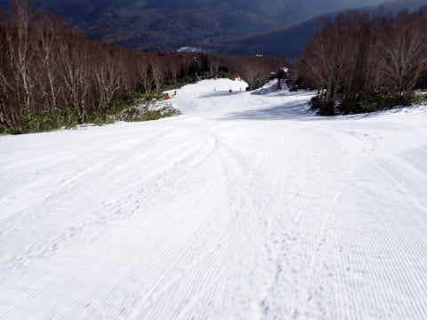

…リフトは遅いけど．

雪もしっかり厚みがあって，コース幅

いっぱい滑れて石ころの心配もないし．

やっぱり4ロマ側がいいなぁ…

そしてコースの人も少ない！！

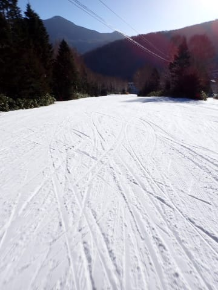

リフト待ちもそんなになくて．

せいぜい数人待つ程度で乗れるし，

ストレスフリー！！

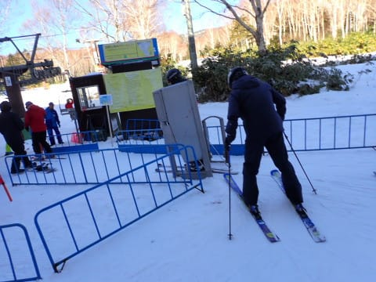

…ただ．

ペアリフトが遅くて，乗車時間7分ほどと

長いのが辛い…

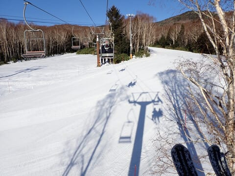

とはいえ．

結構ガラガラなバーンを気持ちよく滑れるし．

朝のうちは結構快適！！

…と，思ってたら．

10時過ぎには一瞬だけリフトがちょっと

混むタイミングも…

でも，待つのは講習の団体さんが並んだ

時だけで，そんなに気にならないレベル．

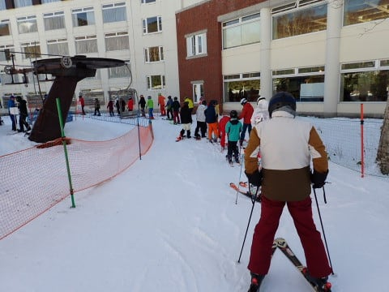

…むしろ．

朝から高めの気温で，日差しも強くて．

11時過ぎには，雪がかなり緩み始め…

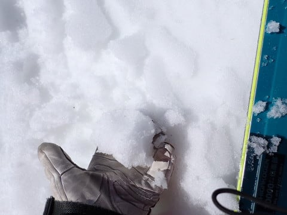

雪が緩ん惰性で，ゲレンデがちょっと

荒れ始めてきました…（ちょい涙）

まぁ，人が少なかったのもあり，硬めの

人工降雪の下地がしっかりできている

サウスコースは，そこまでひどく

荒れませんでしたが…

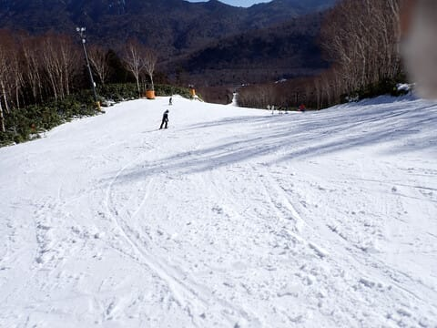

ただ．

第2高速側の唐松コース．

こちらは南斜面で，強烈な日差しを

正面から受けることもあり．

もう，4月の雪か？

と思うほどのざぶざぶした感じの

雪になっていて…

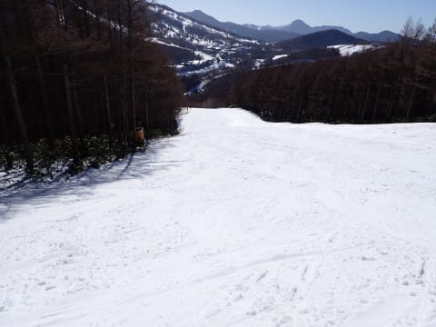

さらに，日差しでかなりの勢いで

雪が融けていき，そこかしこに地面が

出始めてます（激涙）

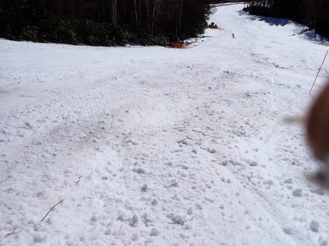

サウスコース側は新しい板でも問題ないの

ですが，こっちは新しい板は絶対やめた

ほうがいいレベル…（泣）

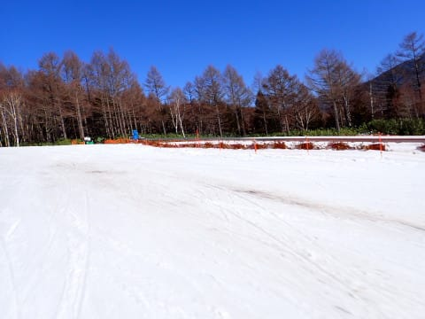

かなり気を付けたのに，石ころを踏んづけて

しまいました（涙）

まぁ，月曜からクローズになったのも納得．

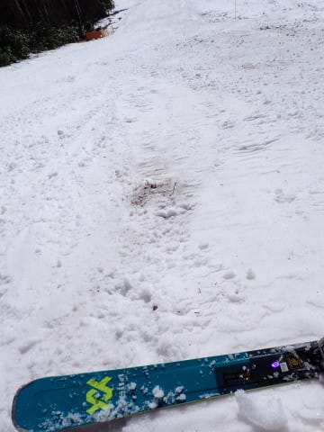

ただ，こんな状況なので．

リフトは飛び乗り状態！

石ころを踏んづけてもいい人なら，

ガラガラ高速リフトでここをぐるぐる

するのもありだったかも…

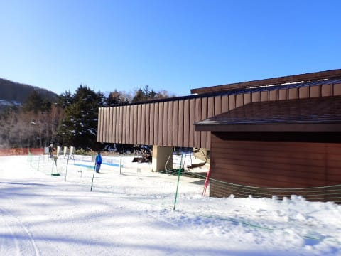

ってなことで．

結局この日は，ほとんど4ロマ側をぐるぐる

していたのですが．

昼になると，ゲレンデから人が減りはじめ…

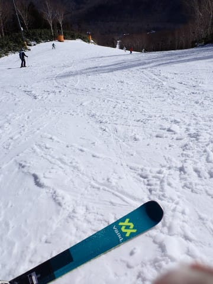

午後に入ると．

日曜午後の志賀高原の定番通り，

ゴーストタウン状態になってきました…

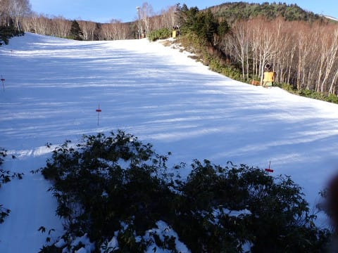

もう，午後2時を過ぎると，人がいない

貸し切りバーンを飛ばしたい放題！！

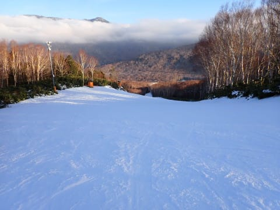

多少は荒れ気味だったものの，大回り板で

気持ちよくロングターンをかまし続け

られるシアワセを噛みしめつつ，

今日も日がかげる16時のラストリフトまで

滑り倒したのでした…

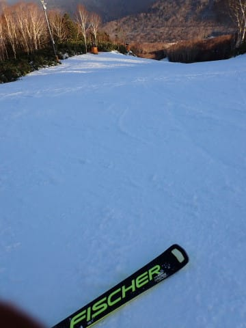

うーん．

なんだかんだ言って，この週末は

天気も良かったし，結構楽しかったん

だけど．

そろそろゴンドラで長いコースを滑りたい…

でも，今年も週末にゴンドラが滑れるのは

23，24日のクリスマスごろになっちゃい

そうな予感…

冷え冷え踊りが効かないようなら，

やっぱり+10℃で水が凍るように

物理法則が変わるよう，祈り続ける

しかないか…？←それ，祈って変わるもんじゃないから

## 💬 コメント一覧

### 💬 コメント by (レインボー76)
**タイトル**: Unknown
**投稿日**: 2023-12-12 06:09:38

月曜日の志賀高原

ヤケビと熊の湯は晴れ、他は濃霧。

気持ちよく滑れたのですが、悲しいお知らせが。

オリンピックの雪がすごーくとけて、地肌が半分！

### 💬 コメント by (レインボー76)
**タイトル**: Unknown
**投稿日**: 2023-12-12 13:44:58

火曜日の志賀高原情報

上林7℃、蓮池5℃と超暖か。下界は小雨なのに、なんとスキー場には陽が！すごい得した気分です。

雪融けが進んで、道中、カラマツコースの地肌の拡がりに驚き！

週末には真っ白だったオリンピックコースは、なんとほぼ地肌に。係員の人が可哀想になります。

私らは天気が崩れる前にと一心不乱！雪は柔らか目。

10時、4ロマ10本でガスが出てきたので終了。

湯田中の12時は小雨。上も多分雨。でも夜には雪が降りそう。板の選択が難しそう？

### 💬 コメント by (アリス)
**タイトル**: 次回はゴンドラ営業期待
**投稿日**: 2023-12-12 15:29:32

Skier_S様

次回は「三顧の礼」を・・・

土曜日は夕方に地域の会議があり、泣く泣くあの時間に帰りました。

23日か24日がゴンドラ営業開始と聞いて、すかさず一の瀬の常宿を予約です。

その時は、ダイヤクワッド経由で8:30の二高スタートとなりますので、ヤケビでSさんとレインボーさんを捜索させていただきます(^^♪

S様　少しこの場をお借りします

レインボー様

先日はお世話になりました。

今シーズン初滑りでレインボーさんと会話できた事は幸運です。レインボーさんの人脈の広さに驚いております。金曜日にレッスンをしていた方の技術力は全日本クラスですね。

傍から見ていても解りやすい指導力と思いました。

ゲレンデでは、猫耳を目印として捜索させていただきます。

### 💬 コメント by (レインボー76)
**タイトル**: Unknown
**投稿日**: 2023-12-12 16:18:54

だめです。湯田中が暖か過ぎます。

明日は太板の出番は、まずなさそうです。

### 💬 コメント by (Skier_S)
**タイトル**: Unknown
**投稿日**: 2023-12-13 05:26:41

>レインボー76さま

雪，融けちゃったんですね…（涙）

今晩は降っているみたいですが，積もったんでしょうか．

朝5時過ぎのライブカメラでは5cmくらいしか積もってないように見えますが…

今週末までにゲレンデが復活するように祈るばかり…

＞アリスさま

23，24日はクリスマス寒波で行けると思います！！

今度こそお会いしましょう！

