# 5月13日（日）のかぐら詳細モード…天気は悪かったけど，この時期としては人が少なめ．メインバーンは意外とまともだったよ

📅 投稿日時: 2018-05-16 06:54:50

🏷️ カテゴリ: [2018スキー滑走日記](c11b88dc181f34079ab41db74a3587646.md)

えー．

本日．

かぐらスキー場のゴンドラコースも，

ついに雪が無くなり，ゴンドラもくだり乗車で

下りることになったようですね…

まだ，みつまたリフトからゴンドラ乗り場までは

雪の上を滑っていけるようですが．

うーん．

このコース．週末まで雪がもつかな…

ってなわけで．

昨晩はご無体時間に帰宅だったので，更新できなかった

かぐらスキー場の詳細レポート．

今さら感が無くもないですが．

本日は，かぐらの詳細レポートをお送りします！

まず．

朝7時頃にかぐらに到着して．

この時期お約束の，リフト券売り場の列に

並びます．

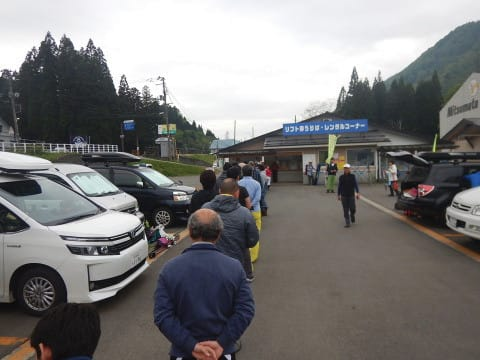

で．

一見すごそうに見える列ですが．

この時期としてはかなり短め．

天気が崩れる予想だったので，

今日は人が少なそうですね…

ロープウェーも，営業開始時には2回で

全員行けるくらいの人数しか並んでなかったし．

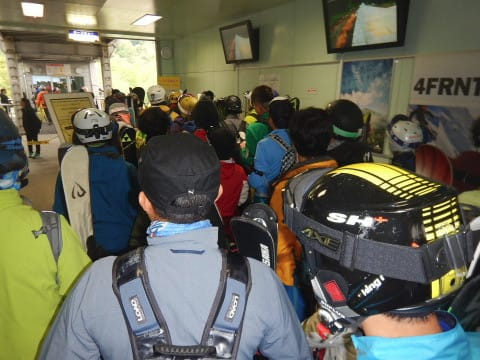

うむ．

今日はそれほど混まなさそうかな…？？

そして．

ロープウェーで登って，みつまたにやってくると…

もう，全く雪が無いですね（涙）

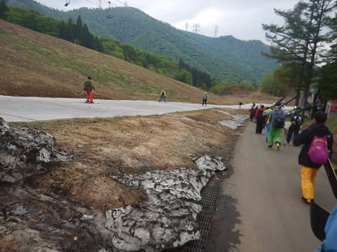

だもんで．

リフトに乗るまでスノーマットを滑る組と，

歩く組に別れます．

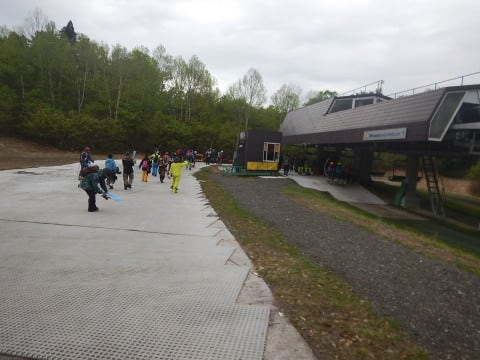

みつまたリフトは，板を履いて乗車です．

乗り場はPislabマットですが．

降り場にはちゃんと雪がついていて…

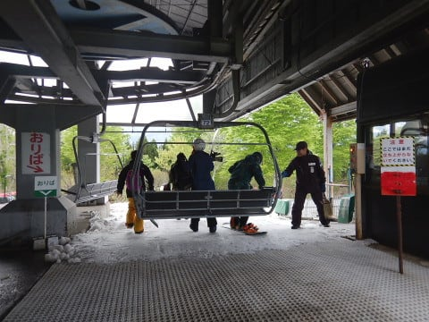

みつまたリフトを降りてからゴンドラ乗り場までは…

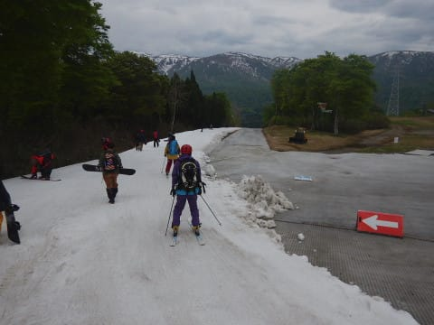

ずっと雪が着けてあり，雪の上を滑っていけ

ますよ～！

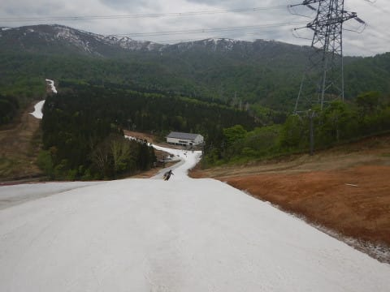

だもんで．

今シーズンから新たに登場した，板運搬サービス．

ロープウェーを降りたところで，こんなトラックに

板を預けると，ゴンドラ乗り場まで運んでくれるの

ですが．

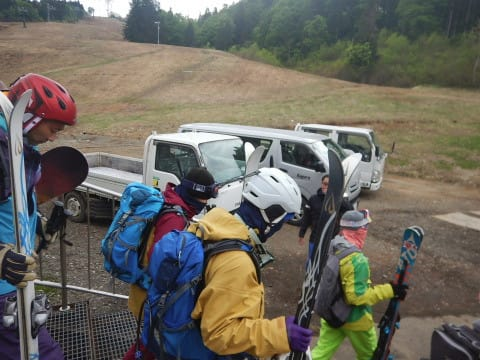

行きは，板を預けちゃうとみつまたリフトから

ゴンドラまで，雪の上を滑っていけないので．

この日は，行きは預けない方が正解です．

そして，ゴンドラに乗ってかぐらへ到着！

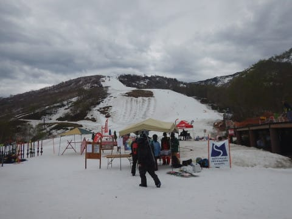

うーむ．

メインバーンの穴，大きくなってきましたね…（涙）

そして．

テクニカルは，もう終わりですね…（泣）

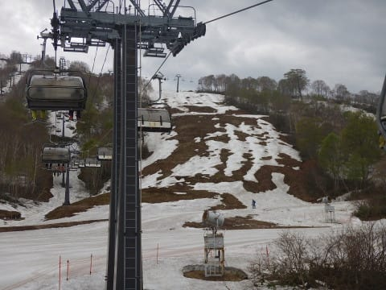

和田小屋から高速リフトの乗り場までの道も，

雪が減ったようで，雪寄せがしてあります…

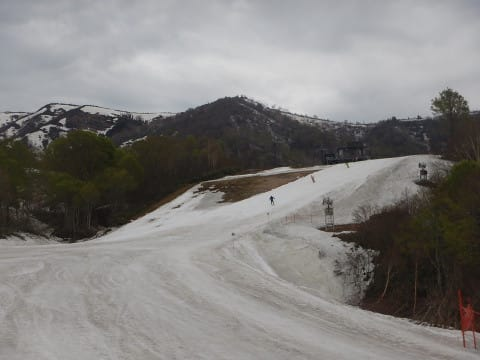

でも．

メインバーンは，まだ結構行けるかな！

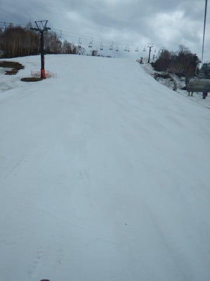

雪は朝から重めだけど…

でも，朝イチは，フラットで人もいなくて．

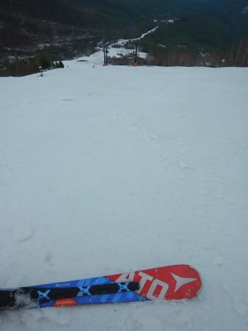

人のいない朝のうちに，ガンガン滑るのだ！！

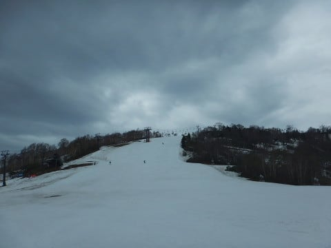

午前9時頃までは，リフトもほぼ飛び乗りで．

荒れてないメインバーンをグルグル！

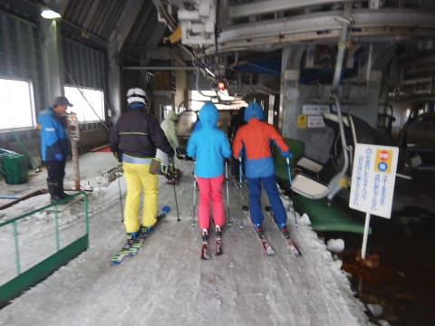

…だけど．

やはり，9時を過ぎると人が増えてきましたね…

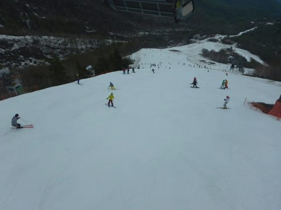

そして．

9時半には…

あぁ…そろそろヤバいか．

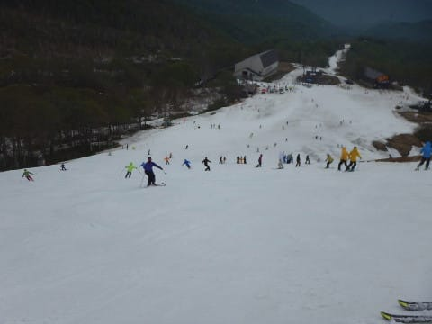

そして．

10時を回ると…

あああああぁ…

これはもうダメだ…（涙）

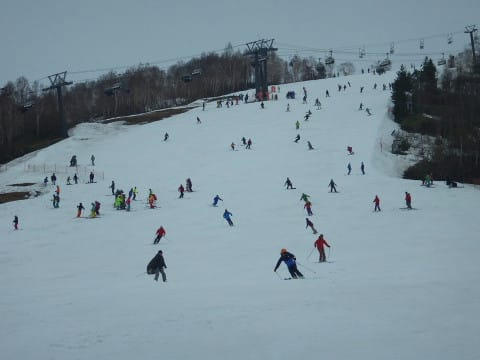

でも．

リフトはこの時期としてはそれほど混まず．

最大でこの程度の待ちだったので，

まだマシかな．

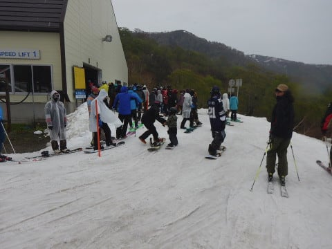

…だけども．

10時前からポツポツ程度ですが．

雨が降り始めてきました…（泣）

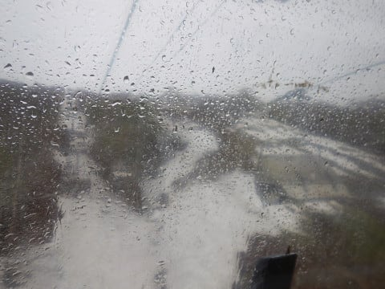

雨は昼過ぎから降るんじゃなかったのか～！！

時折ガスも出て，ゲレンデの視界が

悪くなるタイミングもあったり（涙）

うーむ．

なんてこった…（残念）

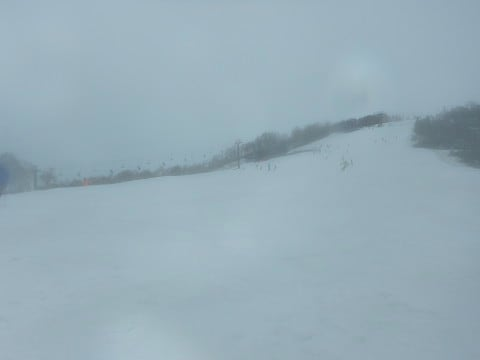

でも．

昼過ぎくらいまではそれほどひどい降りに

なることなく．

リフトもフード付きなので，そんなに

濡れずに滑れたかな…

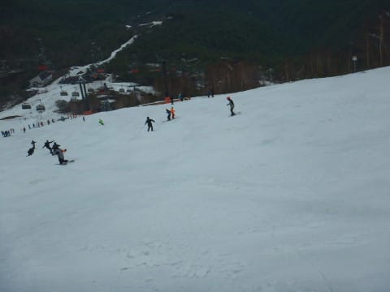

だもんで．

午前中いっぱいは，ゲレンデの人は

そこそこいましたね…

で．

昼ごろに，ジャイアントコースを見に行きましたが．

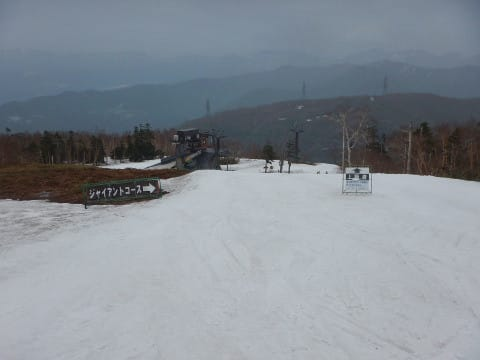

コースのとりつき部分，かなり狭くなってきてます…

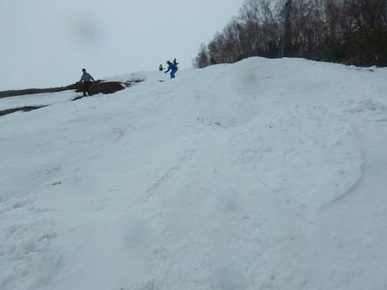

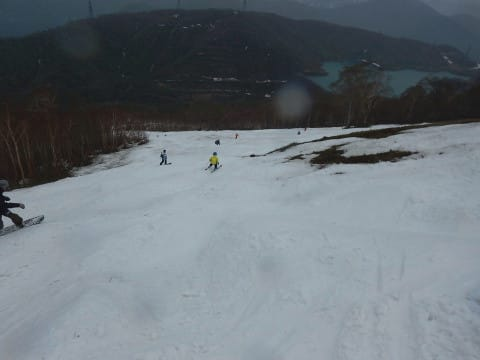

途中部分はまだ雪が残ってましたが…

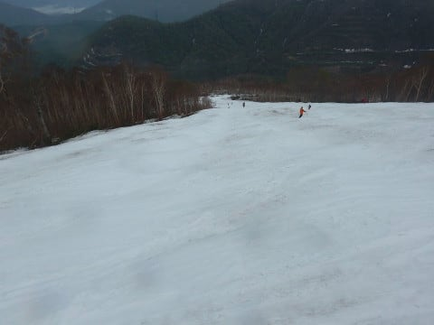

最後の方は，もう終わってる感じで

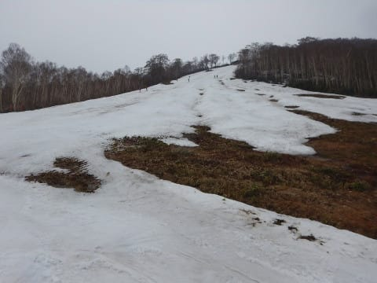

まぁ，この日でジャイアントコースが

終了というのは妥当な判断でしょう…

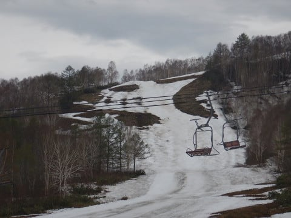

ってな感じで滑ってると．

午後1時過ぎには…

あうーん．

それまで時折ポツポツと降っている程度だった雨が，

パラパラと強めに降ってくるようになってきました…（涙）

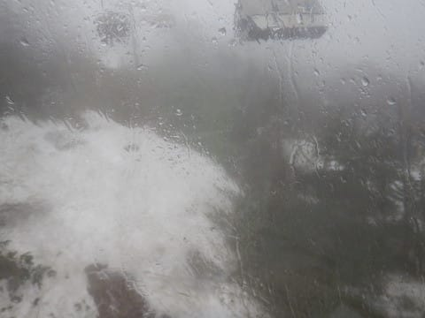

そして，時折ガスも流れてきて，

コース状況が見にくいタイミングも（泣）

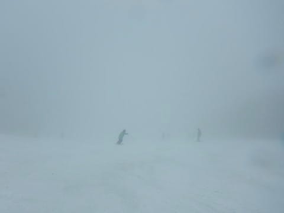

でも．

そのせいで，ゲレンデの人は一気に

減ってきたよ！

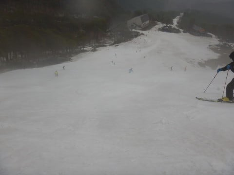

午後はリフトもほぼ飛び乗り！

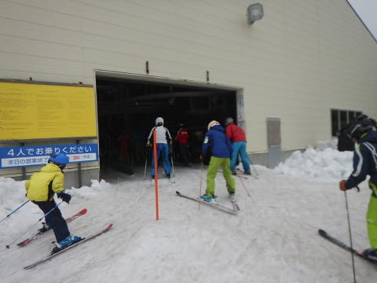

でも…

夕方のリフト終了のころになってくると．

ありゃ？

ちょっと雪が薄くなってきたところも…

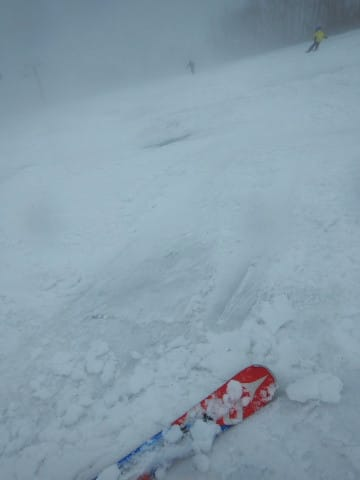

ほんの数カ所ですが，コブ溝部分に土が

出てきたところも（涙）

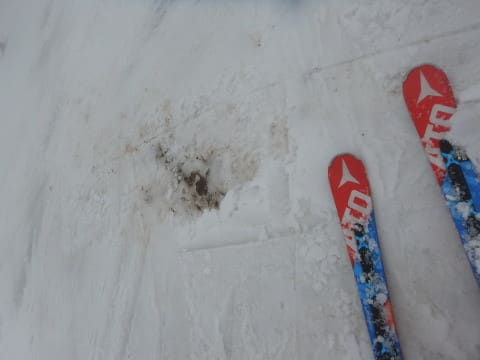

うーむ．

次の週末は，もうコブが深くなると

ヤバい感じかも…

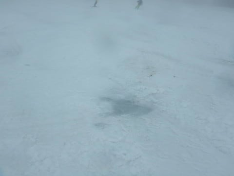

ってな感じで．

天気も悪いので，リフト終了の4時近くには，

ゲレンデはほぼ貸し切り状態になってました…

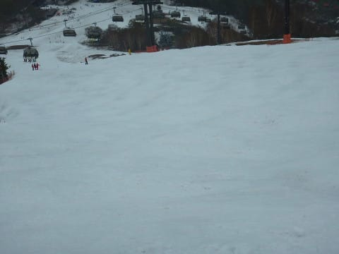

そして．

午後4時のリフト終了後．

かぐらコースをあとにして，下山しますが．

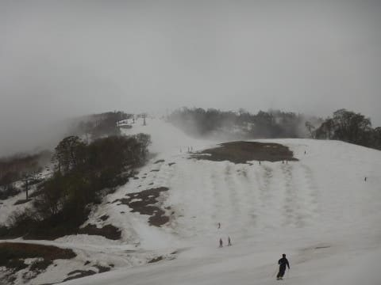

まだゴンドラコースは十分まともに

滑れる感じですね～．

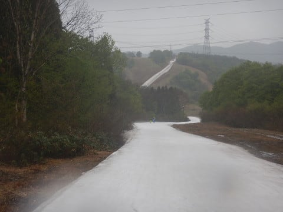

これでゴンドラコースが，15日で終わっちゃうとは

思いませんでした…

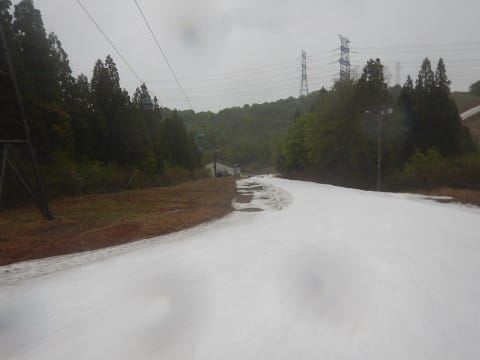

そして，ゴンドラ乗り場までやってくると．

板のキャリーサービスの車が待っているので．

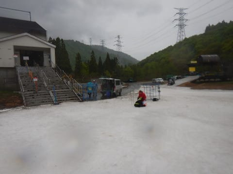

この車に板を預けて，雪がないここから先，

身軽に下山することができます…

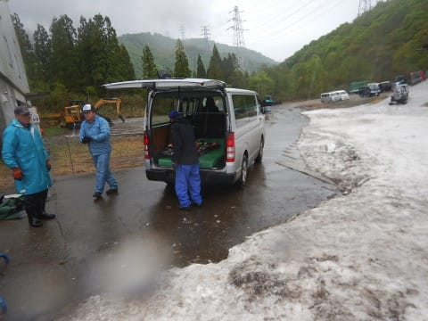

Pislabマットを滑る人は板を履いてここから

先のリフトも乗れるのですが．

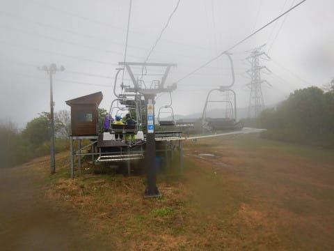

板を傷つけたくない私は，徒歩＆リフトで下山．

リフト降り場はピスラボマットになってます…

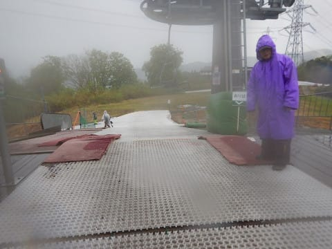

ここから先，みつまた高速リフトまでは

舗装路があって，汚れずに歩いて行けるように

なってましたね～．

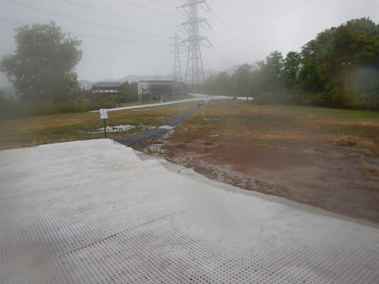

そして，Pislabマットを滑らない人は，

みつまた高速リフトの下り線に乗って…

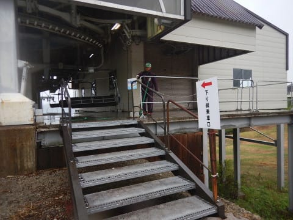

みつまたコースを降りたあと…

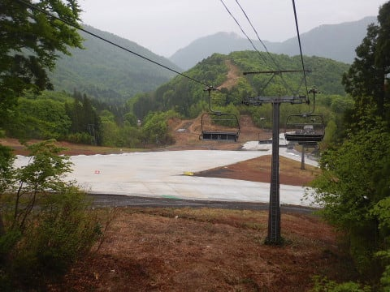

リフトを降りて，ロープウェー乗り場まで

歩くと．

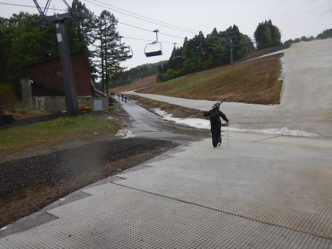

キャリーサービスに預けた板が，

ロープウェー降り場前に置いてあります…

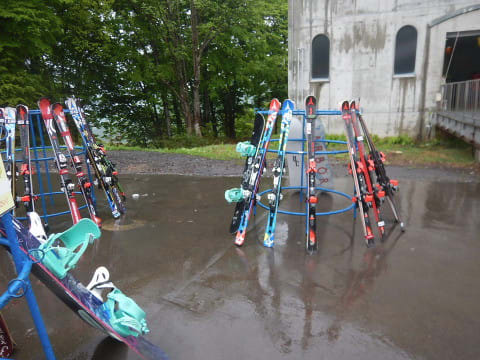

うむ．

このキャリーサービス，なかなか素晴

らしいのでは！？？

ってな感じで．

天気は悪かったものの．

おかげで人も少なかったし．

メインバーンはまだ思ったより雪が多かったし．

まぁまぁ楽しめる一日だったかな！

## 💬 コメント一覧

### 💬 コメント by (新潟のスキーヤー)
**タイトル**: Unknown
**投稿日**: 2018-05-16 23:57:06

かぐらのメインバーン、

思ったより雪ありました！

ただ、昨日、今日が夏の様な気温、虫が…

そして、明日から雨！(>_<)

今日から移動が全てピスラボ！徒歩移動が…

板のキャリーサービスは良かったです！

平日で空いていたからかもしれませんが、

おじさんが板、洗って待っててくれました！(^^)

そんで、今日はアライリゾートに

行って来ました！

感想は…

超～懐かしい！

客が居ない！

建物以外がリゾートでない！

駐車場が遠い！

↑↑↑

春スキーはチケット買う前に汗だくです！爆

アンコールは比較的フラットで

久々にカッ飛べました！

Xレース持って来ればよかった！

↑↑↑

重い板は駐車場が遠いのがネックですが…

結論としては、

景色は最高なので…

春スキーの割引料金になったら…

ビール飲みにお邪魔しまーす！笑

こんな感じでした！

ご参考までに…(^^)

### 💬 コメント by (Skier_S)
**タイトル**: 新潟のスキーヤーさま
**投稿日**: 2018-05-17 01:49:33

え！

ARAIに行きましたか！

意外と良かったようですね…

かぐらより楽しい感じでしょうか？？

ちょっと，ARAIに惹かれています…

交通費がかぐらよりかなりかかるけど，

空いてそうだし，リフト券もちょっと安いし．

土が出てきてなさそうなら，ARAIも

イイかも…

