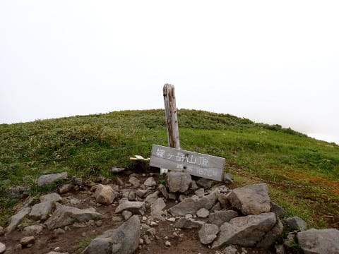

# 2024シーズンモデルのスキー板，試乗レポートその19…ATOMIC REDSTER S9i PRO

📅 投稿日時: 2023-06-28 00:59:23

ってなことで．

先週末は月山に行ってきたわけですが．

月山のTバーの山頂のちょっと上から

登山道の木道があって…

ここをわずか5分ほど歩くと，姥ヶ岳

山頂へ行けます！

…今回は天気が悪かったけど．

天気がいいと，すごい景色がいいので．

（天気が良かった時の姥が岳山頂）

Tバーのてっぺんからはすぐなので．

お昼休みの時なんか，景色のいいところで

お昼ご飯もいいかも…

ただ，スキーブーツで行くのは辛いので，

バックパックに靴を入れて持っていくのが

おススメです…

ってなことで．

本日も2024シーズンモデルのスキー板試乗レポート．

今回はアトミック編です．

では，どうぞ～！

〇ATOMIC REDSTER S9i PRO 165cm

基礎小回り

ビンディングが重いVARビンディングってのも

ありますが…

持つとずっしりとして，最初に履いた感じも

重さを感じます．

ただ，滑ってみると気持ちよくグリップして

走っていくし，重さよりむしろ軽快さを感じる

板です．

試乗したのは，4月の荒れたバーンで，

春のずっしり水気の多い荒れた雪の上に

重い新雪が積もっていくという難しい

コンディションでしたが…

板の重さゆえに，荒れた雪でも板がたたかれず，

高い安定感を保ったまま荒れ荒れ斜面を

グリップして切り裂いていく感じ．

ボコボコ斜面でも，板のエッジがしっかり

効いて，結構気持ちよく切っていけます！

かなりエッジグリップが強く，たわみも

トップからテールまで均一にきれいに

出る感じ．

トップからテールまでの板全体がしっかり

グリップして，結構深めのキレキレの

気持ちいいカービング小回りができます．

板の張り自体はそこそこ強いので，

小回り強制マシンではなく，ある程度の

中回り～小さめの大回りまで行ける

オールラウンド性もあります．

それでいて，しっかり踏んでいけばかなり

深めの小回りまで持っていけます．

ただ，S9i Revoshockがズレをうまく使えたのに対し，

このS9i Proはカービングマシンで，ずらして

滑ってもあんまり面白くありません…

強烈なエッジグリップを利用して，ハイ

スピードなキレキレターンを楽しむ板です．

この両者，性格も乗り手に求めるレベルも

結構違います．

おそらく，S9i Revoshockはそこそこの中級者

でも履けると思いますが…

S9i Proは，ある程度の体力と技術を求めます．

でも，スピード耐性はかなり高く，グリップ・

張りとも強いので，滑走スピードが高めで，

がっつり体力を使って滑る人は，S9i Proのほうが

キレキレで楽しいです！

ただ…板の重さとグリップの強さで，

コブ斜面はちょっと厳しいかも．

でも，春雪の荒れた斜面では，結構雪を蹴散らして

滑っていけるし．

深めの小回りから大回りっぽいところまで

行けるし．

かなりのハイスピードで攻めた深い小回りも

できるし．

低速から，小さめのサイドカーブに乗って

切って滑っていけるし．

（逆に言うと，低速でもずらして滑ろうとは

　あんまり思わない板）

小回り板ベースがいいけど，ガンガンスピードを

出していきたいって人には，

この板，いいんじゃないでしょうか？
