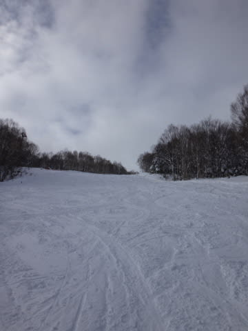

# 12月22日の志賀高原は…かなりの積雪＆午後は晴れ間も！

📅 投稿日時: 2013-12-22 23:07:53

🏷️ カテゴリ: [2014スキー滑走日記](c992167609b6415052179ee69ea1ea7d8.md)

えー．

本日．

志賀高原から，K奈川県の自宅に先ほど戻ってきましたが．

…また，明日は日帰りでスキー場に舞い戻るのだ…

あと5時間後に出発なので，あんまり寝られない…(涙)

＃なのに，Blogを更新している私．えらい！←とりあえず自分でほめておく

さてさて．

本日．

朝はやっぱり，すごい積もってました…

そして，山頂は…

マイナス10度！

雪も降り続けて…寒いよ！

ゲレンデは，こんな感じで，圧雪の上に5cmの新雪が乗ってます．

コース脇はこんな感じで，ひざパフくらい．

…こ，これは．

急いで非圧雪コースに行かねば！

…と，思ったところ．

うううーーーむっ！

オリンピックコースも，エキスパートコースも，スーパーGコースも．

すべて閉鎖(涙)．

結局新雪はコース脇しか楽しめなかった…(かなり残念)

午前中は寒くて視界も悪く，雪ももさもさで，

ちょっと滑りにくかったけど…

（もさもさコブ部分は人がたまる…)

午後1時過ぎ，なんと日が射してきました！

ををを！

って感じで，

午後は時折雪が降ることがあるものの，

おおむね日が射す天気となり．

雪質も最高の，こういう気持ちよいバーンを．

リフトストップの，夕日が沈むまで楽しめたのでした…

いやー．

明日もコンディションよさそう！

＃リフトストップまで滑って，K奈川に戻って

＃んで次の日に日帰りスキーってありえないだろ←自己突っ込み

## 💬 コメント一覧

### 💬 コメント by (zenko)
**タイトル**: すごい雪ですね！
**投稿日**: 2013-12-23 14:11:28

＃リフトストップまで滑って，K奈川に戻って

＃んで次の日に日帰りスキーってありえないだろ

→絶対・・・ありえな～い！！！（笑）

しっかし、すごい積雪ですね～

これなら年末年始の合宿（笑）も良いコンディションで楽しむことができるでしょうね！

### 💬 コメント by (Goku)
**タイトル**: Unknown
**投稿日**: 2013-12-23 17:53:00

本当になんと言う体力。

最終日の今日、私は八方でしたが２時で足が売り切れました。

### 💬 コメント by (Skier_S)
**タイトル**: 帰ってきました
**投稿日**: 2013-12-23 21:50:51

＞ZENKOさま

いや～

積雪は十分ですよ！

しかし、さすがに今日の日帰りはつかれました…

>Gokuさま

今日も朝８時着で、4時近くまで

滑ってしまいました…

あまりにもコンディションがよく、帰る気になれなかった

です…(^-^;

