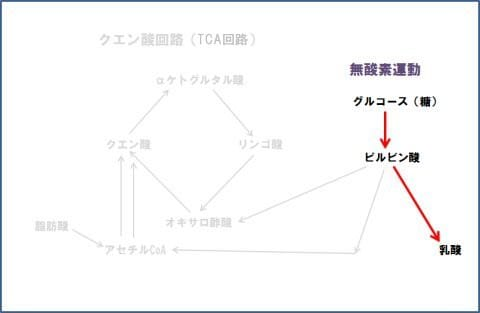

# なぜ登山でVAAMを試してみようと思ったのか？その4…クエン酸回路（TCA回路）周りをもう少し詳しく説明してみる

📅 投稿日時: 2022-09-20 01:27:50

結局，この3連休もどこにも行かず…

PCの前で食事を搔き込みながら，

夜中まで仕事する日々でした（涙）

でも．

今日は12時前に最後の仕事が終わった

ことにしたので．

ちょっと記事を書く時間を取って．

長らく書けなかった，VAAMの記事の続きです！

さぁ．

…技術Blogなら分かるけど．

どこまで専門的なことに突っ込めるか

という，お気楽Blogの限界にチャレンジ

しているこの連載．

かなりの読者を振り落としながら

突っ走ってますが…

[前回](ed5e79774900d797b5d648594f6d5519a.md)は．

糖を乳酸に変化させエネルギー源を生む，

無酸素反応とは違い…

糖を完全にCO2とH2Oだけになるまで分解して，

効率よくエネルギーを生むのが，クエン酸回路だ！

…って感じの説明をして．

クエン酸回路は

糖を酸化させてCO2とH2Oに分解する有酸素回路で，

なので呼吸は酸化のための酸素を取り込んで，

CO2を出すわけだ，

という話をしたわけですが…

で．

この図は大変良くできているんだけど．

いろいろ調べてみると．

うん．人体とちょっと違うな…？

ということに気づいたわけで．

なので．

前回，皆さんの理解を振り切ってしまった

この図を，もう少し分かりやすく説明しなおして，

そして，人体の場合はどうなるか

説明してみましょう…

まず．

運動を始めた直後．

まず，グルコースが乳酸に分解されることで

エネルギーが造り出されます…

これは，酸素を使わない反応です．

いわゆる，無酸素運動のエネルギー生成経路です．

乳酸は肝臓に運ばれて，

また，グルコースに戻されるんですが…

乳酸をグルコースに戻すのにすごい

肝臓のエネルギーを使うので，

ずっと無酸素運動を続けていると，

肝臓が乳酸をグルコースに

戻しきれなくなり，筋肉に乳酸が

溜まって疲れちゃいます…

なので，無酸素運動は長く続けられません…

…覚える必要はないですが．

グルコース⇔乳酸を筋肉⇔肝臓で

やり取りしながらグルグル回す

回路を「コリ回路」と言います．

だもんで．

しばらく運動を続けると…

糖を分解したピルビン酸が

オキサロ酢酸に変わって，

クエン酸回路が回り始めます！！

クエン酸回路が回ると…

グルコースはピルビン酸→アセチルCoAと変化し，

クエン酸回路に入って，

CO2とH2Oに分解され，効率よくエネルギー化される

有酸素でのエネルギー生成が始まります！

…ちなみに，

アセチル「CoA」はアセチル「コエンザイムA」の略で．

アセチル「コア」ではなく，アセチル「コエ―」と呼ぶと

ちょっと専門家っぽいです．

別にアセチルが「怖えー」わけではありません…

…すみません．余談でした．

ってなことで．

クエン酸回路が回り始めると…

脂肪酸からもアセチルCoAが作れるので．

このクエン酸回路．

エネルギー源としての糖（グルコース）が無くなって

きても，脂肪酸をグングン消費し，

エネルギーを作ってくれるようになります！

だもんで，運動して最初は糖が使われるけど，

しばらくすると脂肪が消費され始めるわけですね…

ってことで．

ここまでが，クエン酸回路の復習．

ここから，人体との違いに行こうと思いますが…

そこまで一気に進むと混乱しそうなので，

一旦ここで区切っておきますか…

[（続く）](e52cdbd4e344d2974e9515bf33dfb5ac1.md)

…厳密には，記事を書く時間が取れなくて

ここで切らざるを得なかった…ということに

読者の皆さんは気づいていたとしても，

そっとしておいてあげましょう…

## 💬 コメント一覧

### 💬 コメント by (まだついていけてる読者)
**タイトル**: Unknown
**投稿日**: 2022-09-29 06:51:28

Sさん、いつの間にかTCA回路がTCL回路に・・1G-2高グルグルが1G-２ロマになっちゃった？

### 💬 コメント by (Skier_S)
**タイトル**: ＞まだついていけてる読者さま
**投稿日**: 2022-09-30 01:21:32

ご指摘ありがとうございました~！

直しておきました！

眠い中記事を書くとダメですね…（言い訳）

