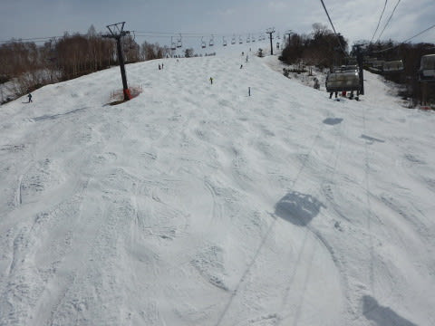

# 5月6日，GW最終日のかぐら・みつまた速報モード

📅 投稿日時: 2018-05-07 00:17:09

という感じで．

昨日レポートしたように，

関西某所→かぐらオープンから終了まで滑り続け→K奈川県

というご無体移動をして，昨日は深夜に帰宅したというのに．

なぜか今日も日帰りでかぐらへ行ってきました～！

まず．

今日はみつまたスタートです！

…いや，さすがに今朝はちょっと眠たくて，

死ぬかと思ったので．

スキー場到着が朝9時近くになるという，

かなりの失態を犯しましたが…（涙）

でも，晴天で絶好のスキー日和です！

…Tシャツで十分なほどに気温が高すぎて．

板が滑らない雪だったのが，ちょいと残念でしたが…

で．

みつまたのコースは…

もう，廊下ですね（泣）．

シーズンスタート時のYetiを

思い出させますね…

ゴンドラから戻るリフト降り場からの

ルートだけに雪がつけてあって，

みつまただけをグルグル滑ることはできず，

かぐらから戻る際の連絡用としてのみ，

滑れる状況になってます…

みつまたから，ゴンドラ乗り場へ降りる

ルートも，廊下ですね…

まだ雪は残ってますが，来週まで

雪の上を滑れるかどうか，微妙な感じ…

そして，本日のかぐらメインゲレンデですが．

最後の落ち込み部分に大きく土が

出てきてます．

そして．

クワッドリフトをくぐるところ．

ここはまだほぼ全面滑れるように見えますが…

下から見て，支柱より左側の部分は，

夕方にはヤバくなってきました…

来週は，下から見て支柱より右側しか

滑れないかな．

でも，それ以外は，まだコブ溝に土も出てきて

ないですね～．

ただ，コブ溝部分，かなり雪が薄くなってるように

見える部分もあるので．

来週は，コブ溝が抜けるところが出てきそうな感じ…

で．

昨日も報告したように，テクニカルコースは

もうかなり終わりげな感じで．

来週はもう無理でしょう…

ジャイアントコースは，途中部分はまだ

結構イケそうに見えますけど．

取りつき部分と最後の部分がそろそろ

ヤバいので．

来週は滑れるかどうか…

おそらくダメなんじゃないかな～…

そして．

今日はGW最終日ということもあって．

昨日より混みませんでしたよ～！

リフト待ちは，平均的にこんな感じで．

最長でも5分，せいぜい搬器数台，

午後はほぼ待ちなしって感じで．

結構快適でしたよ～！！

ってな感じで．

志賀高原より雪がいっぱいあって，

結構まともに滑れますが．

来週はテクニカルもジャイアントも終わりそうで．

…例年より1-2週間ほど，雪が消えるのが

早い感じです（涙）．

とりあえず，また明日詳細レポートします…

…しかし，本来ならゆっくり休めるはずのGW．

なぜだか，いつも以上に睡眠時間を削って

しまった日々だったので．

さすがに今日は早く寝ます…

おやすみなさい…
